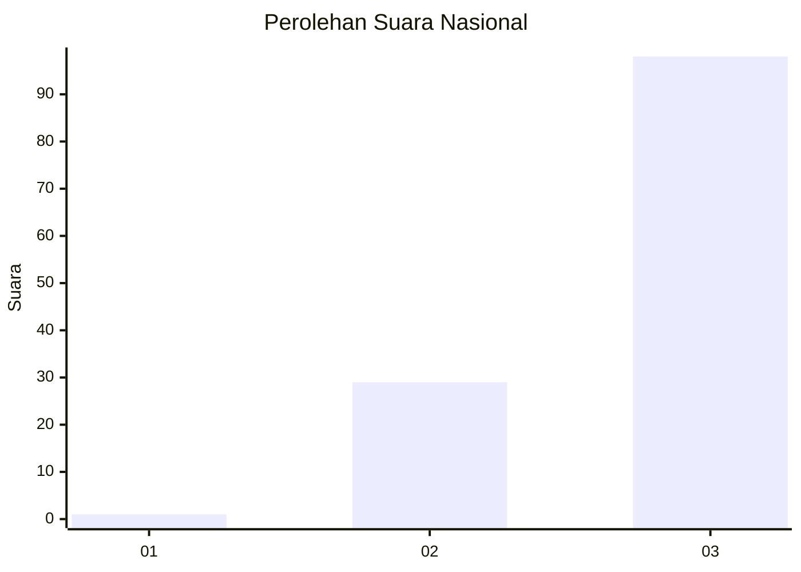
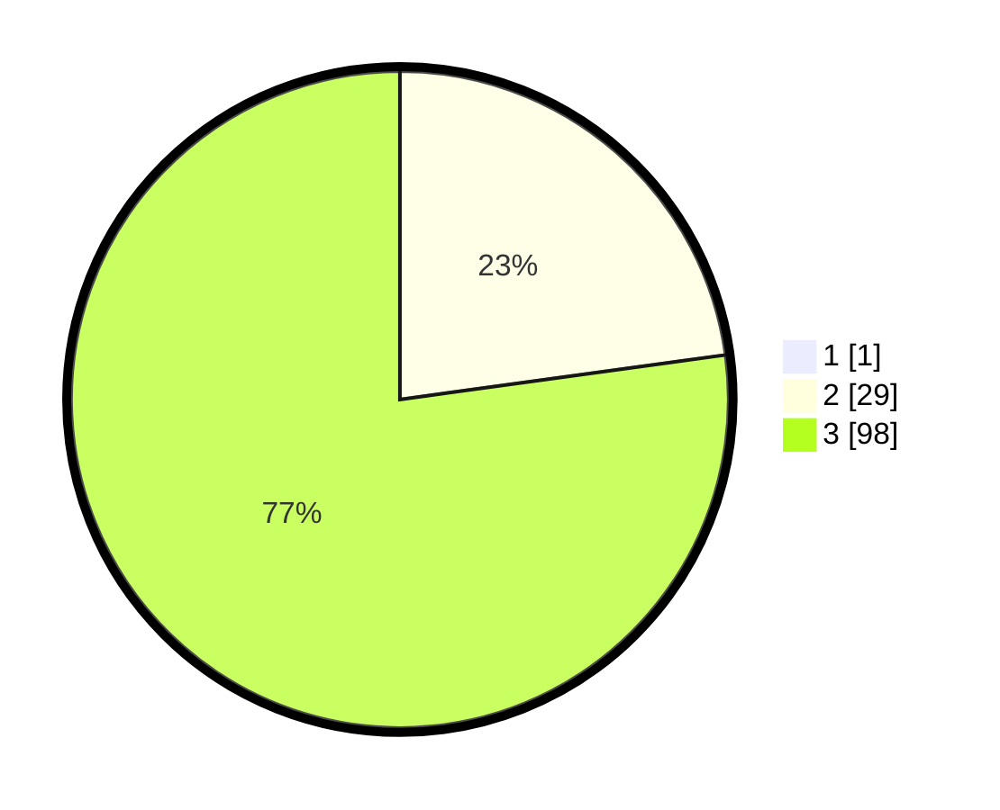

# Hasil

## Grafik

## Tabel

| No. | Nama Paslon    | Suara | Suara (raw) | Persentase |
|:--- |:-------------- | -----:| -----------:| ----------:|
| 1   | ANIES MUHAIMIN | 1     | [1][p-1]    | 0,78       |
| 2   | PRABOWO GIBRAN | 29    | [29][p-2]   | 22,66      |
| 3   | GANJAR MAHFUD  | 98    | [98][p-3]   | 76,56      |

[p-1]: https://github.com/gigit-pemilu/pemilu-2024/blob/main/pilpres/hitung-suara/sub/53-nusa-tenggara-timur/sub/06-flores-timur/sub/07-solor-timur/sub/2013-lewohedo/sub/002-tps/sub/paslon-1.txt
[p-2]: https://github.com/gigit-pemilu/pemilu-2024/blob/main/pilpres/hitung-suara/sub/53-nusa-tenggara-timur/sub/06-flores-timur/sub/07-solor-timur/sub/2013-lewohedo/sub/002-tps/sub/paslon-2.txt
[p-3]: https://github.com/gigit-pemilu/pemilu-2024/blob/main/pilpres/hitung-suara/sub/53-nusa-tenggara-timur/sub/06-flores-timur/sub/07-solor-timur/sub/2013-lewohedo/sub/002-tps/sub/paslon-3.txt

## Foto C Plano

https://sirekap-obj-formc.kpu.go.id/0e63/pemilu/ppwp/53/06/07/20/13/5306072013002-20240215-074617--d4b35bad-fc90-47d3-b4cc-2e4c2eed659f.jpg

https://sirekap-obj-formc.kpu.go.id/0e63/pemilu/ppwp/53/06/07/20/13/5306072013002-20240215-083306--5dc29438-0585-42a9-b43d-d2c8ad8b283f.jpg

https://sirekap-obj-formc.kpu.go.id/0e63/pemilu/ppwp/53/06/07/20/13/5306072013002-20240215-083420--b2587d51-e9a7-46ca-91e7-729659549a81.jpg

## Metadata

| Key        | Value               |
| ---------- | ------------------- |
| Time Stamp | 2024-02-15 21:30:27 |

