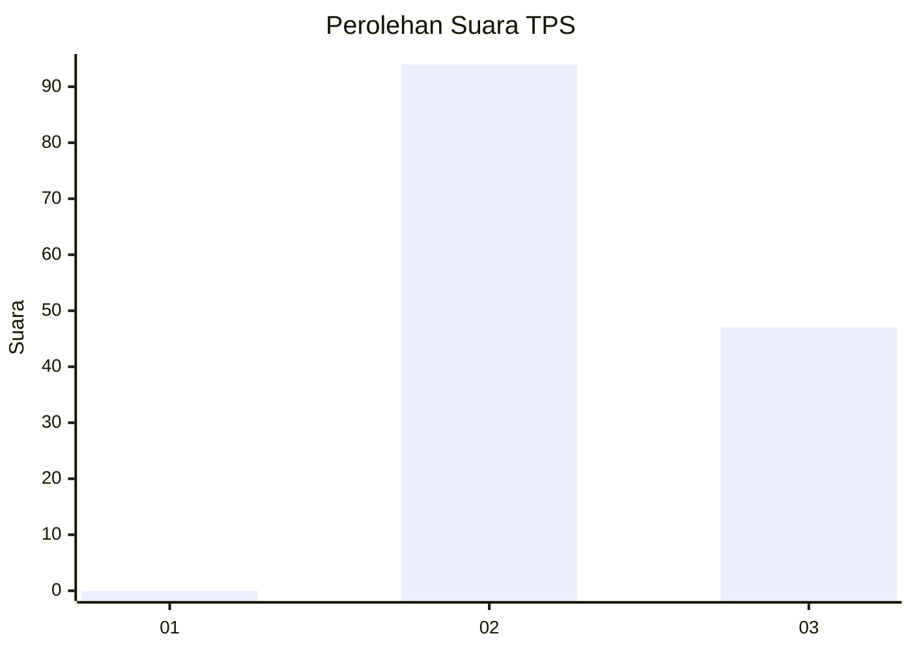
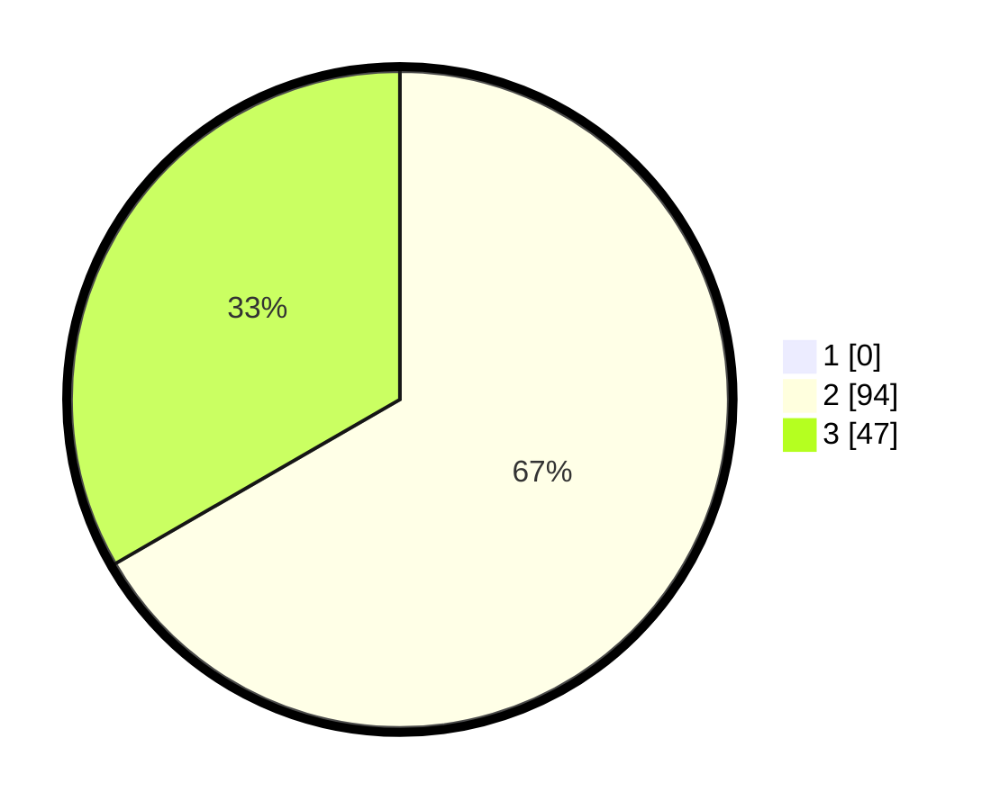

# Hasil

## Grafik

## Tabel

| No. | Nama Paslon    | Suara | Suara (raw) | Persentase |
|:--- |:-------------- | -----:| -----------:| ----------:|
| 1   | ANIES MUHAIMIN | 0     | [0][p-1]    | 0,00       |
| 2   | PRABOWO GIBRAN | 94    | [94][p-2]   | 66,67      |
| 3   | GANJAR MAHFUD  | 47    | [47][p-3]   | 33,33      |

[p-1]: https://github.com/gigit-pemilu/pemilu-2024-53-nusa-tenggara-timur/blob/main/pilpres/hitung-suara/sub/53-nusa-tenggara-timur/sub/06-flores-timur/sub/09-wotan-ulumando/sub/2001-wailebe/sub/001-tps/sub/paslon-1.txt
[p-2]: https://github.com/gigit-pemilu/pemilu-2024-53-nusa-tenggara-timur/blob/main/pilpres/hitung-suara/sub/53-nusa-tenggara-timur/sub/06-flores-timur/sub/09-wotan-ulumando/sub/2001-wailebe/sub/001-tps/sub/paslon-2.txt
[p-3]: https://github.com/gigit-pemilu/pemilu-2024-53-nusa-tenggara-timur/blob/main/pilpres/hitung-suara/sub/53-nusa-tenggara-timur/sub/06-flores-timur/sub/09-wotan-ulumando/sub/2001-wailebe/sub/001-tps/sub/paslon-3.txt

## Foto C Plano

https://sirekap-obj-formc.kpu.go.id/8ba6/pemilu/ppwp/53/06/09/20/01/5306092001001-20240214-193023--568234e7-1bd8-4790-a04f-d8028a0a6459.jpg

https://sirekap-obj-formc.kpu.go.id/8ba6/pemilu/ppwp/53/06/09/20/01/5306092001001-20240214-193606--62f10ffb-3265-49be-869a-dd12eeb46c33.jpg

https://sirekap-obj-formc.kpu.go.id/8ba6/pemilu/ppwp/53/06/09/20/01/5306092001001-20240214-193738--bd63f19a-c497-4d23-b6eb-3f83b5569b96.jpg

## Metadata

| Key        | Value               |
| ---------- | ------------------- |
| Time Stamp | 2024-02-25 15:00:00 |

