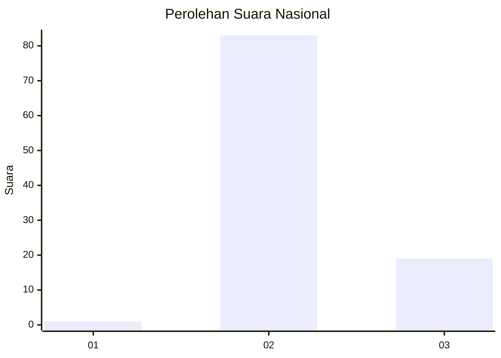
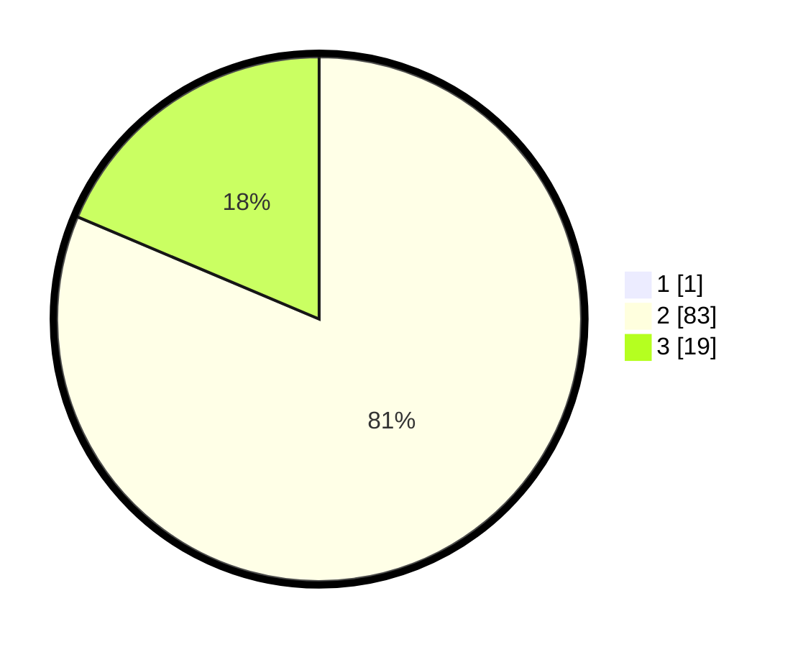

# Hasil

## Grafik

## Tabel

| No. | Nama Paslon    | Suara | Suara (raw) | Persentase |
|:--- |:-------------- | -----:| -----------:| ----------:|
| 1   | ANIES MUHAIMIN | 1     | [1][p-1]    | 0,97       |
| 2   | PRABOWO GIBRAN | 83    | [83][p-2]   | 80,58      |
| 3   | GANJAR MAHFUD  | 19    | [19][p-3]   | 18,45      |

[p-1]: https://github.com/gigit-pemilu/pemilu-2024/blob/main/pilpres/hitung-suara/sub/53-nusa-tenggara-timur/sub/06-flores-timur/sub/09-wotan-ulumando/sub/2001-wailebe/sub/002-tps/sub/paslon-1.txt
[p-2]: https://github.com/gigit-pemilu/pemilu-2024/blob/main/pilpres/hitung-suara/sub/53-nusa-tenggara-timur/sub/06-flores-timur/sub/09-wotan-ulumando/sub/2001-wailebe/sub/002-tps/sub/paslon-2.txt
[p-3]: https://github.com/gigit-pemilu/pemilu-2024/blob/main/pilpres/hitung-suara/sub/53-nusa-tenggara-timur/sub/06-flores-timur/sub/09-wotan-ulumando/sub/2001-wailebe/sub/002-tps/sub/paslon-3.txt

## Foto C Plano

https://sirekap-obj-formc.kpu.go.id/8540/pemilu/ppwp/53/06/09/20/01/5306092001002-20240228-211738--e2e38291-e5dc-4225-9175-239406b1c74e.jpg

https://sirekap-obj-formc.kpu.go.id/8540/pemilu/ppwp/53/06/09/20/01/5306092001002-20240215-184727--5074e8e5-558e-43fe-8316-449026cb70fb.jpg

https://sirekap-obj-formc.kpu.go.id/8540/pemilu/ppwp/53/06/09/20/01/5306092001002-20240215-184833--87b37d12-2428-4658-8fce-bebe4a930118.jpg

## Metadata

| Key        | Value               |
| ---------- | ------------------- |
| Time Stamp | 2024-02-28 22:00:00 |

