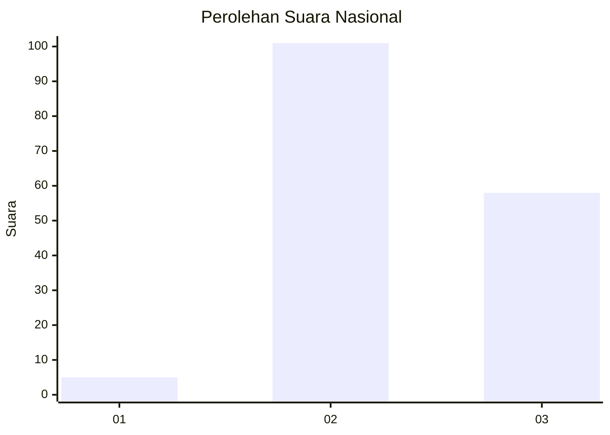
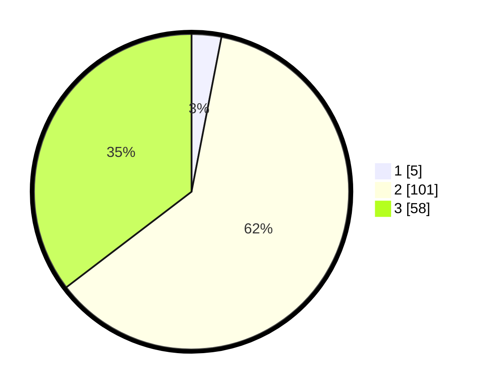

# Hasil

## Grafik

## Tabel

| No. | Nama Paslon    | Suara | Suara (raw) | Persentase |
|:--- |:-------------- | -----:| -----------:| ----------:|
| 1   | ANIES MUHAIMIN | 5     | [5][p-1]    | 3,05       |
| 2   | PRABOWO GIBRAN | 101   | [101][p-2]  | 61,59      |
| 3   | GANJAR MAHFUD  | 58    | [58][p-3]   | 35,37      |

[p-1]: https://github.com/gigit-pemilu/pemilu-2024/blob/main/pilpres/hitung-suara/sub/53-nusa-tenggara-timur/sub/06-flores-timur/sub/09-wotan-ulumando/sub/2003-nayubaya/sub/002-tps/sub/paslon-1.txt
[p-2]: https://github.com/gigit-pemilu/pemilu-2024/blob/main/pilpres/hitung-suara/sub/53-nusa-tenggara-timur/sub/06-flores-timur/sub/09-wotan-ulumando/sub/2003-nayubaya/sub/002-tps/sub/paslon-2.txt
[p-3]: https://github.com/gigit-pemilu/pemilu-2024/blob/main/pilpres/hitung-suara/sub/53-nusa-tenggara-timur/sub/06-flores-timur/sub/09-wotan-ulumando/sub/2003-nayubaya/sub/002-tps/sub/paslon-3.txt

## Foto C Plano

https://sirekap-obj-formc.kpu.go.id/8fe2/pemilu/ppwp/53/06/09/20/03/5306092003002-20240215-201536--98e99dbf-1440-4c91-a54e-bc691f760f4f.jpg

https://sirekap-obj-formc.kpu.go.id/8fe2/pemilu/ppwp/53/06/09/20/03/5306092003002-20240217-110036--76c4995b-455e-49ca-aba6-c9c3da3ca9ab.jpg

https://sirekap-obj-formc.kpu.go.id/8fe2/pemilu/ppwp/53/06/09/20/03/5306092003002-20240228-183831--4395c9b2-bfe9-40db-a6a2-f6e1d158e16c.jpg

## Metadata

| Key        | Value               |
| ---------- | ------------------- |
| Time Stamp | 2024-02-28 19:00:00 |

