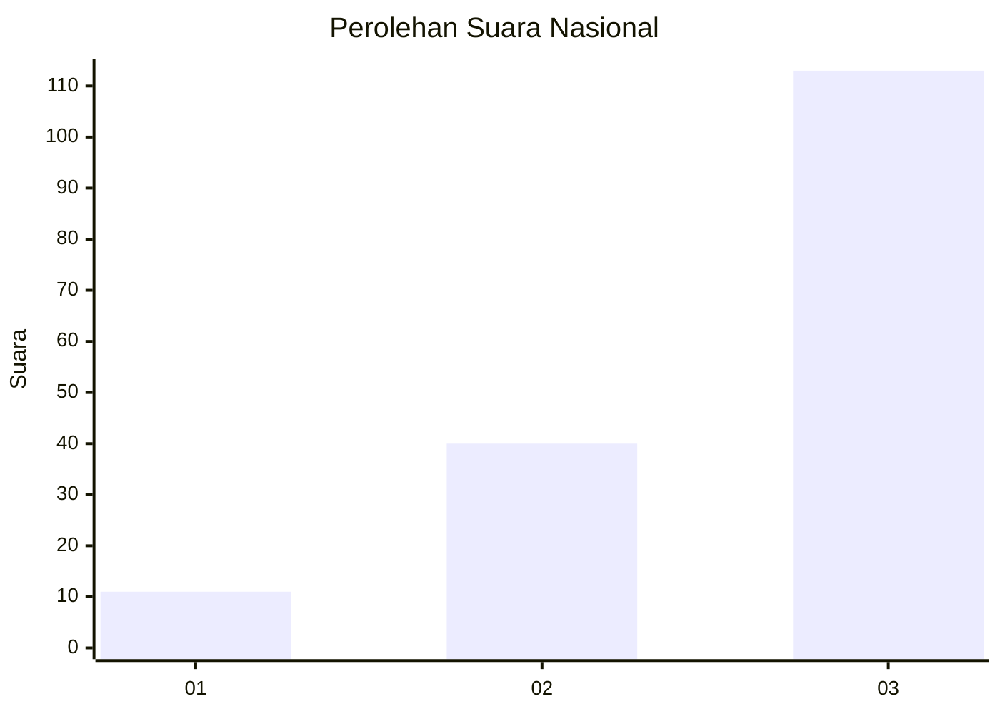
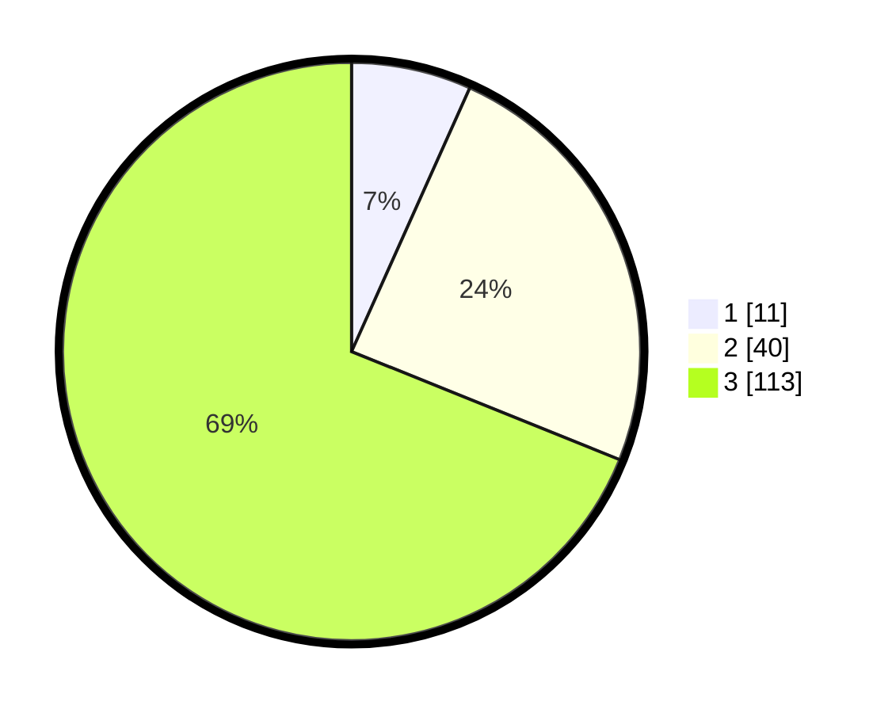

# Hasil

## Grafik

## Tabel

| No. | Nama Paslon    | Suara | Suara (raw) | Persentase |
|:--- |:-------------- | -----:| -----------:| ----------:|
| 1   | ANIES MUHAIMIN | 11    | [11][p-1]   | 6,71       |
| 2   | PRABOWO GIBRAN | 40    | [40][p-2]   | 24,39      |
| 3   | GANJAR MAHFUD  | 113   | [113][p-3]  | 68,90      |

[p-1]: https://github.com/gigit-pemilu/pemilu-2024/blob/main/pilpres/hitung-suara/sub/53-nusa-tenggara-timur/sub/06-flores-timur/sub/09-wotan-ulumando/sub/2006-klukengnuking/sub/001-tps/sub/paslon-1.txt
[p-2]: https://github.com/gigit-pemilu/pemilu-2024/blob/main/pilpres/hitung-suara/sub/53-nusa-tenggara-timur/sub/06-flores-timur/sub/09-wotan-ulumando/sub/2006-klukengnuking/sub/001-tps/sub/paslon-2.txt
[p-3]: https://github.com/gigit-pemilu/pemilu-2024/blob/main/pilpres/hitung-suara/sub/53-nusa-tenggara-timur/sub/06-flores-timur/sub/09-wotan-ulumando/sub/2006-klukengnuking/sub/001-tps/sub/paslon-3.txt

## Foto C Plano

https://sirekap-obj-formc.kpu.go.id/5865/pemilu/ppwp/53/06/09/20/06/5306092006001-20240215-125607--8c39c248-d71b-4a5c-a83d-045a572029f2.jpg

https://sirekap-obj-formc.kpu.go.id/5865/pemilu/ppwp/53/06/09/20/06/5306092006001-20240215-125821--764bc621-3806-4abc-b8ea-f17f4f1a4c61.jpg

https://sirekap-obj-formc.kpu.go.id/5865/pemilu/ppwp/53/06/09/20/06/5306092006001-20240215-130003--48168021-1029-4921-a2fc-0200a96226f5.jpg

## Metadata

| Key        | Value               |
| ---------- | ------------------- |
| Time Stamp | 2024-02-24 22:31:28 |

