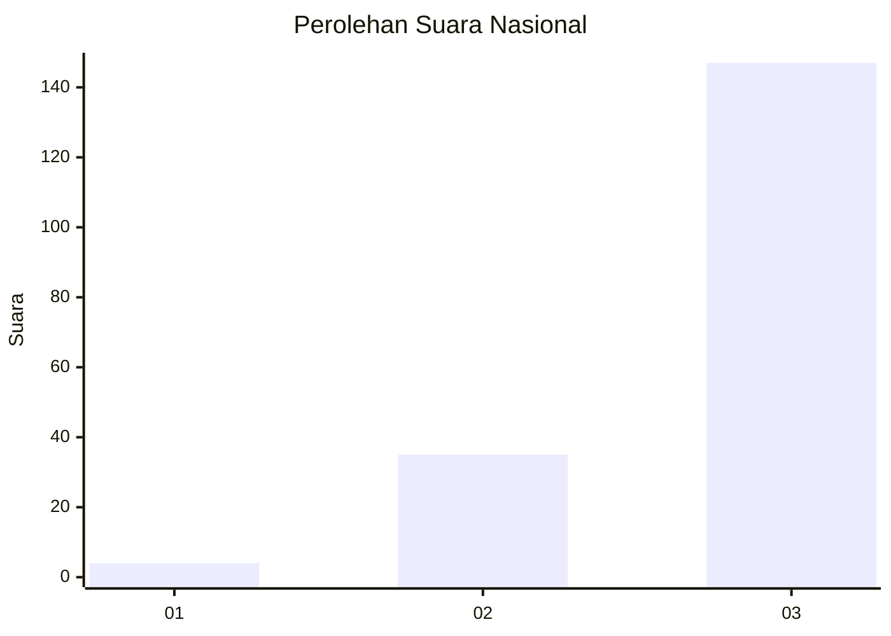
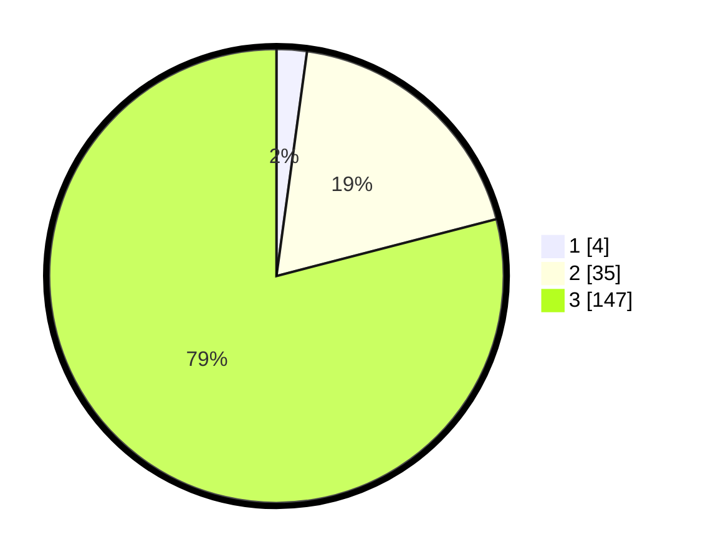

# Hasil

## Grafik

## Tabel

| No. | Nama Paslon    | Suara | Suara (raw) | Persentase |
|:--- |:-------------- | -----:| -----------:| ----------:|
| 1   | ANIES MUHAIMIN | 4     | [4][p-1]    | 2,15       |
| 2   | PRABOWO GIBRAN | 35    | [35][p-2]   | 18,82      |
| 3   | GANJAR MAHFUD  | 147   | [147][p-3]  | 79,03      |

[p-1]: https://github.com/gigit-pemilu/pemilu-2024/blob/main/pilpres/hitung-suara/sub/53-nusa-tenggara-timur/sub/06-flores-timur/sub/09-wotan-ulumando/sub/2007-pandai/sub/001-tps/sub/paslon-1.txt
[p-2]: https://github.com/gigit-pemilu/pemilu-2024/blob/main/pilpres/hitung-suara/sub/53-nusa-tenggara-timur/sub/06-flores-timur/sub/09-wotan-ulumando/sub/2007-pandai/sub/001-tps/sub/paslon-2.txt
[p-3]: https://github.com/gigit-pemilu/pemilu-2024/blob/main/pilpres/hitung-suara/sub/53-nusa-tenggara-timur/sub/06-flores-timur/sub/09-wotan-ulumando/sub/2007-pandai/sub/001-tps/sub/paslon-3.txt

## Foto C Plano

https://sirekap-obj-formc.kpu.go.id/0fdc/pemilu/ppwp/53/06/09/20/07/5306092007001-20240215-133417--ac9d2222-c544-46ef-b602-0b0d342bec3b.jpg

https://sirekap-obj-formc.kpu.go.id/0fdc/pemilu/ppwp/53/06/09/20/07/5306092007001-20240215-162011--6f133142-ae57-4eda-9442-7b34745c0cab.jpg

https://sirekap-obj-formc.kpu.go.id/0fdc/pemilu/ppwp/53/06/09/20/07/5306092007001-20240215-133835--bfb77359-67f0-480c-b1e5-e40ad20fd9a8.jpg

## Metadata

| Key        | Value               |
| ---------- | ------------------- |
| Time Stamp | 2024-02-25 21:00:00 |

