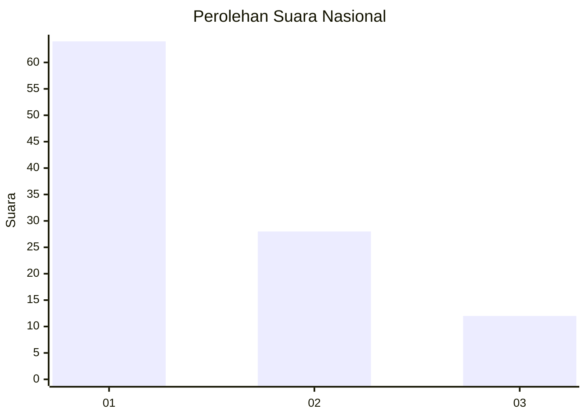
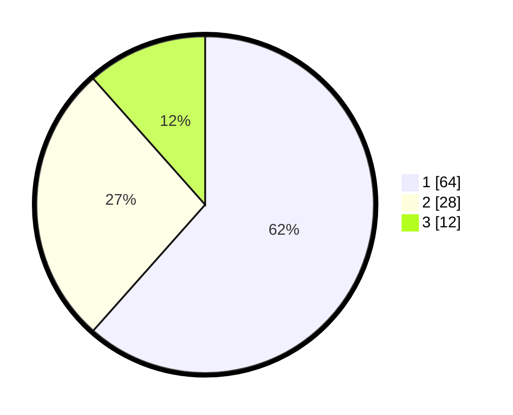

# Hasil

## Grafik

## Tabel

| No. | Nama Paslon    | Suara | Suara (raw) | Persentase |
|:--- |:-------------- | -----:| -----------:| ----------:|
| 1   | ANIES MUHAIMIN | 64    | [64][p-1]   | 61,54      |
| 2   | PRABOWO GIBRAN | 28    | [28][p-2]   | 26,92      |
| 3   | GANJAR MAHFUD  | 12    | [12][p-3]   | 11,54      |

[p-1]: https://github.com/gigit-pemilu/pemilu-2024/blob/main/pilpres/hitung-suara/sub/53-nusa-tenggara-timur/sub/06-flores-timur/sub/09-wotan-ulumando/sub/2009-samsoge/sub/002-tps/sub/paslon-1.txt
[p-2]: https://github.com/gigit-pemilu/pemilu-2024/blob/main/pilpres/hitung-suara/sub/53-nusa-tenggara-timur/sub/06-flores-timur/sub/09-wotan-ulumando/sub/2009-samsoge/sub/002-tps/sub/paslon-2.txt
[p-3]: https://github.com/gigit-pemilu/pemilu-2024/blob/main/pilpres/hitung-suara/sub/53-nusa-tenggara-timur/sub/06-flores-timur/sub/09-wotan-ulumando/sub/2009-samsoge/sub/002-tps/sub/paslon-3.txt

## Foto C Plano

https://sirekap-obj-formc.kpu.go.id/faf6/pemilu/ppwp/53/06/09/20/09/5306092009002-20240215-181500--c6e72e90-bfd0-46c6-9a93-84adeaf634e5.jpg

https://sirekap-obj-formc.kpu.go.id/faf6/pemilu/ppwp/53/06/09/20/09/5306092009002-20240214-220859--5a2c577d-277c-4d34-aeca-95c1dfd43b79.jpg

https://sirekap-obj-formc.kpu.go.id/faf6/pemilu/ppwp/53/06/09/20/09/5306092009002-20240215-031556--12e84a94-68ad-42c9-8e96-7fd9dcebeec0.jpg

## Metadata

| Key        | Value               |
| ---------- | ------------------- |
| Time Stamp | 2024-02-16 00:00:26 |

