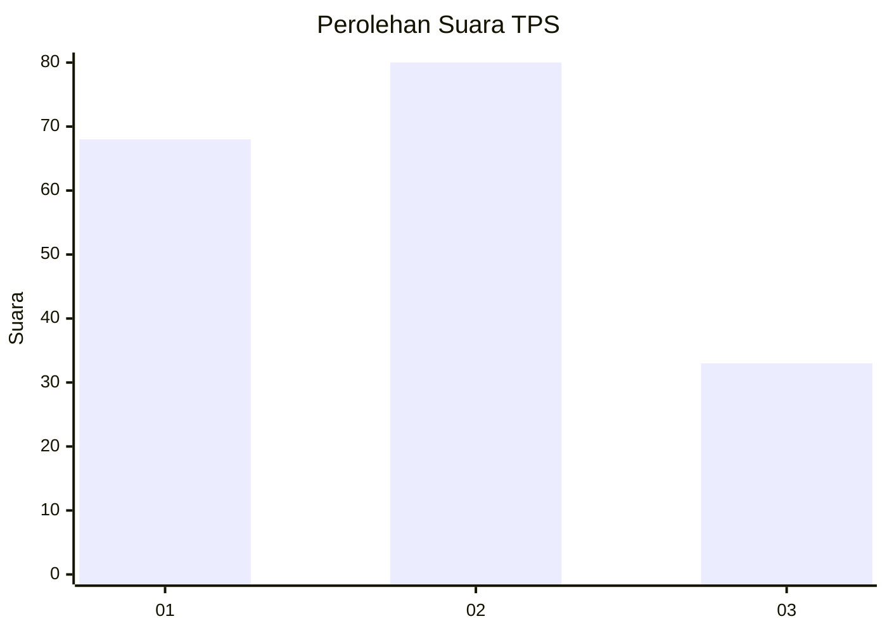
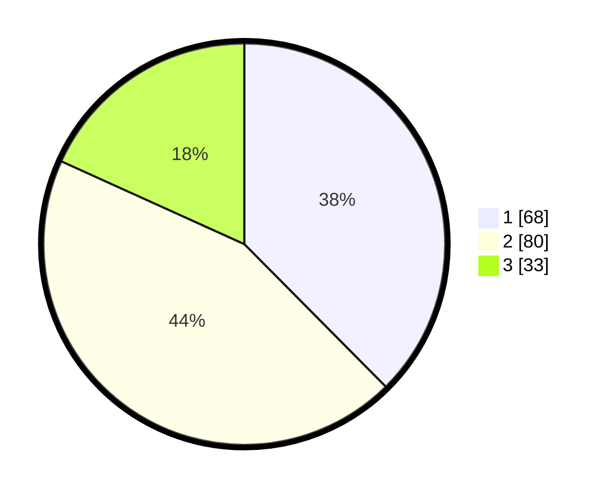

# Hasil

## Grafik

## Tabel

| No. | Nama Paslon    | Suara | Suara (raw) | Persentase |
|:--- |:-------------- | -----:| -----------:| ----------:|
| 1   | ANIES MUHAIMIN | 68    | [68][p-1]   | 37,57      |
| 2   | PRABOWO GIBRAN | 80    | [80][p-2]   | 44,20      |
| 3   | GANJAR MAHFUD  | 33    | [33][p-3]   | 18,23      |

[p-1]: https://github.com/gigit-pemilu/pemilu-2024-53-nusa-tenggara-timur/blob/main/pilpres/hitung-suara/sub/53-nusa-tenggara-timur/sub/06-flores-timur/sub/10-adonara-timur/sub/1001-waiwerang-kota/sub/002-tps/sub/paslon-1.txt
[p-2]: https://github.com/gigit-pemilu/pemilu-2024-53-nusa-tenggara-timur/blob/main/pilpres/hitung-suara/sub/53-nusa-tenggara-timur/sub/06-flores-timur/sub/10-adonara-timur/sub/1001-waiwerang-kota/sub/002-tps/sub/paslon-2.txt
[p-3]: https://github.com/gigit-pemilu/pemilu-2024-53-nusa-tenggara-timur/blob/main/pilpres/hitung-suara/sub/53-nusa-tenggara-timur/sub/06-flores-timur/sub/10-adonara-timur/sub/1001-waiwerang-kota/sub/002-tps/sub/paslon-3.txt

## Foto C Plano

https://sirekap-obj-formc.kpu.go.id/dd78/pemilu/ppwp/53/06/10/10/01/5306101001002-20240215-064546--7abf2e64-940b-4abe-a3cc-2eb4523deb7d.jpg

https://sirekap-obj-formc.kpu.go.id/dd78/pemilu/ppwp/53/06/10/10/01/5306101001002-20240215-064627--047a4d40-d426-40e0-8a24-fa258e7fd350.jpg

https://sirekap-obj-formc.kpu.go.id/dd78/pemilu/ppwp/53/06/10/10/01/5306101001002-20240215-064647--78f5fc5c-4a06-45cf-979d-b1f50834b500.jpg

## Metadata

| Key        | Value               |
| ---------- | ------------------- |
| Time Stamp | 2024-02-25 20:00:00 |

