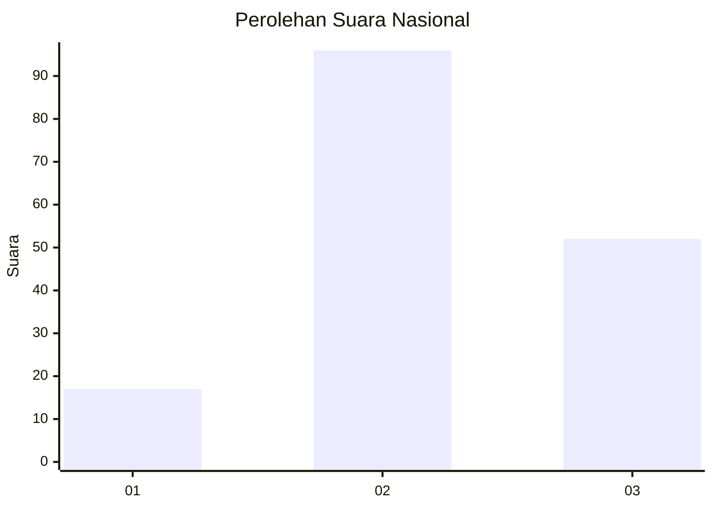
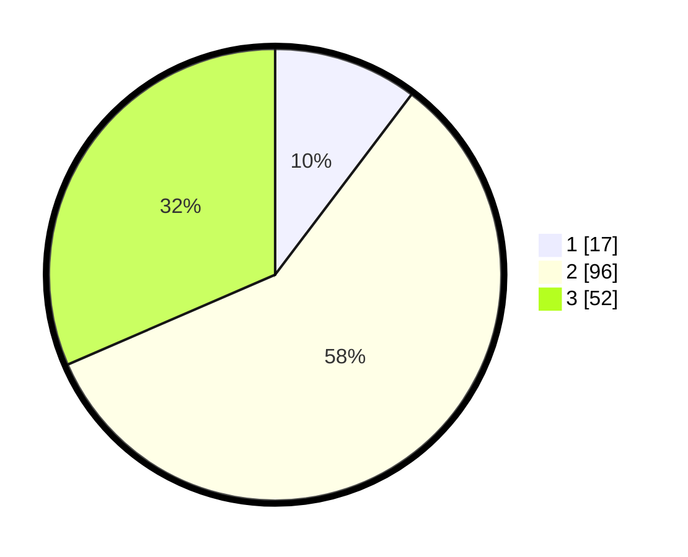

# Hasil

## Grafik

## Tabel

| No. | Nama Paslon    | Suara | Suara (raw) | Persentase |
|:--- |:-------------- | -----:| -----------:| ----------:|
| 1   | ANIES MUHAIMIN | 17    | [17][p-1]   | 10,30      |
| 2   | PRABOWO GIBRAN | 96    | [96][p-2]   | 58,18      |
| 3   | GANJAR MAHFUD  | 52    | [52][p-3]   | 31,52      |

[p-1]: https://github.com/gigit-pemilu/pemilu-2024/blob/main/pilpres/hitung-suara/sub/53-nusa-tenggara-timur/sub/06-flores-timur/sub/10-adonara-timur/sub/1001-waiwerang-kota/sub/007-tps/sub/paslon-1.txt
[p-2]: https://github.com/gigit-pemilu/pemilu-2024/blob/main/pilpres/hitung-suara/sub/53-nusa-tenggara-timur/sub/06-flores-timur/sub/10-adonara-timur/sub/1001-waiwerang-kota/sub/007-tps/sub/paslon-2.txt
[p-3]: https://github.com/gigit-pemilu/pemilu-2024/blob/main/pilpres/hitung-suara/sub/53-nusa-tenggara-timur/sub/06-flores-timur/sub/10-adonara-timur/sub/1001-waiwerang-kota/sub/007-tps/sub/paslon-3.txt

## Foto C Plano

https://sirekap-obj-formc.kpu.go.id/d50f/pemilu/ppwp/53/06/10/10/01/5306101001007-20240214-215537--0804979a-9679-4845-ad6c-24e3adfebcdc.jpg

https://sirekap-obj-formc.kpu.go.id/d50f/pemilu/ppwp/53/06/10/10/01/5306101001007-20240214-215550--f15c49a4-9fa9-4939-8a0c-1484f3a8ffba.jpg

https://sirekap-obj-formc.kpu.go.id/d50f/pemilu/ppwp/53/06/10/10/01/5306101001007-20240214-215731--64ee4bbc-3fbf-410e-83a1-c985b99f3480.jpg

## Metadata

| Key        | Value               |
| ---------- | ------------------- |
| Time Stamp | 2024-02-24 22:31:28 |

