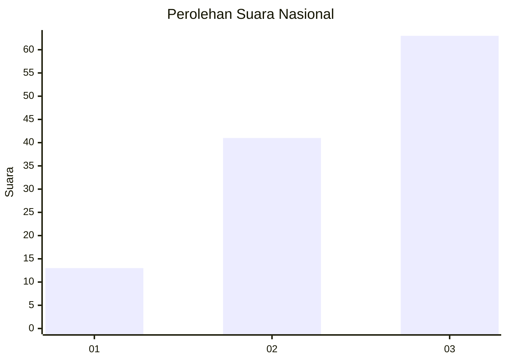
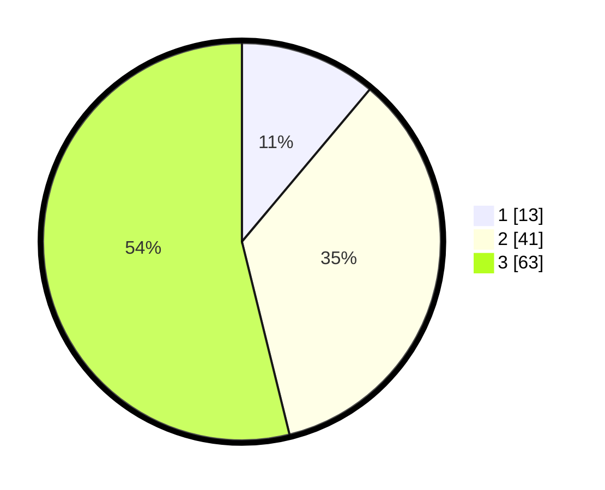

# Hasil

## Grafik

## Tabel

| No. | Nama Paslon    | Suara | Suara (raw) | Persentase |
|:--- |:-------------- | -----:| -----------:| ----------:|
| 1   | ANIES MUHAIMIN | 13    | [13][p-1]   | 11,11      |
| 2   | PRABOWO GIBRAN | 41    | [41][p-2]   | 35,04      |
| 3   | GANJAR MAHFUD  | 63    | [63][p-3]   | 53,85      |

[p-1]: https://github.com/gigit-pemilu/pemilu-2024/blob/main/pilpres/hitung-suara/sub/53-nusa-tenggara-timur/sub/06-flores-timur/sub/10-adonara-timur/sub/2003-dawataa/sub/001-tps/sub/paslon-1.txt
[p-2]: https://github.com/gigit-pemilu/pemilu-2024/blob/main/pilpres/hitung-suara/sub/53-nusa-tenggara-timur/sub/06-flores-timur/sub/10-adonara-timur/sub/2003-dawataa/sub/001-tps/sub/paslon-2.txt
[p-3]: https://github.com/gigit-pemilu/pemilu-2024/blob/main/pilpres/hitung-suara/sub/53-nusa-tenggara-timur/sub/06-flores-timur/sub/10-adonara-timur/sub/2003-dawataa/sub/001-tps/sub/paslon-3.txt

## Foto C Plano

https://sirekap-obj-formc.kpu.go.id/5d75/pemilu/ppwp/53/06/10/20/03/5306102003001-20240215-054329--70fc8c57-8f8e-40a9-be99-95c43dc873ce.jpg

https://sirekap-obj-formc.kpu.go.id/5d75/pemilu/ppwp/53/06/10/20/03/5306102003001-20240215-054420--882e8374-95ea-4c30-ad42-0d69ca3e0b45.jpg

https://sirekap-obj-formc.kpu.go.id/5d75/pemilu/ppwp/53/06/10/20/03/5306102003001-20240215-054438--635bea5c-564d-4d82-9dfe-c7971a8dc017.jpg

## Metadata

| Key        | Value               |
| ---------- | ------------------- |
| Time Stamp | 2024-02-16 21:01:00 |

