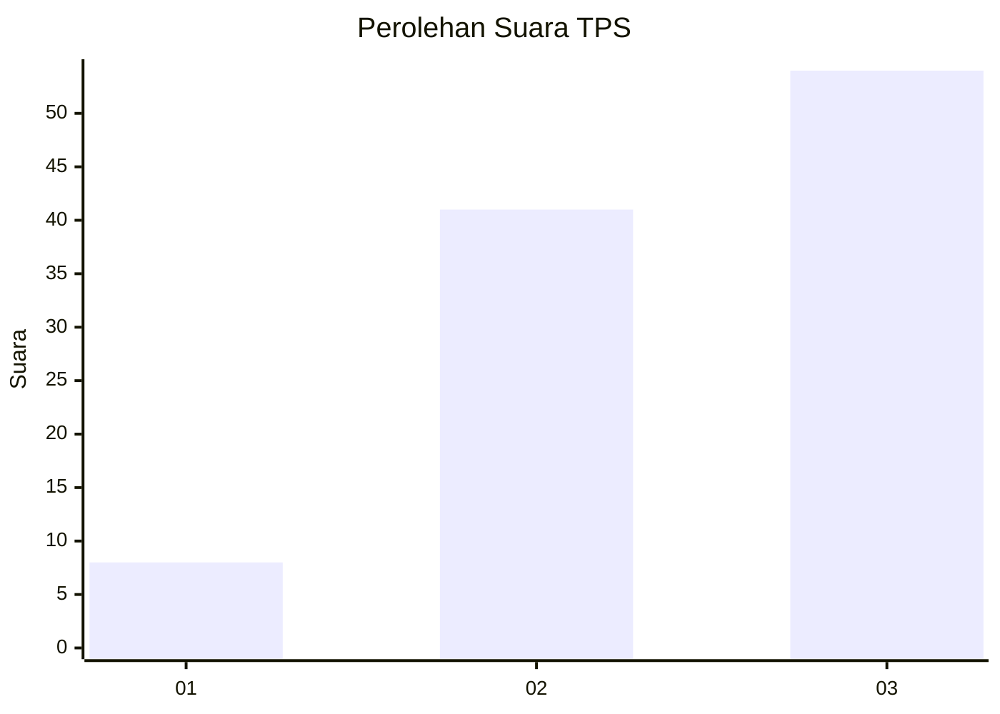
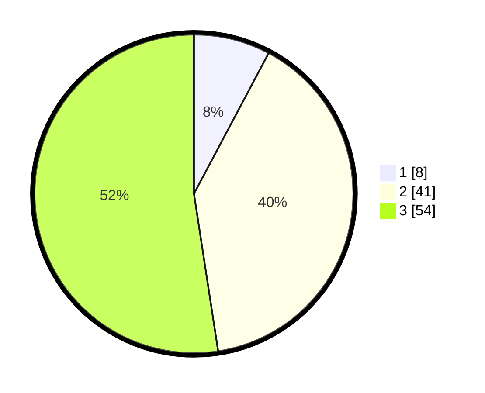

# Hasil

## Grafik

## Tabel

| No. | Nama Paslon    | Suara | Suara (raw) | Persentase |
|:--- |:-------------- | -----:| -----------:| ----------:|
| 1   | ANIES MUHAIMIN | 8     | [8][p-1]    | 7,77       |
| 2   | PRABOWO GIBRAN | 41    | [41][p-2]   | 39,81      |
| 3   | GANJAR MAHFUD  | 54    | [54][p-3]   | 52,43      |

[p-1]: https://github.com/gigit-pemilu/pemilu-2024-53-nusa-tenggara-timur/blob/main/pilpres/hitung-suara/sub/53-nusa-tenggara-timur/sub/06-flores-timur/sub/10-adonara-timur/sub/2003-dawataa/sub/002-tps/sub/paslon-1.txt
[p-2]: https://github.com/gigit-pemilu/pemilu-2024-53-nusa-tenggara-timur/blob/main/pilpres/hitung-suara/sub/53-nusa-tenggara-timur/sub/06-flores-timur/sub/10-adonara-timur/sub/2003-dawataa/sub/002-tps/sub/paslon-2.txt
[p-3]: https://github.com/gigit-pemilu/pemilu-2024-53-nusa-tenggara-timur/blob/main/pilpres/hitung-suara/sub/53-nusa-tenggara-timur/sub/06-flores-timur/sub/10-adonara-timur/sub/2003-dawataa/sub/002-tps/sub/paslon-3.txt

## Foto C Plano

https://sirekap-obj-formc.kpu.go.id/6927/pemilu/ppwp/53/06/10/20/03/5306102003002-20240215-030328--d102712a-749c-4e7c-a1b1-25199b8463b5.jpg

https://sirekap-obj-formc.kpu.go.id/6927/pemilu/ppwp/53/06/10/20/03/5306102003002-20240215-030347--13bc84eb-3458-4d14-b61c-138e241e7f5e.jpg

https://sirekap-obj-formc.kpu.go.id/6927/pemilu/ppwp/53/06/10/20/03/5306102003002-20240215-030408--62f769ce-e18b-48b7-aaa0-7fc4ce140ba4.jpg

## Metadata

| Key        | Value               |
| ---------- | ------------------- |
| Time Stamp | 2024-02-25 12:00:00 |

