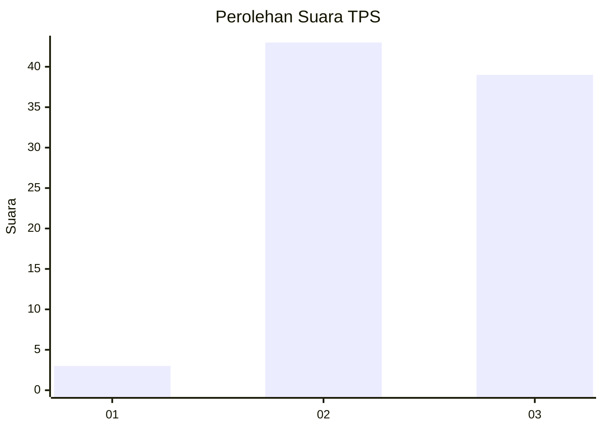
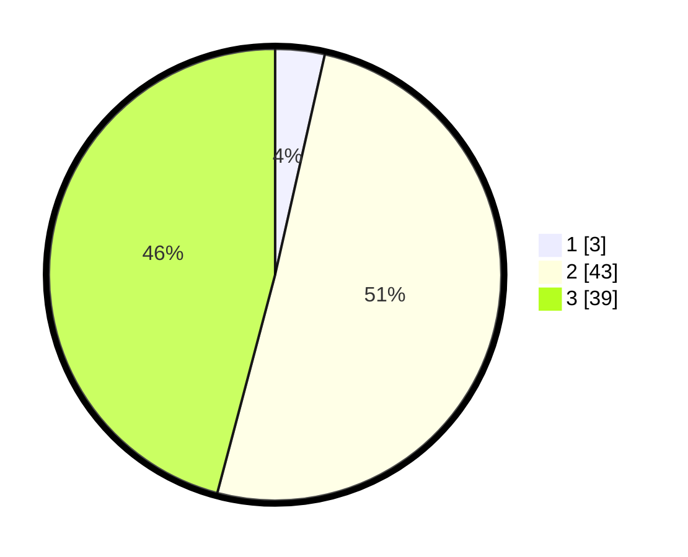

# Hasil

## Grafik

## Tabel

| No. | Nama Paslon    | Suara | Suara (raw) | Persentase |
|:--- |:-------------- | -----:| -----------:| ----------:|
| 1   | ANIES MUHAIMIN | 3     | [3][p-1]    | 3,53       |
| 2   | PRABOWO GIBRAN | 43    | [43][p-2]   | 50,59      |
| 3   | GANJAR MAHFUD  | 39    | [39][p-3]   | 45,88      |

[p-1]: https://github.com/gigit-pemilu/pemilu-2024-53-nusa-tenggara-timur/blob/main/pilpres/hitung-suara/sub/53-nusa-tenggara-timur/sub/06-flores-timur/sub/10-adonara-timur/sub/2008-narasaosina/sub/003-tps/sub/paslon-1.txt
[p-2]: https://github.com/gigit-pemilu/pemilu-2024-53-nusa-tenggara-timur/blob/main/pilpres/hitung-suara/sub/53-nusa-tenggara-timur/sub/06-flores-timur/sub/10-adonara-timur/sub/2008-narasaosina/sub/003-tps/sub/paslon-2.txt
[p-3]: https://github.com/gigit-pemilu/pemilu-2024-53-nusa-tenggara-timur/blob/main/pilpres/hitung-suara/sub/53-nusa-tenggara-timur/sub/06-flores-timur/sub/10-adonara-timur/sub/2008-narasaosina/sub/003-tps/sub/paslon-3.txt

## Foto C Plano

https://sirekap-obj-formc.kpu.go.id/46c3/pemilu/ppwp/53/06/10/20/08/5306102008003-20240215-012531--73152f3e-6592-4d86-a1b1-4a71e082f01b.jpg

https://sirekap-obj-formc.kpu.go.id/46c3/pemilu/ppwp/53/06/10/20/08/5306102008003-20240215-012743--d534e3a4-7100-4e65-83bb-e3d95f38f2c5.jpg

https://sirekap-obj-formc.kpu.go.id/46c3/pemilu/ppwp/53/06/10/20/08/5306102008003-20240215-013031--423070ca-9e72-43fb-b9a2-36a3bfbd97dd.jpg

## Metadata

| Key        | Value               |
| ---------- | ------------------- |
| Time Stamp | 2024-02-25 21:00:00 |

