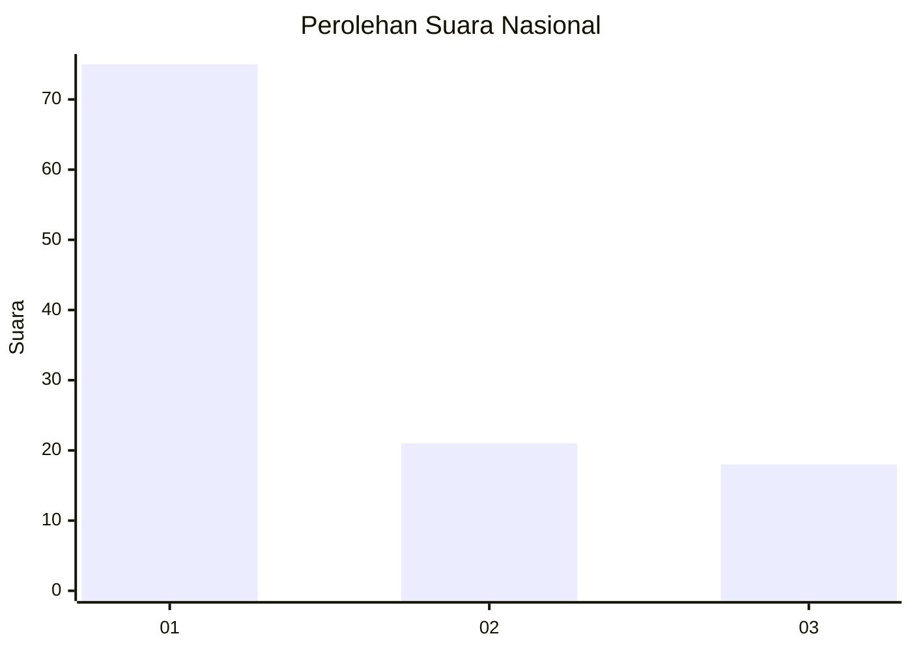
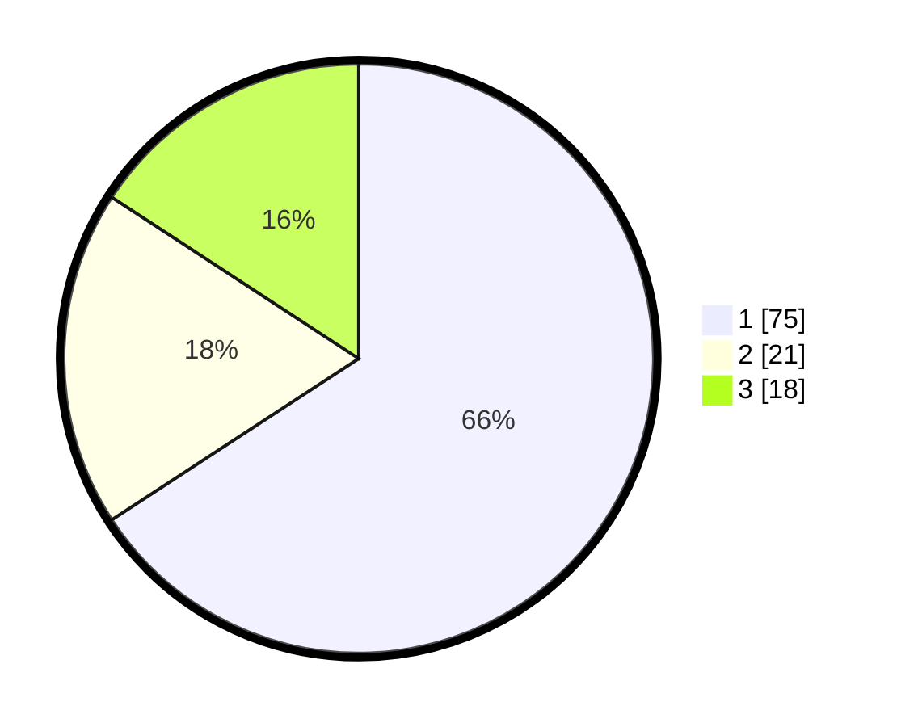

# Hasil

## Grafik

## Tabel

| No. | Nama Paslon    | Suara | Suara (raw) | Persentase |
|:--- |:-------------- | -----:| -----------:| ----------:|
| 1   | ANIES MUHAIMIN | 75    | [75][p-1]   | 65,79      |
| 2   | PRABOWO GIBRAN | 21    | [21][p-2]   | 18,42      |
| 3   | GANJAR MAHFUD  | 18    | [18][p-3]   | 15,79      |

[p-1]: https://github.com/gigit-pemilu/pemilu-2024/blob/main/pilpres/hitung-suara/sub/53-nusa-tenggara-timur/sub/06-flores-timur/sub/10-adonara-timur/sub/2015-ipi-ebang/sub/002-tps/sub/paslon-1.txt
[p-2]: https://github.com/gigit-pemilu/pemilu-2024/blob/main/pilpres/hitung-suara/sub/53-nusa-tenggara-timur/sub/06-flores-timur/sub/10-adonara-timur/sub/2015-ipi-ebang/sub/002-tps/sub/paslon-2.txt
[p-3]: https://github.com/gigit-pemilu/pemilu-2024/blob/main/pilpres/hitung-suara/sub/53-nusa-tenggara-timur/sub/06-flores-timur/sub/10-adonara-timur/sub/2015-ipi-ebang/sub/002-tps/sub/paslon-3.txt

## Foto C Plano

https://sirekap-obj-formc.kpu.go.id/6e38/pemilu/ppwp/53/06/10/20/15/5306102015002-20240214-232752--83c383e0-73cb-4f07-82c8-eedaebc2416f.jpg

https://sirekap-obj-formc.kpu.go.id/6e38/pemilu/ppwp/53/06/10/20/15/5306102015002-20240215-031533--233b2d80-5ebd-4131-b6ae-8dd112002b6d.jpg

https://sirekap-obj-formc.kpu.go.id/6e38/pemilu/ppwp/53/06/10/20/15/5306102015002-20240215-024501--87a97105-674e-4b4c-9b08-6538e8a7628a.jpg

## Metadata

| Key        | Value               |
| ---------- | ------------------- |
| Time Stamp | 2024-02-24 22:31:28 |

