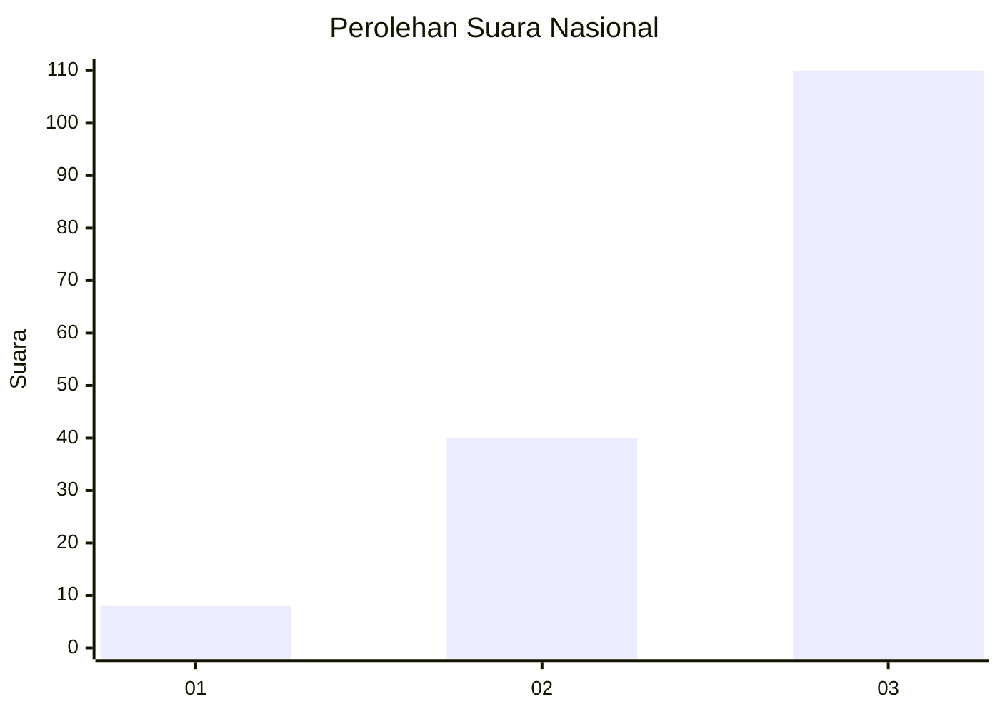
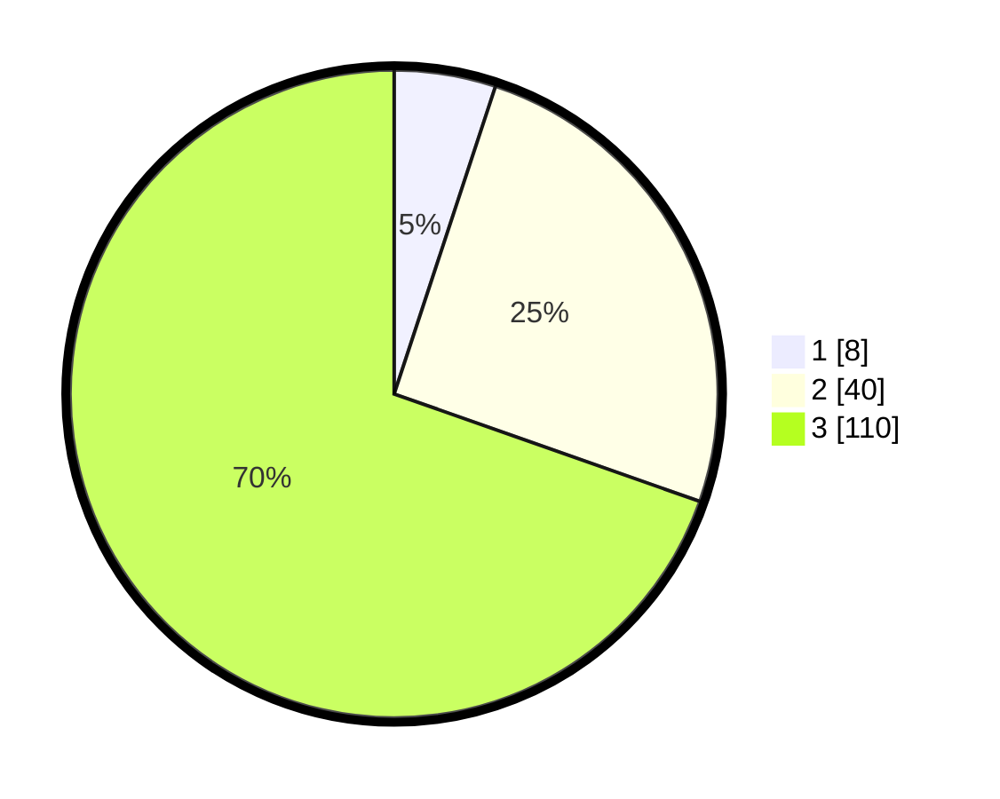

# Hasil

## Grafik

## Tabel

| No. | Nama Paslon    | Suara | Suara (raw) | Persentase |
|:--- |:-------------- | -----:| -----------:| ----------:|
| 1   | ANIES MUHAIMIN | 8     | [8][p-1]    | 5,06       |
| 2   | PRABOWO GIBRAN | 40    | [40][p-2]   | 25,32      |
| 3   | GANJAR MAHFUD  | 110   | [110][p-3]  | 69,62      |

[p-1]: https://github.com/gigit-pemilu/pemilu-2024/blob/main/pilpres/hitung-suara/sub/53-nusa-tenggara-timur/sub/06-flores-timur/sub/12-witihama/sub/2002-tuagoetobi/sub/004-tps/sub/paslon-1.txt
[p-2]: https://github.com/gigit-pemilu/pemilu-2024/blob/main/pilpres/hitung-suara/sub/53-nusa-tenggara-timur/sub/06-flores-timur/sub/12-witihama/sub/2002-tuagoetobi/sub/004-tps/sub/paslon-2.txt
[p-3]: https://github.com/gigit-pemilu/pemilu-2024/blob/main/pilpres/hitung-suara/sub/53-nusa-tenggara-timur/sub/06-flores-timur/sub/12-witihama/sub/2002-tuagoetobi/sub/004-tps/sub/paslon-3.txt

## Foto C Plano

https://sirekap-obj-formc.kpu.go.id/6805/pemilu/ppwp/53/06/12/20/02/5306122002004-20240214-231320--f9658056-3216-495a-88f7-93fa385e4a7f.jpg

https://sirekap-obj-formc.kpu.go.id/6805/pemilu/ppwp/53/06/12/20/02/5306122002004-20240216-135326--488b5ef8-ddfc-4fd3-b010-b2335d52d691.jpg

https://sirekap-obj-formc.kpu.go.id/6805/pemilu/ppwp/53/06/12/20/02/5306122002004-20240215-011506--8b0547dd-05b5-47f0-9abe-8408d92f1890.jpg

## Metadata

| Key        | Value               |
| ---------- | ------------------- |
| Time Stamp | 2024-02-24 22:31:28 |

