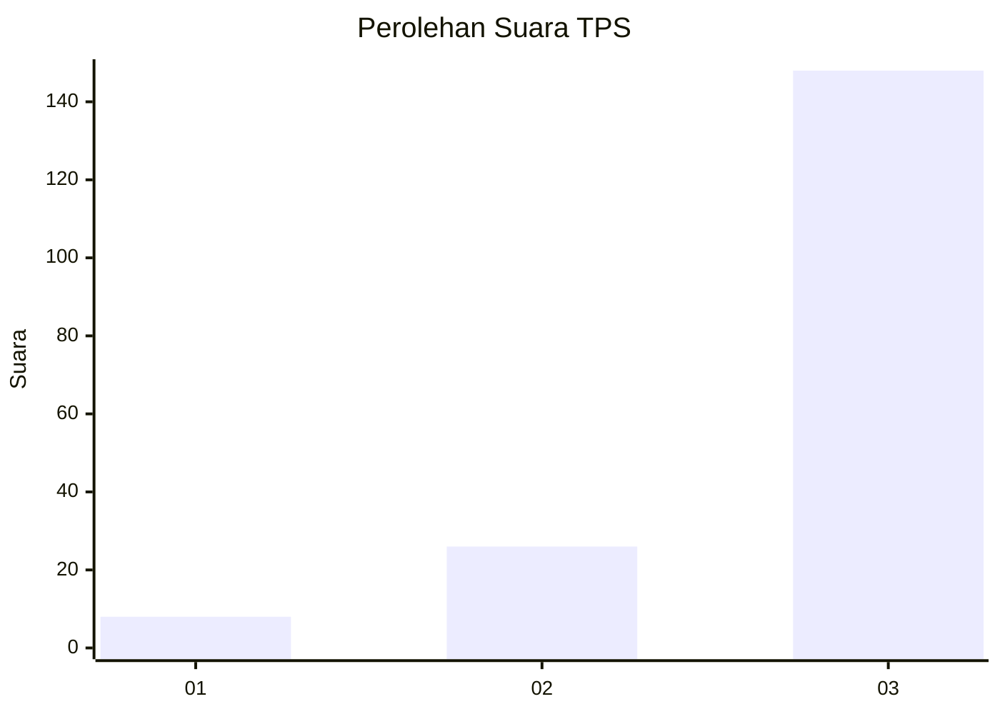
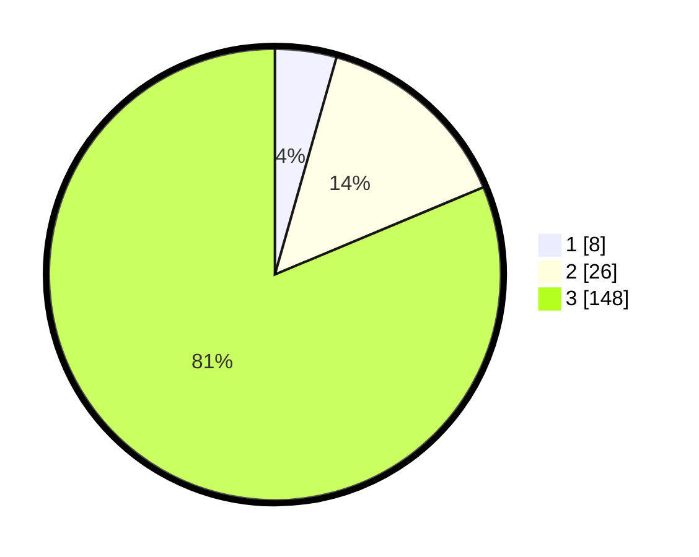

# Hasil

## Grafik

## Tabel

| No. | Nama Paslon    | Suara | Suara (raw) | Persentase |
|:--- |:-------------- | -----:| -----------:| ----------:|
| 1   | ANIES MUHAIMIN | 8     | [8][p-1]    | 4,40       |
| 2   | PRABOWO GIBRAN | 26    | [26][p-2]   | 14,29      |
| 3   | GANJAR MAHFUD  | 148   | [148][p-3]  | 81,32      |

[p-1]: https://github.com/gigit-pemilu/pemilu-2024-53-nusa-tenggara-timur/blob/main/pilpres/hitung-suara/sub/53-nusa-tenggara-timur/sub/06-flores-timur/sub/12-witihama/sub/2005-watoone/sub/002-tps/sub/paslon-1.txt
[p-2]: https://github.com/gigit-pemilu/pemilu-2024-53-nusa-tenggara-timur/blob/main/pilpres/hitung-suara/sub/53-nusa-tenggara-timur/sub/06-flores-timur/sub/12-witihama/sub/2005-watoone/sub/002-tps/sub/paslon-2.txt
[p-3]: https://github.com/gigit-pemilu/pemilu-2024-53-nusa-tenggara-timur/blob/main/pilpres/hitung-suara/sub/53-nusa-tenggara-timur/sub/06-flores-timur/sub/12-witihama/sub/2005-watoone/sub/002-tps/sub/paslon-3.txt

## Foto C Plano

https://sirekap-obj-formc.kpu.go.id/a8e2/pemilu/ppwp/53/06/12/20/05/5306122005002-20240215-025142--972d69e4-bc42-4719-9487-0283d59c4ec0.jpg

https://sirekap-obj-formc.kpu.go.id/a8e2/pemilu/ppwp/53/06/12/20/05/5306122005002-20240216-121717--2c19f36c-3199-47d6-a7ef-236aebfbd2e3.jpg

https://sirekap-obj-formc.kpu.go.id/a8e2/pemilu/ppwp/53/06/12/20/05/5306122005002-20240216-121712--e8e2eb39-6022-4696-84b0-961cd58a1e58.jpg

## Metadata

| Key        | Value               |
| ---------- | ------------------- |
| Time Stamp | 2024-02-21 22:00:00 |

