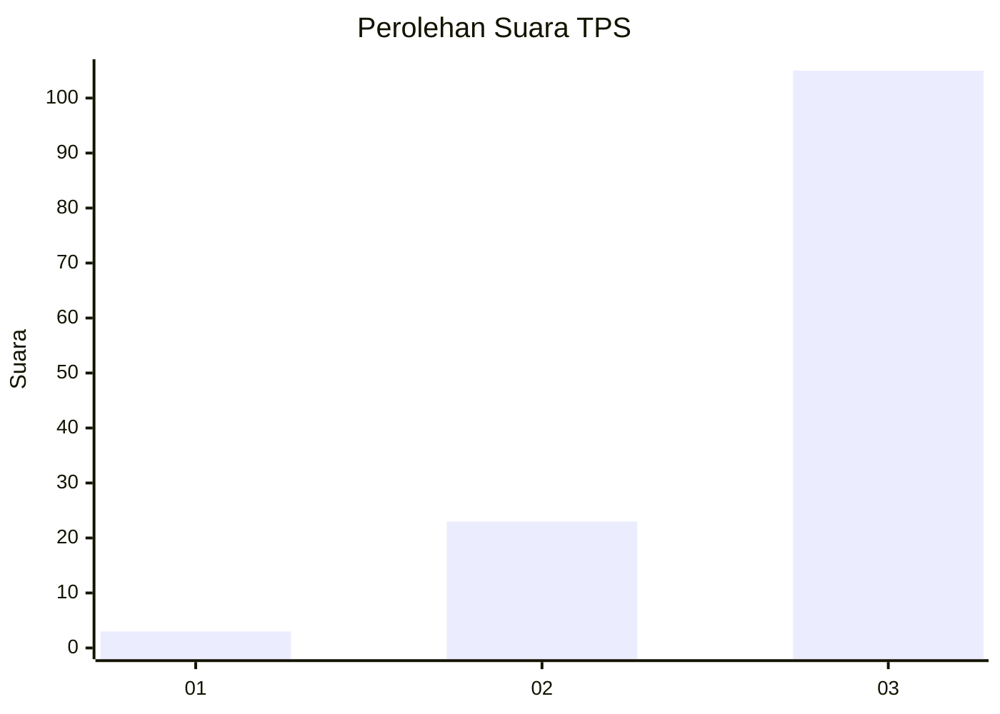
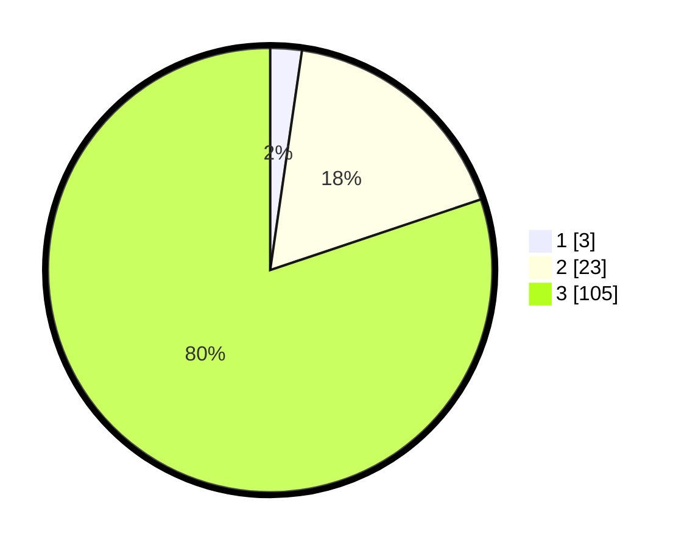

# Hasil

## Grafik

## Tabel

| No. | Nama Paslon    | Suara | Suara (raw) | Persentase |
|:--- |:-------------- | -----:| -----------:| ----------:|
| 1   | ANIES MUHAIMIN | 3     | [3][p-1]    | 2,29       |
| 2   | PRABOWO GIBRAN | 23    | [23][p-2]   | 17,56      |
| 3   | GANJAR MAHFUD  | 105   | [105][p-3]  | 80,15      |

[p-1]: https://github.com/gigit-pemilu/pemilu-2024-53-nusa-tenggara-timur/blob/main/pilpres/hitung-suara/sub/53-nusa-tenggara-timur/sub/06-flores-timur/sub/12-witihama/sub/2005-watoone/sub/006-tps/sub/paslon-1.txt
[p-2]: https://github.com/gigit-pemilu/pemilu-2024-53-nusa-tenggara-timur/blob/main/pilpres/hitung-suara/sub/53-nusa-tenggara-timur/sub/06-flores-timur/sub/12-witihama/sub/2005-watoone/sub/006-tps/sub/paslon-2.txt
[p-3]: https://github.com/gigit-pemilu/pemilu-2024-53-nusa-tenggara-timur/blob/main/pilpres/hitung-suara/sub/53-nusa-tenggara-timur/sub/06-flores-timur/sub/12-witihama/sub/2005-watoone/sub/006-tps/sub/paslon-3.txt

## Foto C Plano

https://sirekap-obj-formc.kpu.go.id/6710/pemilu/ppwp/53/06/12/20/05/5306122005006-20240214-233050--6aa6f738-912f-4076-a1d5-ca2f5870d317.jpg

https://sirekap-obj-formc.kpu.go.id/6710/pemilu/ppwp/53/06/12/20/05/5306122005006-20240214-235701--18017ca7-9858-408f-99be-186cc63b0870.jpg

https://sirekap-obj-formc.kpu.go.id/6710/pemilu/ppwp/53/06/12/20/05/5306122005006-20240214-235951--57db7ca8-b9dc-4cd5-ab0d-ac850bc62cbe.jpg

## Metadata

| Key        | Value               |
| ---------- | ------------------- |
| Time Stamp | 2024-02-24 22:31:28 |

