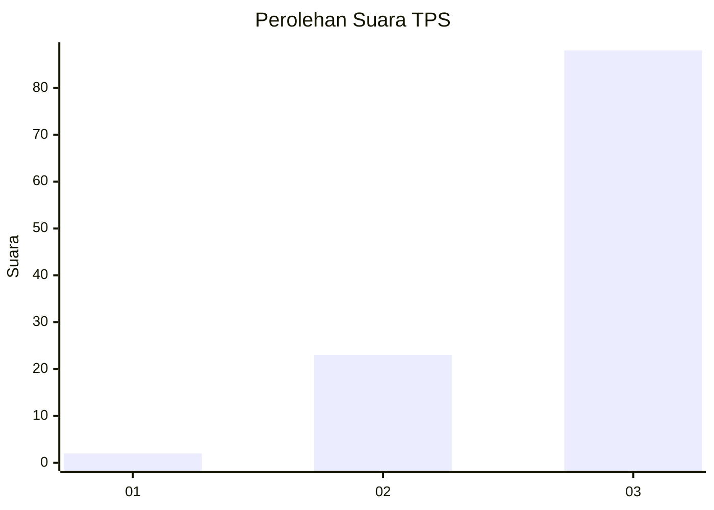
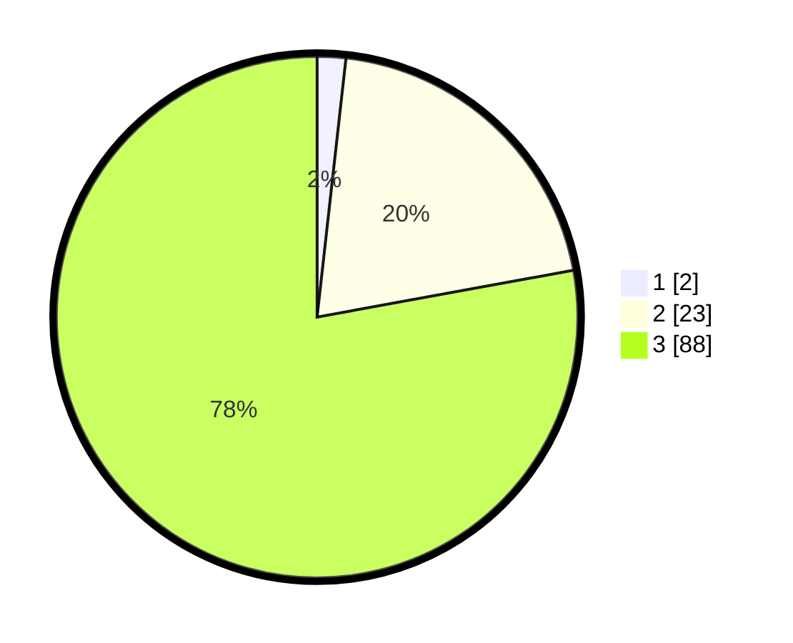

# Hasil

## Grafik

## Tabel

| No. | Nama Paslon    | Suara | Suara (raw) | Persentase |
|:--- |:-------------- | -----:| -----------:| ----------:|
| 1   | ANIES MUHAIMIN | 2     | [2][p-1]    | 1,77       |
| 2   | PRABOWO GIBRAN | 23    | [23][p-2]   | 20,35      |
| 3   | GANJAR MAHFUD  | 88    | [88][p-3]   | 77,88      |

[p-1]: https://github.com/gigit-pemilu/pemilu-2024-53-nusa-tenggara-timur/blob/main/pilpres/hitung-suara/sub/53-nusa-tenggara-timur/sub/06-flores-timur/sub/12-witihama/sub/2007-pledo/sub/006-tps/sub/paslon-1.txt
[p-2]: https://github.com/gigit-pemilu/pemilu-2024-53-nusa-tenggara-timur/blob/main/pilpres/hitung-suara/sub/53-nusa-tenggara-timur/sub/06-flores-timur/sub/12-witihama/sub/2007-pledo/sub/006-tps/sub/paslon-2.txt
[p-3]: https://github.com/gigit-pemilu/pemilu-2024-53-nusa-tenggara-timur/blob/main/pilpres/hitung-suara/sub/53-nusa-tenggara-timur/sub/06-flores-timur/sub/12-witihama/sub/2007-pledo/sub/006-tps/sub/paslon-3.txt

## Foto C Plano

https://sirekap-obj-formc.kpu.go.id/a0f8/pemilu/ppwp/53/06/12/20/07/5306122007006-20240229-203234--9a0080b3-ff12-4fc4-acdc-9b02ee60289c.jpg

https://sirekap-obj-formc.kpu.go.id/a0f8/pemilu/ppwp/53/06/12/20/07/5306122007006-20240215-220138--b1d0ef79-dc5b-4963-9295-f9400700dabe.jpg

https://sirekap-obj-formc.kpu.go.id/a0f8/pemilu/ppwp/53/06/12/20/07/5306122007006-20240215-220304--bfbe3e87-6039-427b-bea0-414776145cbe.jpg

## Metadata

| Key        | Value               |
| ---------- | ------------------- |
| Time Stamp | 2024-02-29 21:00:00 |

