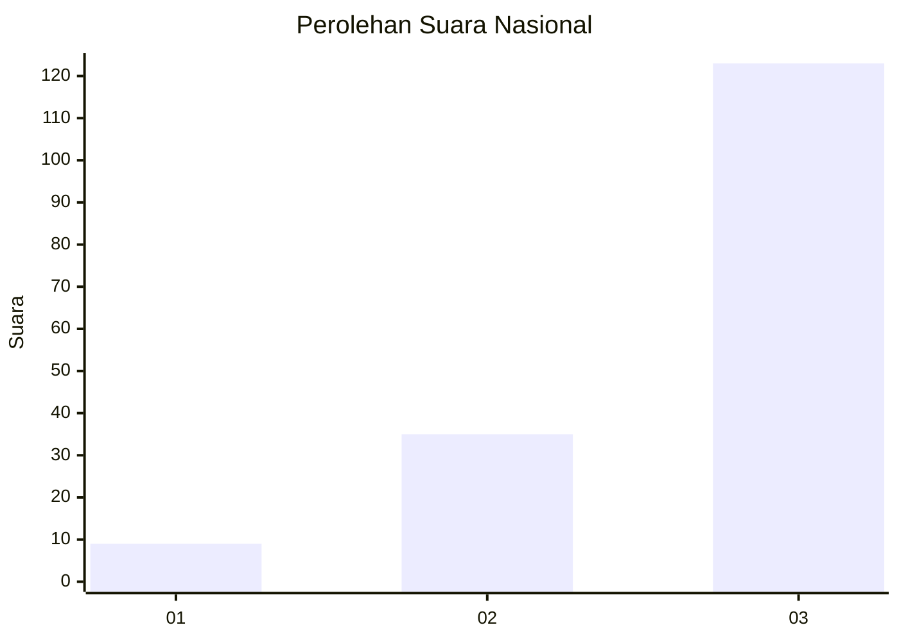
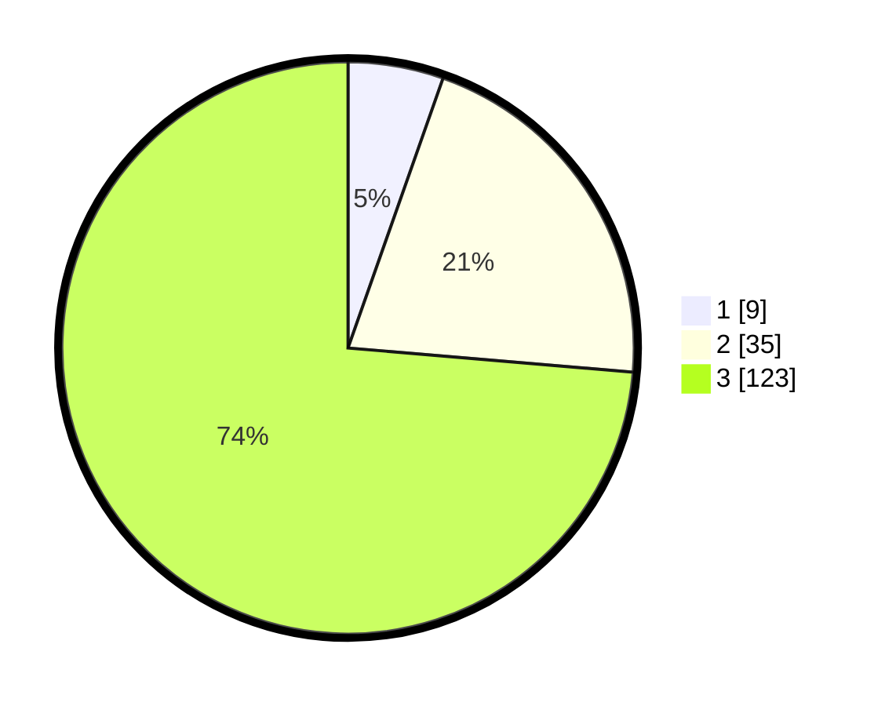

# Hasil

## Grafik

## Tabel

| No. | Nama Paslon    | Suara | Suara (raw) | Persentase |
|:--- |:-------------- | -----:| -----------:| ----------:|
| 1   | ANIES MUHAIMIN | 9     | [9][p-1]    | 5,39       |
| 2   | PRABOWO GIBRAN | 35    | [35][p-2]   | 20,96      |
| 3   | GANJAR MAHFUD  | 123   | [123][p-3]  | 73,65      |

[p-1]: https://github.com/gigit-pemilu/pemilu-2024/blob/main/pilpres/hitung-suara/sub/53-nusa-tenggara-timur/sub/06-flores-timur/sub/12-witihama/sub/2009-sandosi/sub/001-tps/sub/paslon-1.txt
[p-2]: https://github.com/gigit-pemilu/pemilu-2024/blob/main/pilpres/hitung-suara/sub/53-nusa-tenggara-timur/sub/06-flores-timur/sub/12-witihama/sub/2009-sandosi/sub/001-tps/sub/paslon-2.txt
[p-3]: https://github.com/gigit-pemilu/pemilu-2024/blob/main/pilpres/hitung-suara/sub/53-nusa-tenggara-timur/sub/06-flores-timur/sub/12-witihama/sub/2009-sandosi/sub/001-tps/sub/paslon-3.txt

## Foto C Plano

https://sirekap-obj-formc.kpu.go.id/9437/pemilu/ppwp/53/06/12/20/09/5306122009001-20240215-011628--c9e31721-993a-4e89-96da-e85c2436a203.jpg

https://sirekap-obj-formc.kpu.go.id/9437/pemilu/ppwp/53/06/12/20/09/5306122009001-20240215-024307--1569e83e-ca0a-4181-b0d1-61cf6716bbdf.jpg

https://sirekap-obj-formc.kpu.go.id/9437/pemilu/ppwp/53/06/12/20/09/5306122009001-20240214-231129--cfbbb302-35ef-418b-a151-9729d122b337.jpg

## Metadata

| Key        | Value               |
| ---------- | ------------------- |
| Time Stamp | 2024-02-25 13:00:00 |

