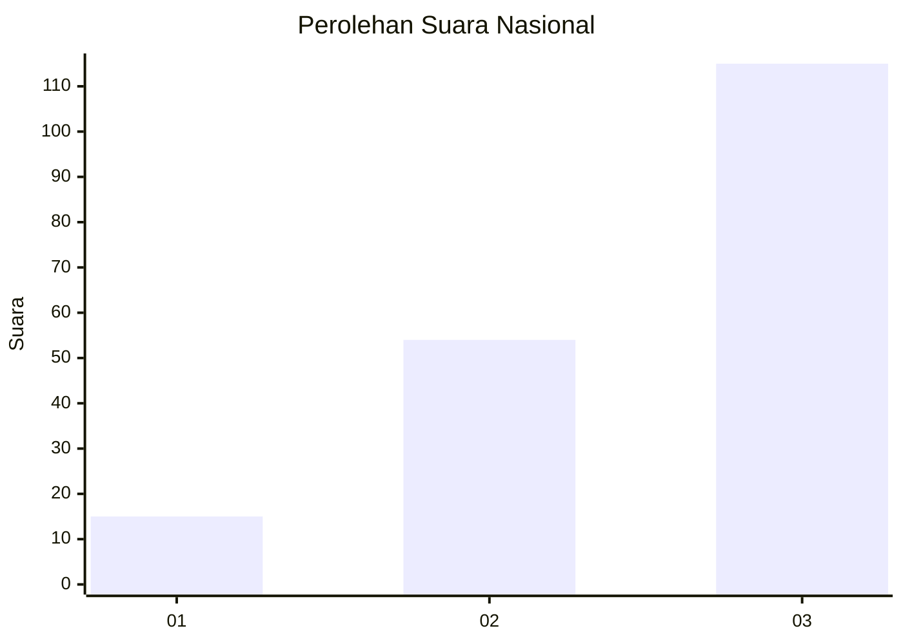
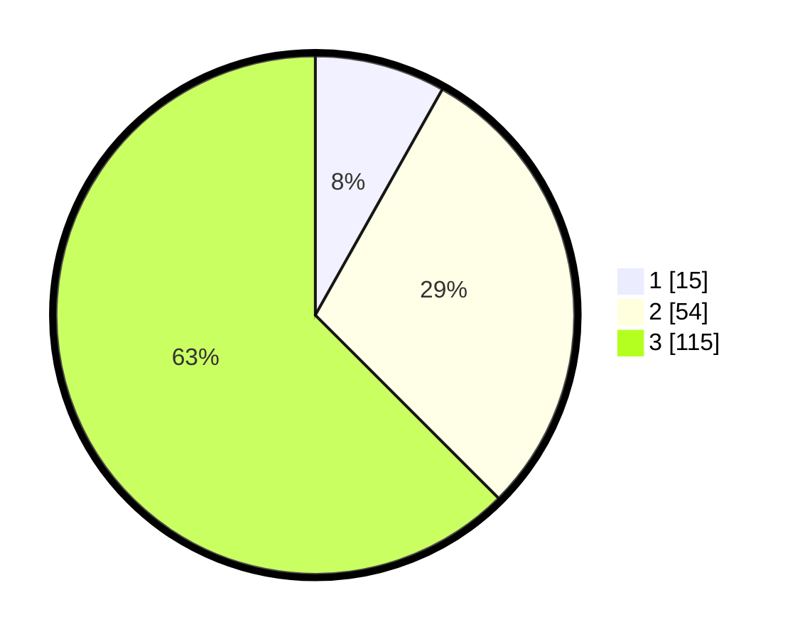

# Hasil

## Grafik

## Tabel

| No. | Nama Paslon    | Suara | Suara (raw) | Persentase |
|:--- |:-------------- | -----:| -----------:| ----------:|
| 1   | ANIES MUHAIMIN | 15    | [15][p-1]   | 8,15       |
| 2   | PRABOWO GIBRAN | 54    | [54][p-2]   | 29,35      |
| 3   | GANJAR MAHFUD  | 115   | [115][p-3]  | 62,50      |

[p-1]: https://github.com/gigit-pemilu/pemilu-2024/blob/main/pilpres/hitung-suara/sub/53-nusa-tenggara-timur/sub/06-flores-timur/sub/19-solor-selatan/sub/2001-kelike/sub/001-tps/sub/paslon-1.txt
[p-2]: https://github.com/gigit-pemilu/pemilu-2024/blob/main/pilpres/hitung-suara/sub/53-nusa-tenggara-timur/sub/06-flores-timur/sub/19-solor-selatan/sub/2001-kelike/sub/001-tps/sub/paslon-2.txt
[p-3]: https://github.com/gigit-pemilu/pemilu-2024/blob/main/pilpres/hitung-suara/sub/53-nusa-tenggara-timur/sub/06-flores-timur/sub/19-solor-selatan/sub/2001-kelike/sub/001-tps/sub/paslon-3.txt

## Foto C Plano

https://sirekap-obj-formc.kpu.go.id/b496/pemilu/ppwp/53/06/19/20/01/5306192001001-20240301-145713--e2ca2586-5fdd-4dbe-8792-03101db4ca06.jpg

https://sirekap-obj-formc.kpu.go.id/b496/pemilu/ppwp/53/06/19/20/01/5306192001001-20240215-083142--c48a8728-abe0-48ac-a216-92b7e8ffb91e.jpg

https://sirekap-obj-formc.kpu.go.id/b496/pemilu/ppwp/53/06/19/20/01/5306192001001-20240215-083340--d2510ccb-ca4b-49ef-87cc-fde55d8a99b5.jpg

## Metadata

| Key        | Value               |
| ---------- | ------------------- |
| Time Stamp | 2024-03-01 15:00:00 |

