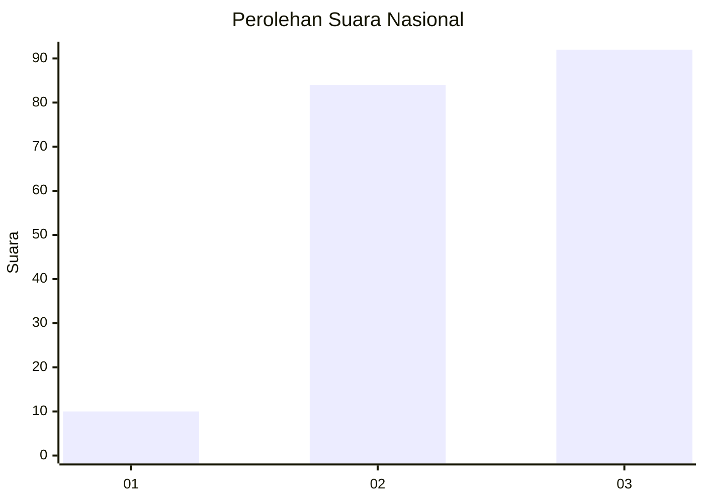
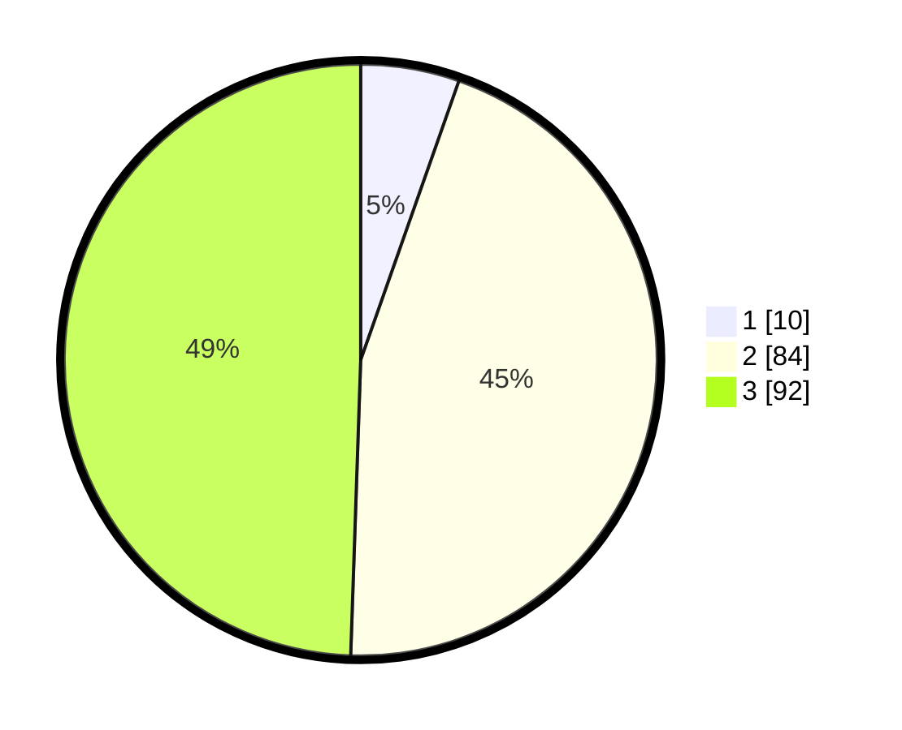

# Hasil

## Grafik

## Tabel

| No. | Nama Paslon    | Suara | Suara (raw) | Persentase |
|:--- |:-------------- | -----:| -----------:| ----------:|
| 1   | ANIES MUHAIMIN | 10    | [10][p-1]   | 5,38       |
| 2   | PRABOWO GIBRAN | 84    | [84][p-2]   | 45,16      |
| 3   | GANJAR MAHFUD  | 92    | [92][p-3]   | 49,46      |

[p-1]: https://github.com/gigit-pemilu/pemilu-2024/blob/main/pilpres/hitung-suara/sub/53-nusa-tenggara-timur/sub/06-flores-timur/sub/19-solor-selatan/sub/2003-sulengwaseng/sub/001-tps/sub/paslon-1.txt
[p-2]: https://github.com/gigit-pemilu/pemilu-2024/blob/main/pilpres/hitung-suara/sub/53-nusa-tenggara-timur/sub/06-flores-timur/sub/19-solor-selatan/sub/2003-sulengwaseng/sub/001-tps/sub/paslon-2.txt
[p-3]: https://github.com/gigit-pemilu/pemilu-2024/blob/main/pilpres/hitung-suara/sub/53-nusa-tenggara-timur/sub/06-flores-timur/sub/19-solor-selatan/sub/2003-sulengwaseng/sub/001-tps/sub/paslon-3.txt

## Foto C Plano

https://sirekap-obj-formc.kpu.go.id/fc02/pemilu/ppwp/53/06/19/20/03/5306192003001-20240215-122351--e6653d8d-1665-4c89-a109-9037d8e515bb.jpg

https://sirekap-obj-formc.kpu.go.id/fc02/pemilu/ppwp/53/06/19/20/03/5306192003001-20240215-134539--8b10f6e0-658f-4a5d-acc1-71f2ac185067.jpg

https://sirekap-obj-formc.kpu.go.id/fc02/pemilu/ppwp/53/06/19/20/03/5306192003001-20240215-134637--78dd0477-3be8-445f-b1f6-520dab14c54f.jpg

## Metadata

| Key        | Value               |
| ---------- | ------------------- |
| Time Stamp | 2024-02-19 06:16:00 |

