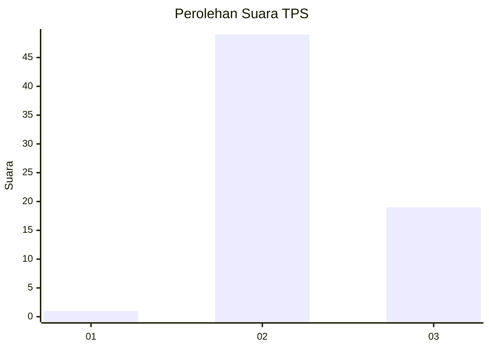
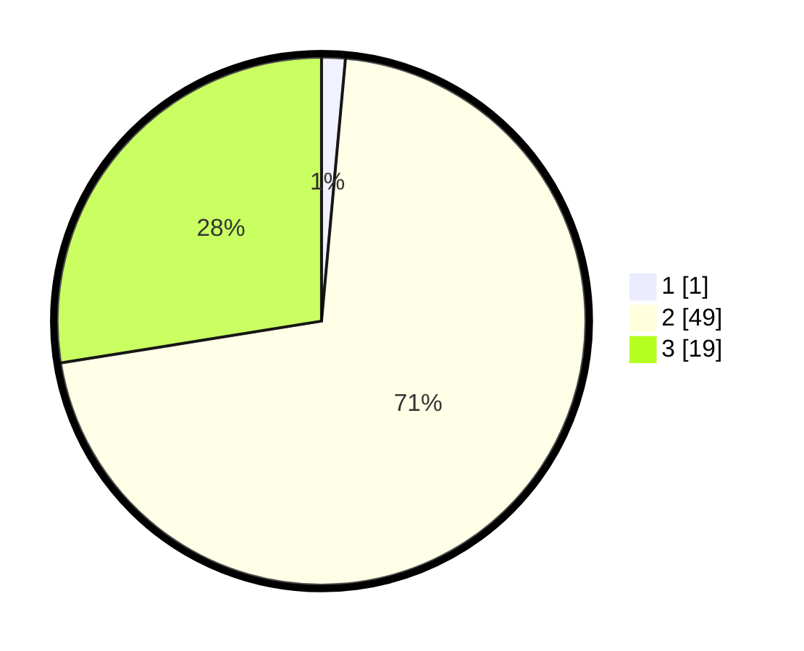

# Hasil

## Grafik

## Tabel

| No. | Nama Paslon    | Suara | Suara (raw) | Persentase |
|:--- |:-------------- | -----:| -----------:| ----------:|
| 1   | ANIES MUHAIMIN | 1     | [1][p-1]    | 1,45       |
| 2   | PRABOWO GIBRAN | 49    | [49][p-2]   | 71,01      |
| 3   | GANJAR MAHFUD  | 19    | [19][p-3]   | 27,54      |

[p-1]: https://github.com/gigit-pemilu/pemilu-2024-53-nusa-tenggara-timur/blob/main/pilpres/hitung-suara/sub/53-nusa-tenggara-timur/sub/06-flores-timur/sub/19-solor-selatan/sub/2003-sulengwaseng/sub/003-tps/sub/paslon-1.txt
[p-2]: https://github.com/gigit-pemilu/pemilu-2024-53-nusa-tenggara-timur/blob/main/pilpres/hitung-suara/sub/53-nusa-tenggara-timur/sub/06-flores-timur/sub/19-solor-selatan/sub/2003-sulengwaseng/sub/003-tps/sub/paslon-2.txt
[p-3]: https://github.com/gigit-pemilu/pemilu-2024-53-nusa-tenggara-timur/blob/main/pilpres/hitung-suara/sub/53-nusa-tenggara-timur/sub/06-flores-timur/sub/19-solor-selatan/sub/2003-sulengwaseng/sub/003-tps/sub/paslon-3.txt

## Foto C Plano

https://sirekap-obj-formc.kpu.go.id/5e16/pemilu/ppwp/53/06/19/20/03/5306192003003-20240215-094815--c6bf1efa-0c7e-4da7-aeba-f3609b6fbf17.jpg

https://sirekap-obj-formc.kpu.go.id/5e16/pemilu/ppwp/53/06/19/20/03/5306192003003-20240215-095322--e48d5c69-8633-4394-a968-1cd0cf070a14.jpg

https://sirekap-obj-formc.kpu.go.id/5e16/pemilu/ppwp/53/06/19/20/03/5306192003003-20240215-095630--824a19d6-2daf-47f6-bae6-1ec97d831ece.jpg

## Metadata

| Key        | Value               |
| ---------- | ------------------- |
| Time Stamp | 2024-02-19 06:16:00 |

