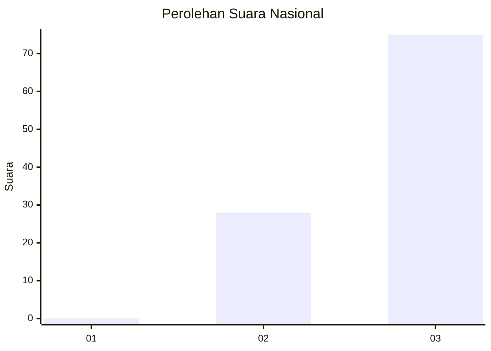
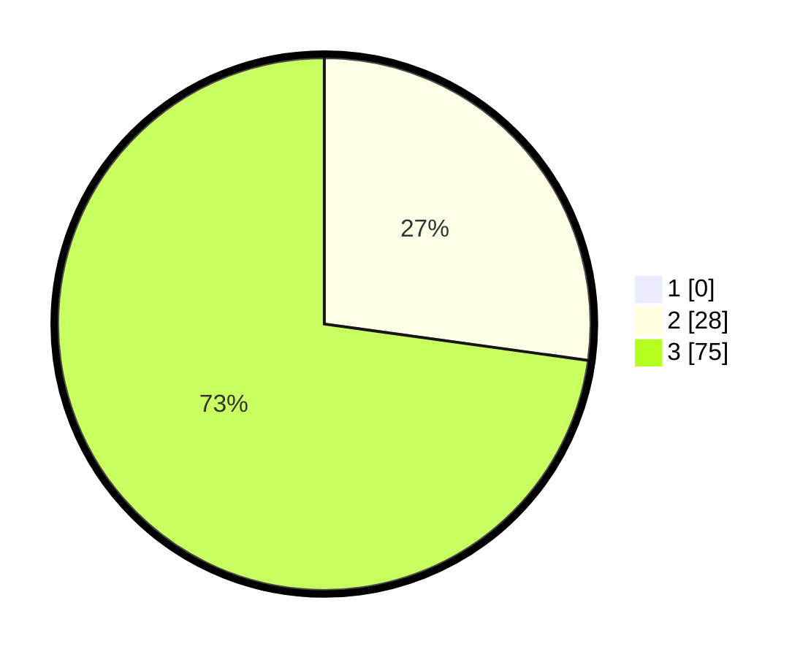

# Hasil

## Grafik

## Tabel

| No. | Nama Paslon    | Suara | Suara (raw) | Persentase |
|:--- |:-------------- | -----:| -----------:| ----------:|
| 1   | ANIES MUHAIMIN | 0     | [0][p-1]    | 0,00       |
| 2   | PRABOWO GIBRAN | 28    | [28][p-2]   | 27,18      |
| 3   | GANJAR MAHFUD  | 75    | [75][p-3]   | 72,82      |

[p-1]: https://github.com/gigit-pemilu/pemilu-2024/blob/main/pilpres/hitung-suara/sub/53-nusa-tenggara-timur/sub/06-flores-timur/sub/19-solor-selatan/sub/2007-bubuatagamu/sub/003-tps/sub/paslon-1.txt
[p-2]: https://github.com/gigit-pemilu/pemilu-2024/blob/main/pilpres/hitung-suara/sub/53-nusa-tenggara-timur/sub/06-flores-timur/sub/19-solor-selatan/sub/2007-bubuatagamu/sub/003-tps/sub/paslon-2.txt
[p-3]: https://github.com/gigit-pemilu/pemilu-2024/blob/main/pilpres/hitung-suara/sub/53-nusa-tenggara-timur/sub/06-flores-timur/sub/19-solor-selatan/sub/2007-bubuatagamu/sub/003-tps/sub/paslon-3.txt

## Foto C Plano

https://sirekap-obj-formc.kpu.go.id/3953/pemilu/ppwp/53/06/19/20/07/5306192007003-20240214-235110--25820d32-0ed2-4aa0-8998-b78efd1fa3bc.jpg

https://sirekap-obj-formc.kpu.go.id/3953/pemilu/ppwp/53/06/19/20/07/5306192007003-20240214-235826--2703dcf6-ab28-4fce-921b-2c603f462672.jpg

https://sirekap-obj-formc.kpu.go.id/3953/pemilu/ppwp/53/06/19/20/07/5306192007003-20240214-234304--3f9bfb7f-a5bd-41b5-8a4e-cf5a604be6ae.jpg

## Metadata

| Key        | Value               |
| ---------- | ------------------- |
| Time Stamp | 2024-02-19 06:16:00 |

