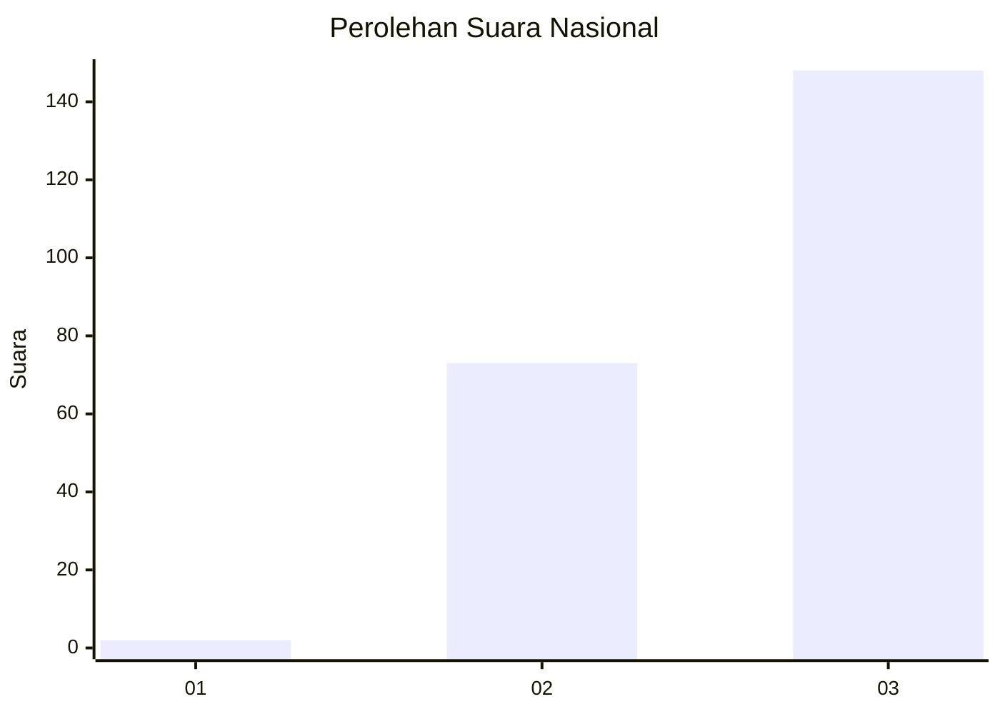
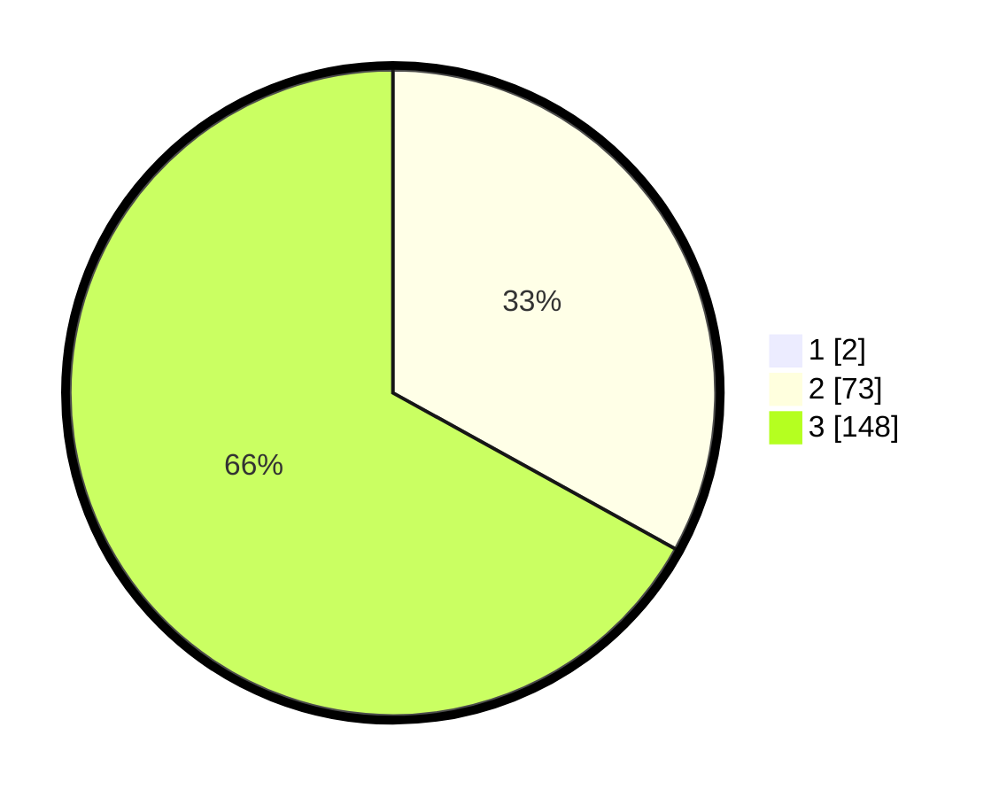

# Hasil

## Grafik

## Tabel

| No. | Nama Paslon    | Suara | Suara (raw) | Persentase |
|:--- |:-------------- | -----:| -----------:| ----------:|
| 1   | ANIES MUHAIMIN | 2     | [2][p-1]    | 0,90       |
| 2   | PRABOWO GIBRAN | 73    | [73][p-2]   | 32,74      |
| 3   | GANJAR MAHFUD  | 148   | [148][p-3]  | 66,37      |

[p-1]: https://github.com/gigit-pemilu/pemilu-2024/blob/main/pilpres/hitung-suara/sub/53-nusa-tenggara-timur/sub/07-sikka/sub/01-paga/sub/2001-masabewa/sub/004-tps/sub/paslon-1.txt
[p-2]: https://github.com/gigit-pemilu/pemilu-2024/blob/main/pilpres/hitung-suara/sub/53-nusa-tenggara-timur/sub/07-sikka/sub/01-paga/sub/2001-masabewa/sub/004-tps/sub/paslon-2.txt
[p-3]: https://github.com/gigit-pemilu/pemilu-2024/blob/main/pilpres/hitung-suara/sub/53-nusa-tenggara-timur/sub/07-sikka/sub/01-paga/sub/2001-masabewa/sub/004-tps/sub/paslon-3.txt

## Foto C Plano

https://sirekap-obj-formc.kpu.go.id/c327/pemilu/ppwp/53/07/01/20/01/5307012001004-20240215-135001--a2d03d53-fcf3-4a54-9d24-c37c1ac987e6.jpg

https://sirekap-obj-formc.kpu.go.id/c327/pemilu/ppwp/53/07/01/20/01/5307012001004-20240215-135206--4b29939c-149a-48b9-86e4-294b4a958349.jpg

https://sirekap-obj-formc.kpu.go.id/c327/pemilu/ppwp/53/07/01/20/01/5307012001004-20240215-181244--ea4fc0c2-8b4d-433c-9b09-58790ff3abf8.jpg

## Metadata

| Key        | Value               |
| ---------- | ------------------- |
| Time Stamp | 2024-02-16 09:30:28 |

