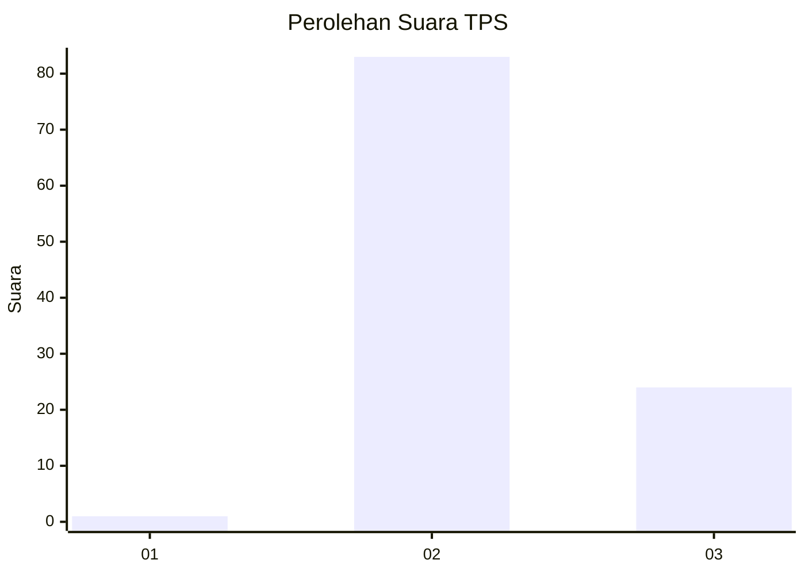
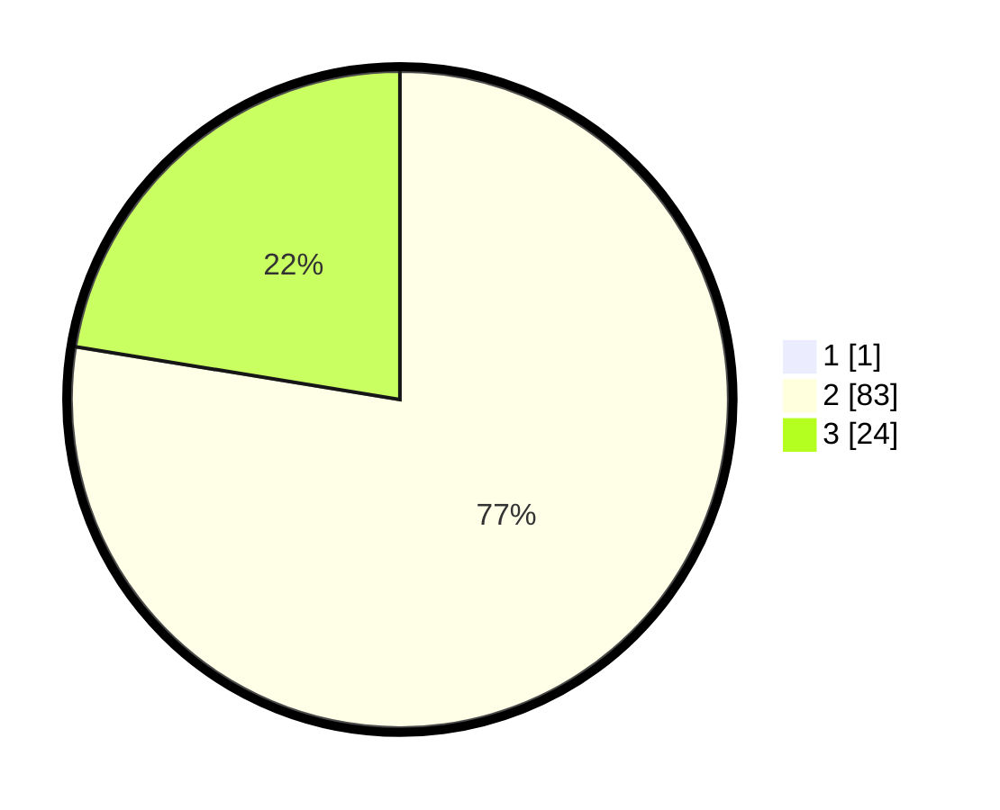

# Hasil

## Grafik

## Tabel

| No. | Nama Paslon    | Suara | Suara (raw) | Persentase |
|:--- |:-------------- | -----:| -----------:| ----------:|
| 1   | ANIES MUHAIMIN | 1     | [1][p-1]    | 0,93       |
| 2   | PRABOWO GIBRAN | 83    | [83][p-2]   | 76,85      |
| 3   | GANJAR MAHFUD  | 24    | [24][p-3]   | 22,22      |

[p-1]: https://github.com/gigit-pemilu/pemilu-2024-53-nusa-tenggara-timur/blob/main/pilpres/hitung-suara/sub/53-nusa-tenggara-timur/sub/07-sikka/sub/01-paga/sub/2003-wolowiro/sub/004-tps/sub/paslon-1.txt
[p-2]: https://github.com/gigit-pemilu/pemilu-2024-53-nusa-tenggara-timur/blob/main/pilpres/hitung-suara/sub/53-nusa-tenggara-timur/sub/07-sikka/sub/01-paga/sub/2003-wolowiro/sub/004-tps/sub/paslon-2.txt
[p-3]: https://github.com/gigit-pemilu/pemilu-2024-53-nusa-tenggara-timur/blob/main/pilpres/hitung-suara/sub/53-nusa-tenggara-timur/sub/07-sikka/sub/01-paga/sub/2003-wolowiro/sub/004-tps/sub/paslon-3.txt

## Foto C Plano

https://sirekap-obj-formc.kpu.go.id/5071/pemilu/ppwp/53/07/01/20/03/5307012003004-20240215-174137--7c6ad5d3-1b7d-46df-846f-54263551ed5f.jpg

https://sirekap-obj-formc.kpu.go.id/5071/pemilu/ppwp/53/07/01/20/03/5307012003004-20240215-174227--b78901bc-0a0d-4848-bd97-4a7f200e3366.jpg

https://sirekap-obj-formc.kpu.go.id/5071/pemilu/ppwp/53/07/01/20/03/5307012003004-20240215-174345--54335c64-4f9e-484e-8272-428afe59bf7d.jpg

## Metadata

| Key        | Value               |
| ---------- | ------------------- |
| Time Stamp | 2024-02-26 14:00:00 |

