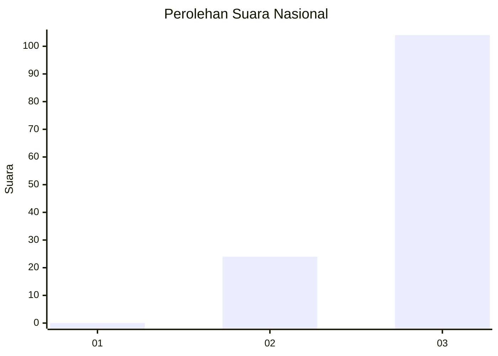
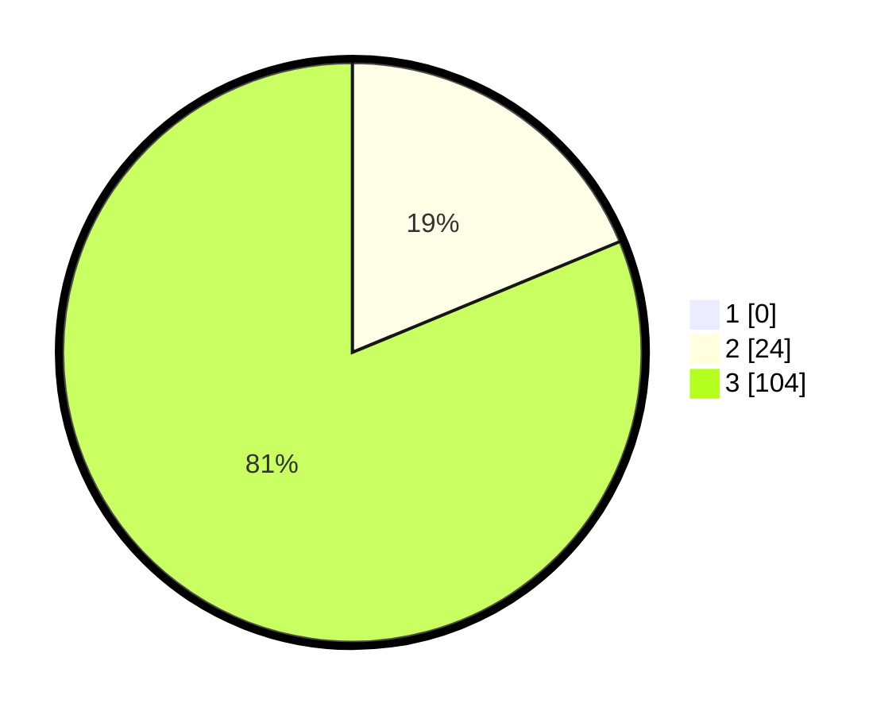

# Hasil

## Grafik

## Tabel

| No. | Nama Paslon    | Suara | Suara (raw) | Persentase |
|:--- |:-------------- | -----:| -----------:| ----------:|
| 1   | ANIES MUHAIMIN | 0     | [0][p-1]    | 0,00       |
| 2   | PRABOWO GIBRAN | 24    | [24][p-2]   | 18,75      |
| 3   | GANJAR MAHFUD  | 104   | [104][p-3]  | 81,25      |

[p-1]: https://github.com/gigit-pemilu/pemilu-2024/blob/main/pilpres/hitung-suara/sub/53-nusa-tenggara-timur/sub/07-sikka/sub/01-paga/sub/2012-mauloo/sub/002-tps/sub/paslon-1.txt
[p-2]: https://github.com/gigit-pemilu/pemilu-2024/blob/main/pilpres/hitung-suara/sub/53-nusa-tenggara-timur/sub/07-sikka/sub/01-paga/sub/2012-mauloo/sub/002-tps/sub/paslon-2.txt
[p-3]: https://github.com/gigit-pemilu/pemilu-2024/blob/main/pilpres/hitung-suara/sub/53-nusa-tenggara-timur/sub/07-sikka/sub/01-paga/sub/2012-mauloo/sub/002-tps/sub/paslon-3.txt

## Foto C Plano

https://sirekap-obj-formc.kpu.go.id/0a06/pemilu/ppwp/53/07/01/20/12/5307012012002-20240215-200728--c4c8fee6-d0eb-4fa6-9e2e-600e34879f92.jpg

https://sirekap-obj-formc.kpu.go.id/0a06/pemilu/ppwp/53/07/01/20/12/5307012012002-20240215-200958--dba42c05-cc99-4126-b613-6fb9c224d9ec.jpg

https://sirekap-obj-formc.kpu.go.id/0a06/pemilu/ppwp/53/07/01/20/12/5307012012002-20240215-200039--dd5d0336-18a4-4622-b0d4-294244b38dd6.jpg

## Metadata

| Key        | Value               |
| ---------- | ------------------- |
| Time Stamp | 2024-02-16 11:00:29 |

