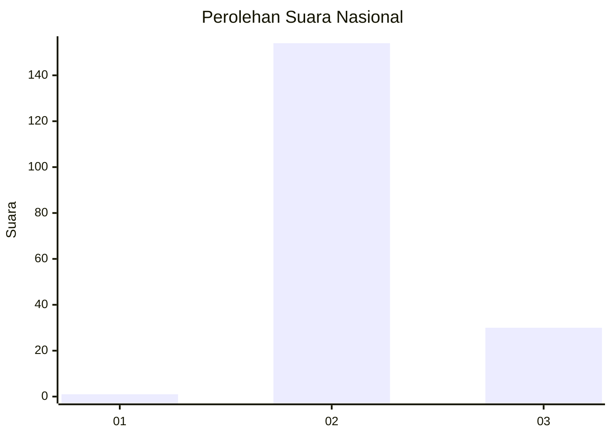
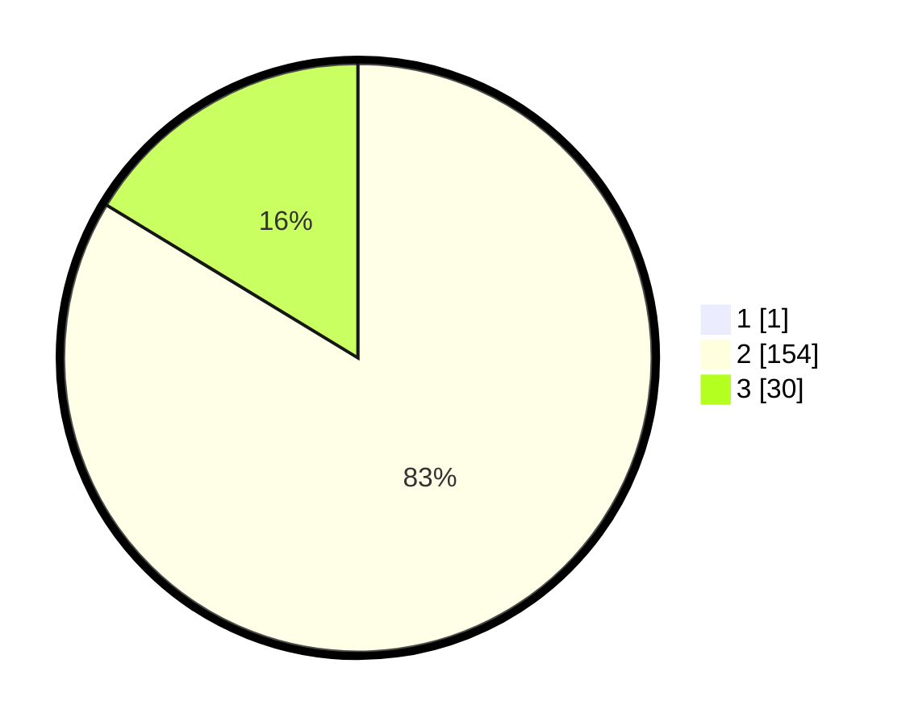

# Hasil

## Grafik

## Tabel

| No. | Nama Paslon    | Suara | Suara (raw) | Persentase |
|:--- |:-------------- | -----:| -----------:| ----------:|
| 1   | ANIES MUHAIMIN | 1     | [1][p-1]    | 0,54       |
| 2   | PRABOWO GIBRAN | 154   | [154][p-2]  | 83,24      |
| 3   | GANJAR MAHFUD  | 30    | [30][p-3]   | 16,22      |

[p-1]: https://github.com/gigit-pemilu/pemilu-2024/blob/main/pilpres/hitung-suara/sub/53-nusa-tenggara-timur/sub/07-sikka/sub/02-mego/sub/2001-bhera/sub/002-tps/sub/paslon-1.txt
[p-2]: https://github.com/gigit-pemilu/pemilu-2024/blob/main/pilpres/hitung-suara/sub/53-nusa-tenggara-timur/sub/07-sikka/sub/02-mego/sub/2001-bhera/sub/002-tps/sub/paslon-2.txt
[p-3]: https://github.com/gigit-pemilu/pemilu-2024/blob/main/pilpres/hitung-suara/sub/53-nusa-tenggara-timur/sub/07-sikka/sub/02-mego/sub/2001-bhera/sub/002-tps/sub/paslon-3.txt

## Foto C Plano

https://sirekap-obj-formc.kpu.go.id/6320/pemilu/ppwp/53/07/02/20/01/5307022001002-20240218-120800--c0845975-369a-4f1e-9573-2dcbfe21af99.jpg

https://sirekap-obj-formc.kpu.go.id/6320/pemilu/ppwp/53/07/02/20/01/5307022001002-20240218-120922--bbd158de-6d2c-4e77-bdd7-d9ce451ed61e.jpg

https://sirekap-obj-formc.kpu.go.id/6320/pemilu/ppwp/53/07/02/20/01/5307022001002-20240218-121137--22067e1a-1c83-4a0c-88d3-0815ea7b2f9c.jpg

## Metadata

| Key        | Value               |
| ---------- | ------------------- |
| Time Stamp | 2024-02-24 22:31:28 |

