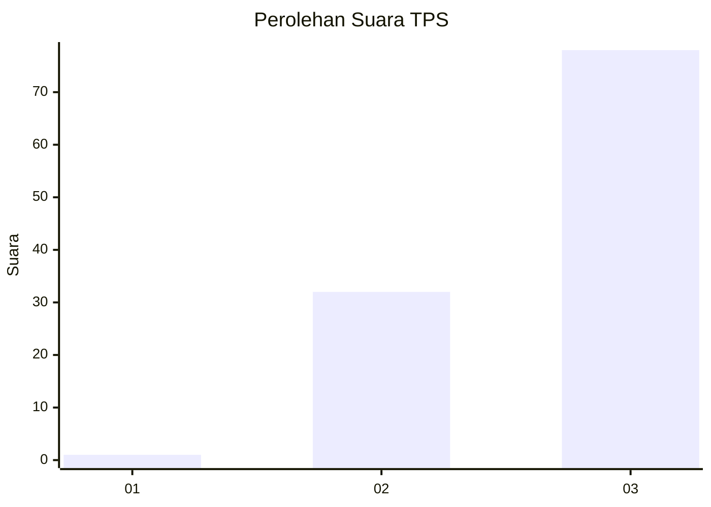
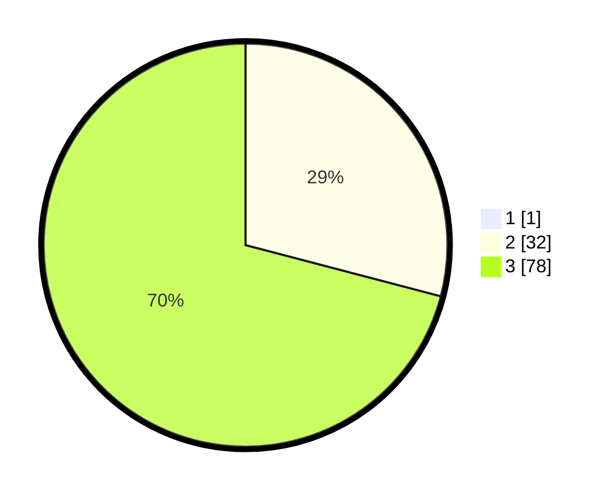

# Hasil

## Grafik

## Tabel

| No. | Nama Paslon    | Suara | Suara (raw) | Persentase |
|:--- |:-------------- | -----:| -----------:| ----------:|
| 1   | ANIES MUHAIMIN | 1     | [1][p-1]    | 0,90       |
| 2   | PRABOWO GIBRAN | 32    | [32][p-2]   | 28,83      |
| 3   | GANJAR MAHFUD  | 78    | [78][p-3]   | 70,27      |

[p-1]: https://github.com/gigit-pemilu/pemilu-2024-53-nusa-tenggara-timur/blob/main/pilpres/hitung-suara/sub/53-nusa-tenggara-timur/sub/07-sikka/sub/02-mego/sub/2001-bhera/sub/005-tps/sub/paslon-1.txt
[p-2]: https://github.com/gigit-pemilu/pemilu-2024-53-nusa-tenggara-timur/blob/main/pilpres/hitung-suara/sub/53-nusa-tenggara-timur/sub/07-sikka/sub/02-mego/sub/2001-bhera/sub/005-tps/sub/paslon-2.txt
[p-3]: https://github.com/gigit-pemilu/pemilu-2024-53-nusa-tenggara-timur/blob/main/pilpres/hitung-suara/sub/53-nusa-tenggara-timur/sub/07-sikka/sub/02-mego/sub/2001-bhera/sub/005-tps/sub/paslon-3.txt

## Foto C Plano

https://sirekap-obj-formc.kpu.go.id/e8e4/pemilu/ppwp/53/07/02/20/01/5307022001005-20240217-093810--f759e487-94be-402a-9cc8-4ce1aa0a1631.jpg

https://sirekap-obj-formc.kpu.go.id/e8e4/pemilu/ppwp/53/07/02/20/01/5307022001005-20240217-093836--8307f2ee-1f31-401a-aa92-6c119641ad1b.jpg

https://sirekap-obj-formc.kpu.go.id/e8e4/pemilu/ppwp/53/07/02/20/01/5307022001005-20240217-093908--a5e61515-04f0-4132-b393-a8f2da304652.jpg

## Metadata

| Key        | Value               |
| ---------- | ------------------- |
| Time Stamp | 2024-02-17 10:00:02 |

