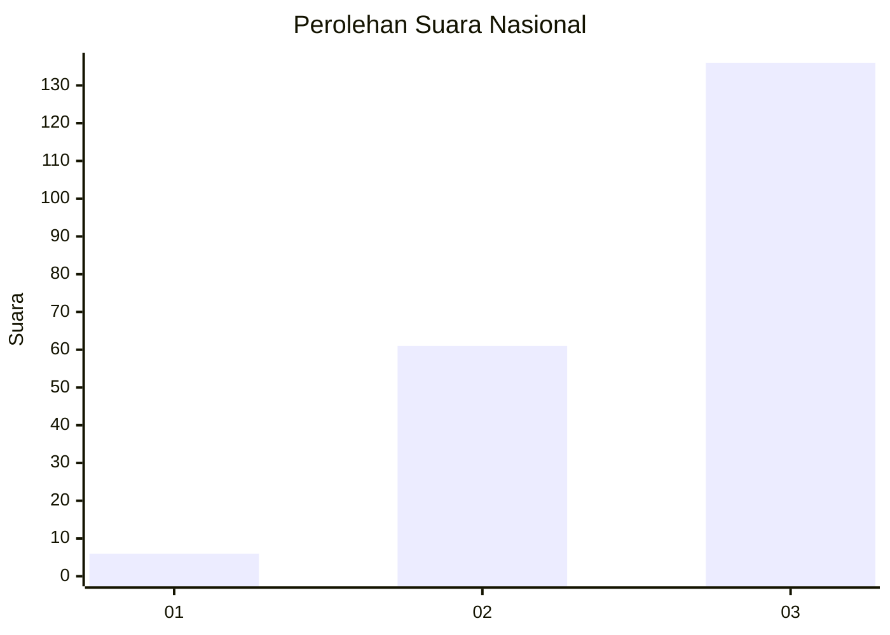
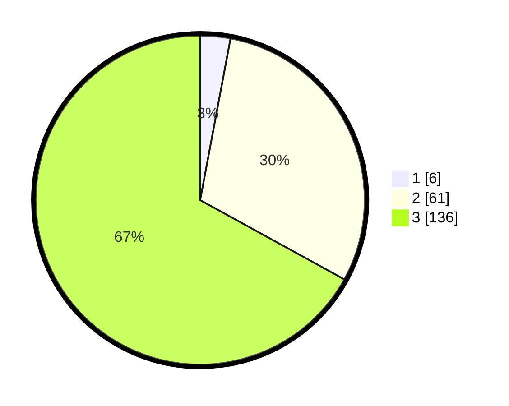

# Hasil

## Grafik

## Tabel

| No. | Nama Paslon    | Suara | Suara (raw) | Persentase |
|:--- |:-------------- | -----:| -----------:| ----------:|
| 1   | ANIES MUHAIMIN | 6     | [6][p-1]    | 2,96       |
| 2   | PRABOWO GIBRAN | 61    | [61][p-2]   | 30,05      |
| 3   | GANJAR MAHFUD  | 136   | [136][p-3]  | 67,00      |

[p-1]: https://github.com/gigit-pemilu/pemilu-2024/blob/main/pilpres/hitung-suara/sub/53-nusa-tenggara-timur/sub/07-sikka/sub/03-lela/sub/2003-korowuwu/sub/001-tps/sub/paslon-1.txt
[p-2]: https://github.com/gigit-pemilu/pemilu-2024/blob/main/pilpres/hitung-suara/sub/53-nusa-tenggara-timur/sub/07-sikka/sub/03-lela/sub/2003-korowuwu/sub/001-tps/sub/paslon-2.txt
[p-3]: https://github.com/gigit-pemilu/pemilu-2024/blob/main/pilpres/hitung-suara/sub/53-nusa-tenggara-timur/sub/07-sikka/sub/03-lela/sub/2003-korowuwu/sub/001-tps/sub/paslon-3.txt

## Foto C Plano

https://sirekap-obj-formc.kpu.go.id/ca2b/pemilu/ppwp/53/07/03/20/03/5307032003001-20240214-193059--3856029f-a1cc-4400-898f-d479ea5db00d.jpg

https://sirekap-obj-formc.kpu.go.id/ca2b/pemilu/ppwp/53/07/03/20/03/5307032003001-20240214-210515--28083cc6-9b64-4f87-bd19-32d9e1853843.jpg

https://sirekap-obj-formc.kpu.go.id/ca2b/pemilu/ppwp/53/07/03/20/03/5307032003001-20240214-193344--298728a2-ff34-46dd-824d-764a2290da65.jpg

## Metadata

| Key        | Value               |
| ---------- | ------------------- |
| Time Stamp | 2024-02-15 04:00:24 |

