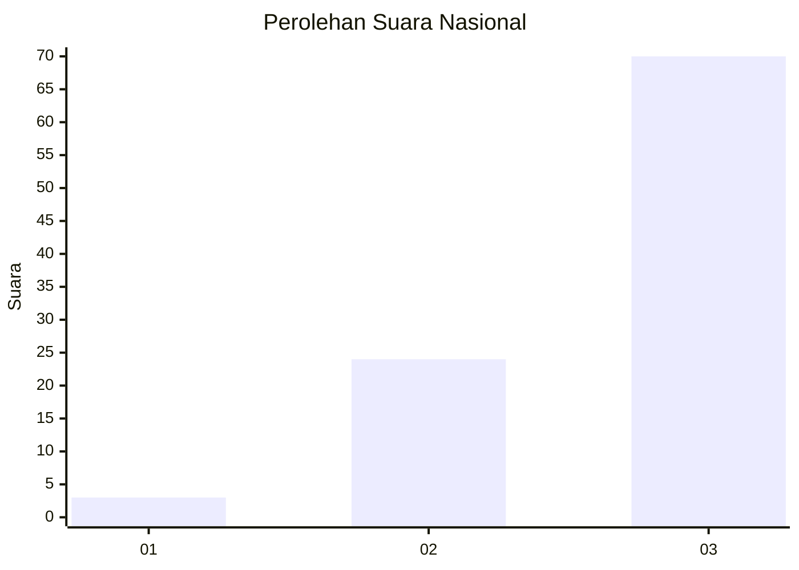
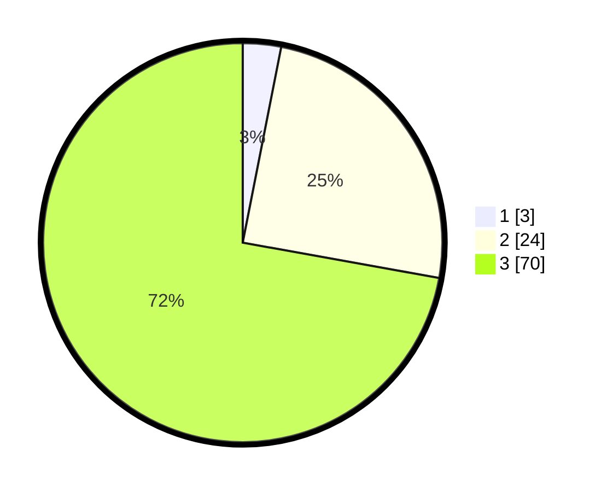

# Hasil

## Grafik

## Tabel

| No. | Nama Paslon    | Suara | Suara (raw) | Persentase |
|:--- |:-------------- | -----:| -----------:| ----------:|
| 1   | ANIES MUHAIMIN | 3     | [3][p-1]    | 3,09       |
| 2   | PRABOWO GIBRAN | 24    | [24][p-2]   | 24,74      |
| 3   | GANJAR MAHFUD  | 70    | [70][p-3]   | 72,16      |

[p-1]: https://github.com/gigit-pemilu/pemilu-2024/blob/main/pilpres/hitung-suara/sub/53-nusa-tenggara-timur/sub/07-sikka/sub/03-lela/sub/2004-kolidetung/sub/005-tps/sub/paslon-1.txt
[p-2]: https://github.com/gigit-pemilu/pemilu-2024/blob/main/pilpres/hitung-suara/sub/53-nusa-tenggara-timur/sub/07-sikka/sub/03-lela/sub/2004-kolidetung/sub/005-tps/sub/paslon-2.txt
[p-3]: https://github.com/gigit-pemilu/pemilu-2024/blob/main/pilpres/hitung-suara/sub/53-nusa-tenggara-timur/sub/07-sikka/sub/03-lela/sub/2004-kolidetung/sub/005-tps/sub/paslon-3.txt

## Foto C Plano

https://sirekap-obj-formc.kpu.go.id/55c3/pemilu/ppwp/53/07/03/20/04/5307032004005-20240215-075327--50cc0146-ad65-48b1-bbfa-aa7643af3829.jpg

https://sirekap-obj-formc.kpu.go.id/55c3/pemilu/ppwp/53/07/03/20/04/5307032004005-20240216-145005--81439fcf-0b9b-4d59-8ef6-9dbc6f5b99c0.jpg

https://sirekap-obj-formc.kpu.go.id/55c3/pemilu/ppwp/53/07/03/20/04/5307032004005-20240216-145004--e913a1fc-0c92-4a2b-b2b3-c555f807980c.jpg

## Metadata

| Key        | Value               |
| ---------- | ------------------- |
| Time Stamp | 2024-02-16 21:01:00 |

