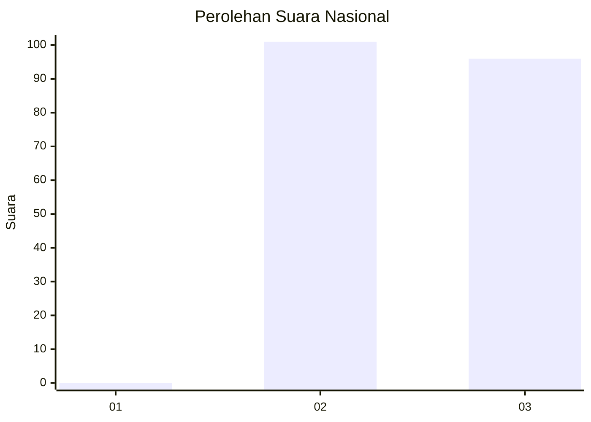
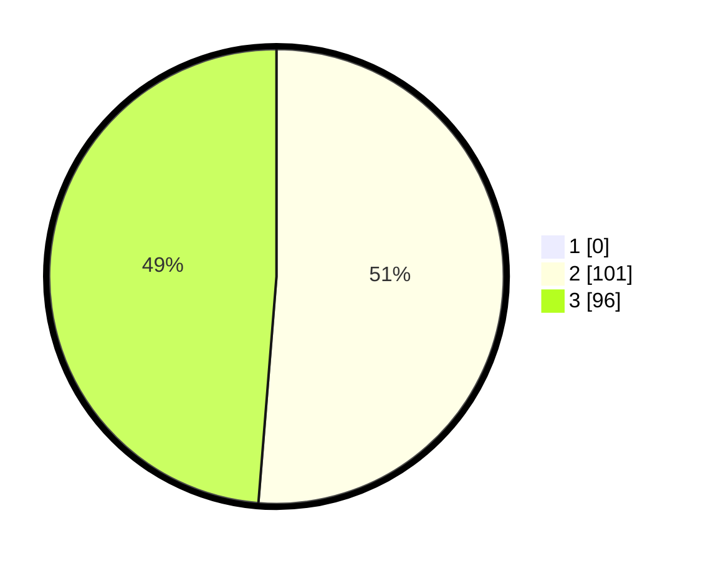

# Hasil

## Grafik

## Tabel

| No. | Nama Paslon    | Suara | Suara (raw) | Persentase |
|:--- |:-------------- | -----:| -----------:| ----------:|
| 1   | ANIES MUHAIMIN | 0     | [0][p-1]    | 0,00       |
| 2   | PRABOWO GIBRAN | 101   | [101][p-2]  | 51,27      |
| 3   | GANJAR MAHFUD  | 96    | [96][p-3]   | 48,73      |

[p-1]: https://github.com/gigit-pemilu/pemilu-2024/blob/main/pilpres/hitung-suara/sub/53-nusa-tenggara-timur/sub/07-sikka/sub/04-nita/sub/2001-nita/sub/001-tps/sub/paslon-1.txt
[p-2]: https://github.com/gigit-pemilu/pemilu-2024/blob/main/pilpres/hitung-suara/sub/53-nusa-tenggara-timur/sub/07-sikka/sub/04-nita/sub/2001-nita/sub/001-tps/sub/paslon-2.txt
[p-3]: https://github.com/gigit-pemilu/pemilu-2024/blob/main/pilpres/hitung-suara/sub/53-nusa-tenggara-timur/sub/07-sikka/sub/04-nita/sub/2001-nita/sub/001-tps/sub/paslon-3.txt

## Foto C Plano

https://sirekap-obj-formc.kpu.go.id/2806/pemilu/ppwp/53/07/04/20/01/5307042001001-20240215-093635--a1fcd2c5-70c5-44f8-9942-45c01def661f.jpg

https://sirekap-obj-formc.kpu.go.id/2806/pemilu/ppwp/53/07/04/20/01/5307042001001-20240215-094024--e4bef9d4-9cc5-48d4-9c36-a7063c801dc5.jpg

https://sirekap-obj-formc.kpu.go.id/2806/pemilu/ppwp/53/07/04/20/01/5307042001001-20240215-094205--7a092073-f816-42b6-a5be-cfec9b151a36.jpg

## Metadata

| Key        | Value               |
| ---------- | ------------------- |
| Time Stamp | 2024-02-25 10:00:00 |

