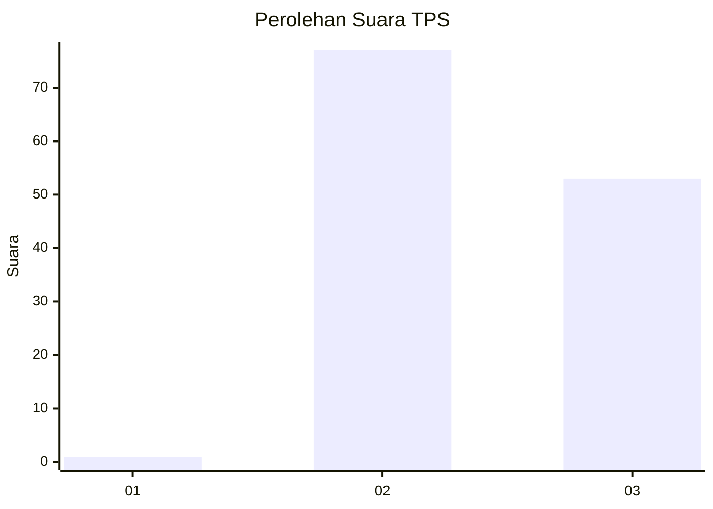
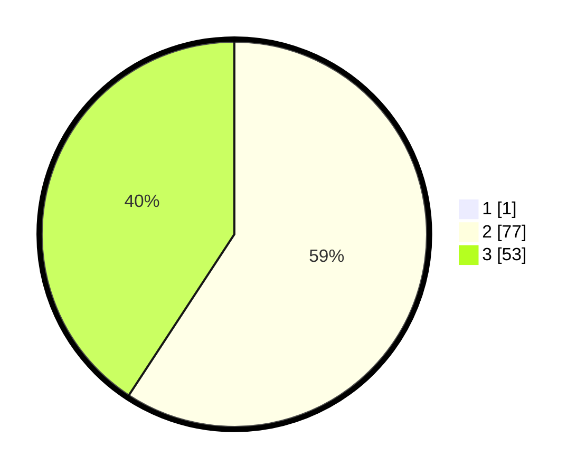

# Hasil

## Grafik

## Tabel

| No. | Nama Paslon    | Suara | Suara (raw) | Persentase |
|:--- |:-------------- | -----:| -----------:| ----------:|
| 1   | ANIES MUHAIMIN | 1     | [1][p-1]    | 0,76       |
| 2   | PRABOWO GIBRAN | 77    | [77][p-2]   | 58,78      |
| 3   | GANJAR MAHFUD  | 53    | [53][p-3]   | 40,46      |

[p-1]: https://github.com/gigit-pemilu/pemilu-2024-53-nusa-tenggara-timur/blob/main/pilpres/hitung-suara/sub/53-nusa-tenggara-timur/sub/07-sikka/sub/04-nita/sub/2001-nita/sub/002-tps/sub/paslon-1.txt
[p-2]: https://github.com/gigit-pemilu/pemilu-2024-53-nusa-tenggara-timur/blob/main/pilpres/hitung-suara/sub/53-nusa-tenggara-timur/sub/07-sikka/sub/04-nita/sub/2001-nita/sub/002-tps/sub/paslon-2.txt
[p-3]: https://github.com/gigit-pemilu/pemilu-2024-53-nusa-tenggara-timur/blob/main/pilpres/hitung-suara/sub/53-nusa-tenggara-timur/sub/07-sikka/sub/04-nita/sub/2001-nita/sub/002-tps/sub/paslon-3.txt

## Foto C Plano

https://sirekap-obj-formc.kpu.go.id/c4eb/pemilu/ppwp/53/07/04/20/01/5307042001002-20240215-103751--743bb8a7-96c0-49db-898c-126b638b736a.jpg

https://sirekap-obj-formc.kpu.go.id/c4eb/pemilu/ppwp/53/07/04/20/01/5307042001002-20240215-103837--768386fe-f494-460b-b873-7a726afafdf2.jpg

https://sirekap-obj-formc.kpu.go.id/c4eb/pemilu/ppwp/53/07/04/20/01/5307042001002-20240215-103945--4acf5b8c-cd8e-408c-9879-733c731f36b6.jpg

## Metadata

| Key        | Value               |
| ---------- | ------------------- |
| Time Stamp | 2024-02-24 22:31:28 |

