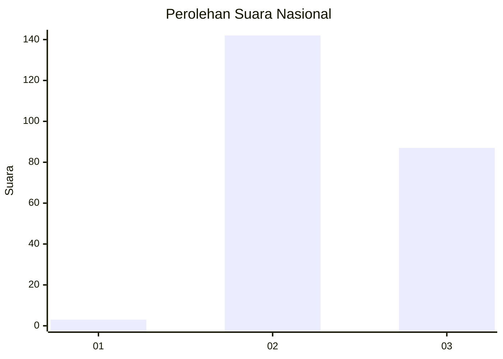
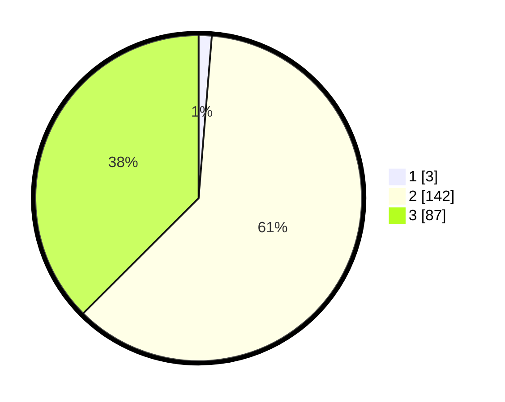

# Hasil

## Grafik

## Tabel

| No. | Nama Paslon    | Suara | Suara (raw) | Persentase |
|:--- |:-------------- | -----:| -----------:| ----------:|
| 1   | ANIES MUHAIMIN | 3     | [3][p-1]    | 1,29       |
| 2   | PRABOWO GIBRAN | 142   | [142][p-2]  | 61,21      |
| 3   | GANJAR MAHFUD  | 87    | [87][p-3]   | 37,50      |

[p-1]: https://github.com/gigit-pemilu/pemilu-2024/blob/main/pilpres/hitung-suara/sub/53-nusa-tenggara-timur/sub/07-sikka/sub/04-nita/sub/2001-nita/sub/010-tps/sub/paslon-1.txt
[p-2]: https://github.com/gigit-pemilu/pemilu-2024/blob/main/pilpres/hitung-suara/sub/53-nusa-tenggara-timur/sub/07-sikka/sub/04-nita/sub/2001-nita/sub/010-tps/sub/paslon-2.txt
[p-3]: https://github.com/gigit-pemilu/pemilu-2024/blob/main/pilpres/hitung-suara/sub/53-nusa-tenggara-timur/sub/07-sikka/sub/04-nita/sub/2001-nita/sub/010-tps/sub/paslon-3.txt

## Foto C Plano

https://sirekap-obj-formc.kpu.go.id/fd93/pemilu/ppwp/53/07/04/20/01/5307042001010-20240215-161924--6d812d8f-8f75-400b-be93-a7944dc2b03e.jpg

https://sirekap-obj-formc.kpu.go.id/fd93/pemilu/ppwp/53/07/04/20/01/5307042001010-20240215-102749--d4c7d20c-7913-4a9a-891b-aae1ac7c7e23.jpg

https://sirekap-obj-formc.kpu.go.id/fd93/pemilu/ppwp/53/07/04/20/01/5307042001010-20240215-103036--0d5621e8-f291-4bcd-ae95-7612425aa269.jpg

## Metadata

| Key        | Value               |
| ---------- | ------------------- |
| Time Stamp | 2024-02-15 21:01:18 |

