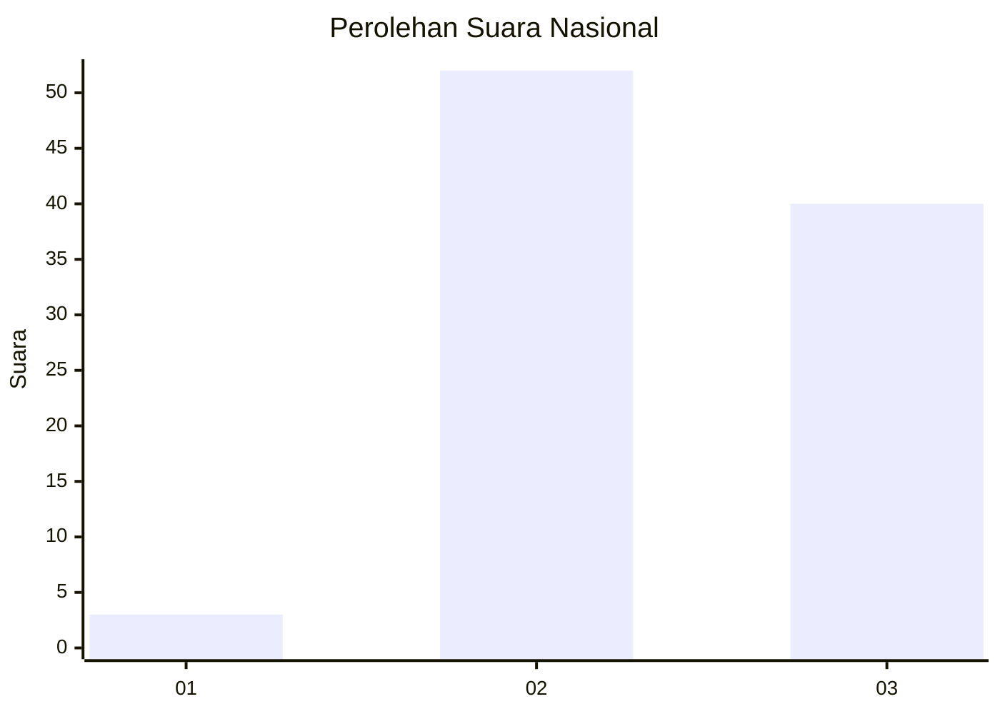
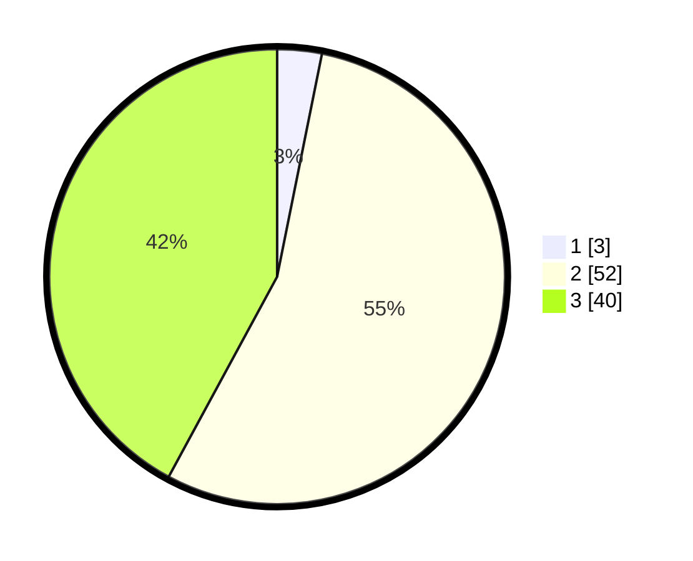

# Hasil

## Grafik

## Tabel

| No. | Nama Paslon    | Suara | Suara (raw) | Persentase |
|:--- |:-------------- | -----:| -----------:| ----------:|
| 1   | ANIES MUHAIMIN | 3     | [3][p-1]    | 3,16       |
| 2   | PRABOWO GIBRAN | 52    | [52][p-2]   | 54,74      |
| 3   | GANJAR MAHFUD  | 40    | [40][p-3]   | 42,11      |

[p-1]: https://github.com/gigit-pemilu/pemilu-2024/blob/main/pilpres/hitung-suara/sub/53-nusa-tenggara-timur/sub/07-sikka/sub/04-nita/sub/2002-takaplager/sub/005-tps/sub/paslon-1.txt
[p-2]: https://github.com/gigit-pemilu/pemilu-2024/blob/main/pilpres/hitung-suara/sub/53-nusa-tenggara-timur/sub/07-sikka/sub/04-nita/sub/2002-takaplager/sub/005-tps/sub/paslon-2.txt
[p-3]: https://github.com/gigit-pemilu/pemilu-2024/blob/main/pilpres/hitung-suara/sub/53-nusa-tenggara-timur/sub/07-sikka/sub/04-nita/sub/2002-takaplager/sub/005-tps/sub/paslon-3.txt

## Foto C Plano

https://sirekap-obj-formc.kpu.go.id/80a4/pemilu/ppwp/53/07/04/20/02/5307042002005-20240215-000434--39af97d2-5ca7-4b3a-9803-3a1f633ed9bf.jpg

https://sirekap-obj-formc.kpu.go.id/80a4/pemilu/ppwp/53/07/04/20/02/5307042002005-20240215-003822--c670e24b-4e76-4fae-b2fb-d9f1c82fcf6c.jpg

https://sirekap-obj-formc.kpu.go.id/80a4/pemilu/ppwp/53/07/04/20/02/5307042002005-20240215-004106--f8a04502-2261-471f-9cc8-160d7240f393.jpg

## Metadata

| Key        | Value               |
| ---------- | ------------------- |
| Time Stamp | 2024-02-15 12:00:28 |

