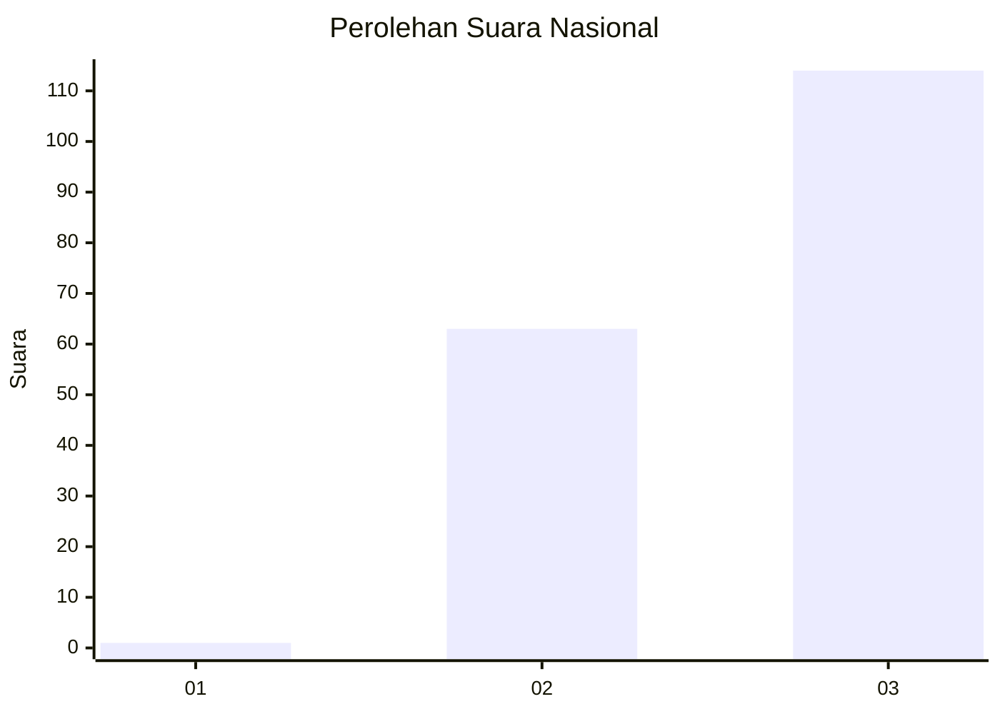
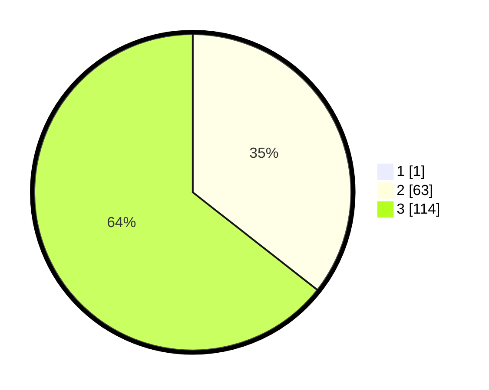

# Hasil

## Grafik

## Tabel

| No. | Nama Paslon    | Suara | Suara (raw) | Persentase |
|:--- |:-------------- | -----:| -----------:| ----------:|
| 1   | ANIES MUHAIMIN | 1     | [1][p-1]    | 0,56       |
| 2   | PRABOWO GIBRAN | 63    | [63][p-2]   | 35,39      |
| 3   | GANJAR MAHFUD  | 114   | [114][p-3]  | 64,04      |

[p-1]: https://github.com/gigit-pemilu/pemilu-2024/blob/main/pilpres/hitung-suara/sub/53-nusa-tenggara-timur/sub/07-sikka/sub/04-nita/sub/2006-wuliwutik/sub/002-tps/sub/paslon-1.txt
[p-2]: https://github.com/gigit-pemilu/pemilu-2024/blob/main/pilpres/hitung-suara/sub/53-nusa-tenggara-timur/sub/07-sikka/sub/04-nita/sub/2006-wuliwutik/sub/002-tps/sub/paslon-2.txt
[p-3]: https://github.com/gigit-pemilu/pemilu-2024/blob/main/pilpres/hitung-suara/sub/53-nusa-tenggara-timur/sub/07-sikka/sub/04-nita/sub/2006-wuliwutik/sub/002-tps/sub/paslon-3.txt

## Foto C Plano

https://sirekap-obj-formc.kpu.go.id/f5ba/pemilu/ppwp/53/07/04/20/06/5307042006002-20240215-011722--d6866dd0-61f0-44c9-a53b-a5d2f90376f6.jpg

https://sirekap-obj-formc.kpu.go.id/f5ba/pemilu/ppwp/53/07/04/20/06/5307042006002-20240215-060029--c5fe382f-c272-4caf-aa90-78906ab10ab8.jpg

https://sirekap-obj-formc.kpu.go.id/f5ba/pemilu/ppwp/53/07/04/20/06/5307042006002-20240215-060548--f5b85111-ec5d-4af6-b2c3-d53fd4e51020.jpg

## Metadata

| Key        | Value               |
| ---------- | ------------------- |
| Time Stamp | 2024-02-25 11:00:00 |

