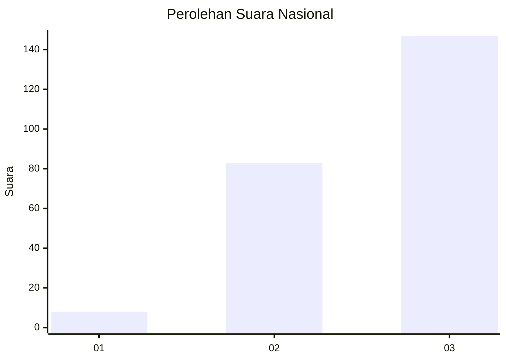
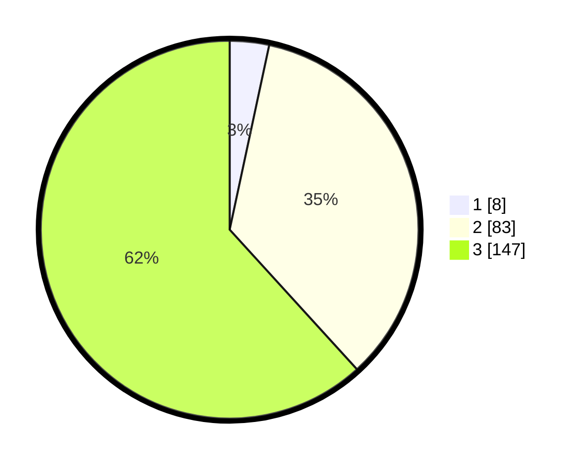

# Hasil

## Grafik

## Tabel

| No. | Nama Paslon    | Suara | Suara (raw) | Persentase |
|:--- |:-------------- | -----:| -----------:| ----------:|
| 1   | ANIES MUHAIMIN | 8     | [8][p-1]    | 3,36       |
| 2   | PRABOWO GIBRAN | 83    | [83][p-2]   | 34,87      |
| 3   | GANJAR MAHFUD  | 147   | [147][p-3]  | 61,76      |

[p-1]: https://github.com/gigit-pemilu/pemilu-2024/blob/main/pilpres/hitung-suara/sub/53-nusa-tenggara-timur/sub/07-sikka/sub/04-nita/sub/2011-nirangkliung/sub/003-tps/sub/paslon-1.txt
[p-2]: https://github.com/gigit-pemilu/pemilu-2024/blob/main/pilpres/hitung-suara/sub/53-nusa-tenggara-timur/sub/07-sikka/sub/04-nita/sub/2011-nirangkliung/sub/003-tps/sub/paslon-2.txt
[p-3]: https://github.com/gigit-pemilu/pemilu-2024/blob/main/pilpres/hitung-suara/sub/53-nusa-tenggara-timur/sub/07-sikka/sub/04-nita/sub/2011-nirangkliung/sub/003-tps/sub/paslon-3.txt

## Foto C Plano

https://sirekap-obj-formc.kpu.go.id/67e7/pemilu/ppwp/53/07/04/20/11/5307042011003-20240215-155210--f6701c5c-68e5-4e14-8ab8-f3a7aa69ab86.jpg

https://sirekap-obj-formc.kpu.go.id/67e7/pemilu/ppwp/53/07/04/20/11/5307042011003-20240215-155954--e9677055-1816-402e-b70d-1a2f3647e1e7.jpg

https://sirekap-obj-formc.kpu.go.id/67e7/pemilu/ppwp/53/07/04/20/11/5307042011003-20240215-160309--5ed4d3ee-21b5-4a06-9d71-a8dcfefe5ecf.jpg

## Metadata

| Key        | Value               |
| ---------- | ------------------- |
| Time Stamp | 2024-02-25 12:00:00 |

