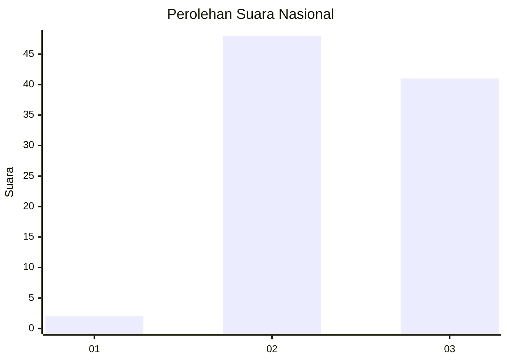
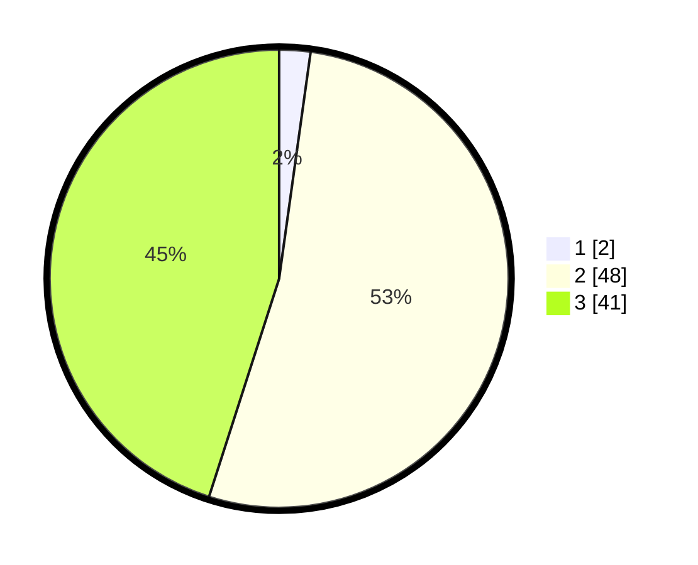

# Hasil

## Grafik

## Tabel

| No. | Nama Paslon    | Suara | Suara (raw) | Persentase |
|:--- |:-------------- | -----:| -----------:| ----------:|
| 1   | ANIES MUHAIMIN | 2     | [2][p-1]    | 2,20       |
| 2   | PRABOWO GIBRAN | 48    | [48][p-2]   | 52,75      |
| 3   | GANJAR MAHFUD  | 41    | [41][p-3]   | 45,05      |

[p-1]: https://github.com/gigit-pemilu/pemilu-2024/blob/main/pilpres/hitung-suara/sub/53-nusa-tenggara-timur/sub/07-sikka/sub/04-nita/sub/2017-mahebora/sub/003-tps/sub/paslon-1.txt
[p-2]: https://github.com/gigit-pemilu/pemilu-2024/blob/main/pilpres/hitung-suara/sub/53-nusa-tenggara-timur/sub/07-sikka/sub/04-nita/sub/2017-mahebora/sub/003-tps/sub/paslon-2.txt
[p-3]: https://github.com/gigit-pemilu/pemilu-2024/blob/main/pilpres/hitung-suara/sub/53-nusa-tenggara-timur/sub/07-sikka/sub/04-nita/sub/2017-mahebora/sub/003-tps/sub/paslon-3.txt

## Foto C Plano

https://sirekap-obj-formc.kpu.go.id/45fb/pemilu/ppwp/53/07/04/20/17/5307042017003-20240214-194326--8d2bddcd-3e6a-4ed7-aba0-94c9a0970d4b.jpg

https://sirekap-obj-formc.kpu.go.id/45fb/pemilu/ppwp/53/07/04/20/17/5307042017003-20240215-091304--cb66c1a7-7398-44d9-b995-2a6feb3ebdef.jpg

https://sirekap-obj-formc.kpu.go.id/45fb/pemilu/ppwp/53/07/04/20/17/5307042017003-20240214-160149--6dcda8a4-cfbd-4336-b4a1-590f894f571d.jpg

## Metadata

| Key        | Value               |
| ---------- | ------------------- |
| Time Stamp | 2024-02-25 15:00:00 |

