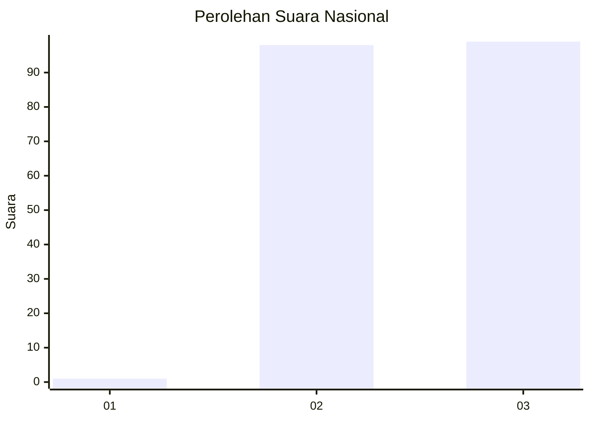
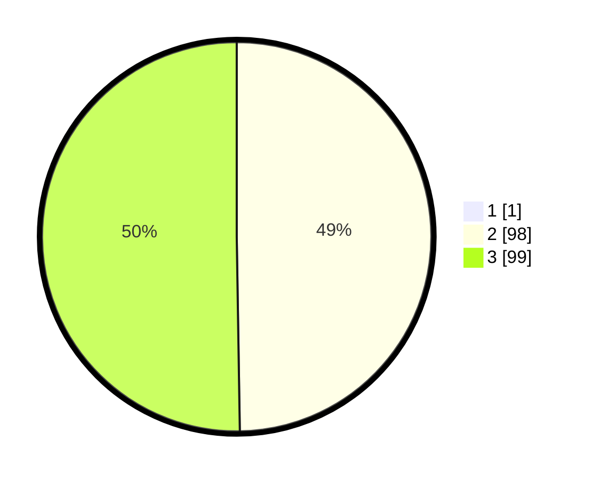

# Hasil

## Grafik

## Tabel

| No. | Nama Paslon    | Suara | Suara (raw) | Persentase |
|:--- |:-------------- | -----:| -----------:| ----------:|
| 1   | ANIES MUHAIMIN | 1     | [1][p-1]    | 0,51       |
| 2   | PRABOWO GIBRAN | 98    | [98][p-2]   | 49,49      |
| 3   | GANJAR MAHFUD  | 99    | [99][p-3]   | 50,00      |

[p-1]: https://github.com/gigit-pemilu/pemilu-2024/blob/main/pilpres/hitung-suara/sub/53-nusa-tenggara-timur/sub/07-sikka/sub/06-palue/sub/2001-maluriwu/sub/003-tps/sub/paslon-1.txt
[p-2]: https://github.com/gigit-pemilu/pemilu-2024/blob/main/pilpres/hitung-suara/sub/53-nusa-tenggara-timur/sub/07-sikka/sub/06-palue/sub/2001-maluriwu/sub/003-tps/sub/paslon-2.txt
[p-3]: https://github.com/gigit-pemilu/pemilu-2024/blob/main/pilpres/hitung-suara/sub/53-nusa-tenggara-timur/sub/07-sikka/sub/06-palue/sub/2001-maluriwu/sub/003-tps/sub/paslon-3.txt

## Foto C Plano

https://sirekap-obj-formc.kpu.go.id/3a73/pemilu/ppwp/53/07/06/20/01/5307062001003-20240216-071724--db7d5184-e92c-4da4-89c5-630a8ad60dd7.jpg

https://sirekap-obj-formc.kpu.go.id/3a73/pemilu/ppwp/53/07/06/20/01/5307062001003-20240216-071858--65528380-b1a2-4e05-a34b-992bc667868e.jpg

https://sirekap-obj-formc.kpu.go.id/3a73/pemilu/ppwp/53/07/06/20/01/5307062001003-20240216-072108--b4507ca6-1c5f-4352-a69b-4f99ef247f82.jpg

## Metadata

| Key        | Value               |
| ---------- | ------------------- |
| Time Stamp | 2024-02-25 12:00:00 |

