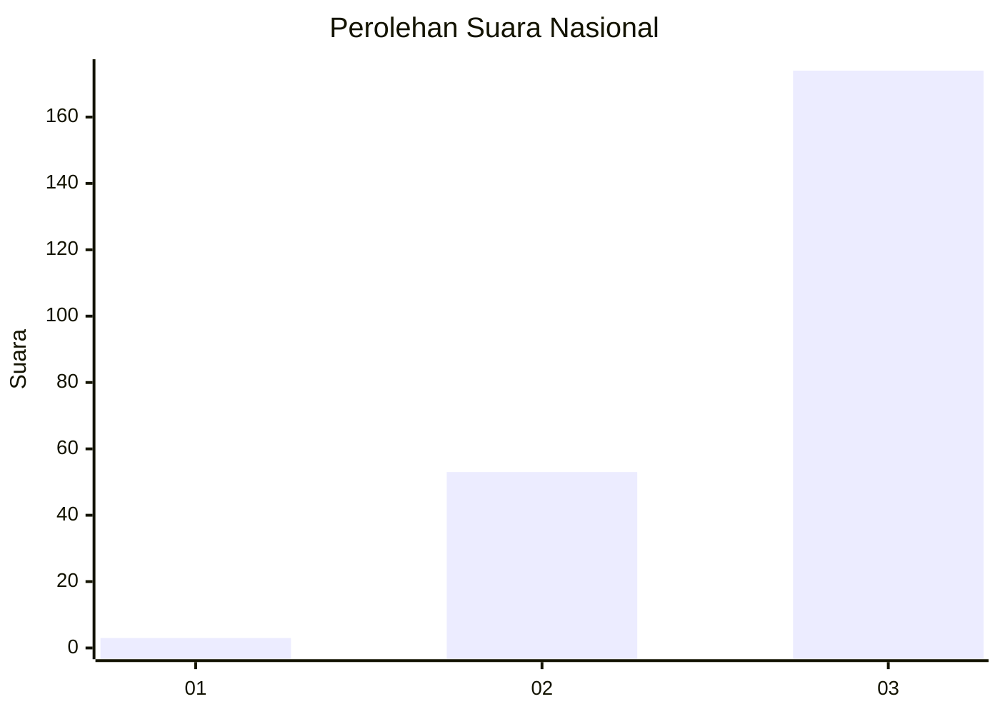
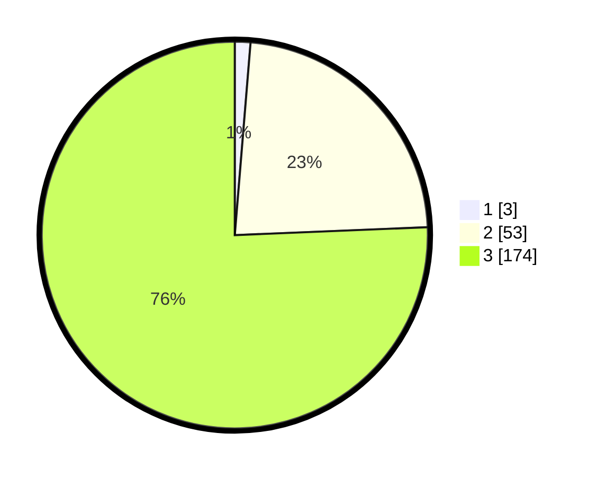

# Hasil

## Grafik

## Tabel

| No. | Nama Paslon    | Suara | Suara (raw) | Persentase |
|:--- |:-------------- | -----:| -----------:| ----------:|
| 1   | ANIES MUHAIMIN | 3     | [3][p-1]    | 1,30       |
| 2   | PRABOWO GIBRAN | 53    | [53][p-2]   | 23,04      |
| 3   | GANJAR MAHFUD  | 174   | [174][p-3]  | 75,65      |

[p-1]: https://github.com/gigit-pemilu/pemilu-2024/blob/main/pilpres/hitung-suara/sub/53-nusa-tenggara-timur/sub/07-sikka/sub/06-palue/sub/2003-tuanggeo/sub/001-tps/sub/paslon-1.txt
[p-2]: https://github.com/gigit-pemilu/pemilu-2024/blob/main/pilpres/hitung-suara/sub/53-nusa-tenggara-timur/sub/07-sikka/sub/06-palue/sub/2003-tuanggeo/sub/001-tps/sub/paslon-2.txt
[p-3]: https://github.com/gigit-pemilu/pemilu-2024/blob/main/pilpres/hitung-suara/sub/53-nusa-tenggara-timur/sub/07-sikka/sub/06-palue/sub/2003-tuanggeo/sub/001-tps/sub/paslon-3.txt

## Foto C Plano

https://sirekap-obj-formc.kpu.go.id/a3a3/pemilu/ppwp/53/07/06/20/03/5307062003001-20240215-115925--b3dd1a80-ccb6-4d67-bb9a-2d33d83b67a8.jpg

https://sirekap-obj-formc.kpu.go.id/a3a3/pemilu/ppwp/53/07/06/20/03/5307062003001-20240215-120243--457928fb-b8b6-4862-a41c-aa1884c63699.jpg

https://sirekap-obj-formc.kpu.go.id/a3a3/pemilu/ppwp/53/07/06/20/03/5307062003001-20240215-120424--94c20a4b-ed32-4724-9165-edf0e9b9080c.jpg

## Metadata

| Key        | Value               |
| ---------- | ------------------- |
| Time Stamp | 2024-02-25 15:00:00 |

