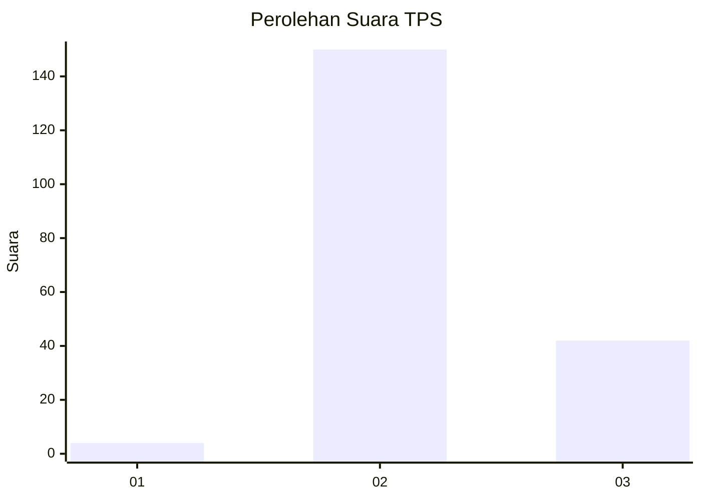

# Hasil

## Grafik

## Tabel

| No. | Nama Paslon    | Suara | Suara (raw) | Persentase |
|:--- |:-------------- | -----:| -----------:| ----------:|
| 1   | ANIES MUHAIMIN | 4     | [4][p-1]    | 2,04       |
| 2   | PRABOWO GIBRAN | 150   | [150][p-2]  | 76,53      |
| 3   | GANJAR MAHFUD  | 42    | [42][p-3]   | 21,43      |

[p-1]: https://github.com/gigit-pemilu/pemilu-2024-53-nusa-tenggara-timur/blob/main/pilpres/hitung-suara/sub/53-nusa-tenggara-timur/sub/07-sikka/sub/07-nelle/sub/2003-nelle-wutung/sub/001-tps/sub/paslon-1.txt
[p-2]: https://github.com/gigit-pemilu/pemilu-2024-53-nusa-tenggara-timur/blob/main/pilpres/hitung-suara/sub/53-nusa-tenggara-timur/sub/07-sikka/sub/07-nelle/sub/2003-nelle-wutung/sub/001-tps/sub/paslon-2.txt
[p-3]: https://github.com/gigit-pemilu/pemilu-2024-53-nusa-tenggara-timur/blob/main/pilpres/hitung-suara/sub/53-nusa-tenggara-timur/sub/07-sikka/sub/07-nelle/sub/2003-nelle-wutung/sub/001-tps/sub/paslon-3.txt

## Foto C Plano

https://sirekap-obj-formc.kpu.go.id/69df/pemilu/ppwp/53/07/07/20/03/5307072003001-20240215-151822--d9554d49-4532-4018-b699-e1d4c9dc5d10.jpg

https://sirekap-obj-formc.kpu.go.id/69df/pemilu/ppwp/53/07/07/20/03/5307072003001-20240215-151957--bdc30862-aee1-4a23-9037-d720b117a327.jpg

https://sirekap-obj-formc.kpu.go.id/69df/pemilu/ppwp/53/07/07/20/03/5307072003001-20240215-152133--2b118164-9e0f-462e-ad4a-784a0f646308.jpg

## Metadata

| Key        | Value               |
| ---------- | ------------------- |
| Time Stamp | 2024-02-25 00:00:00 |

