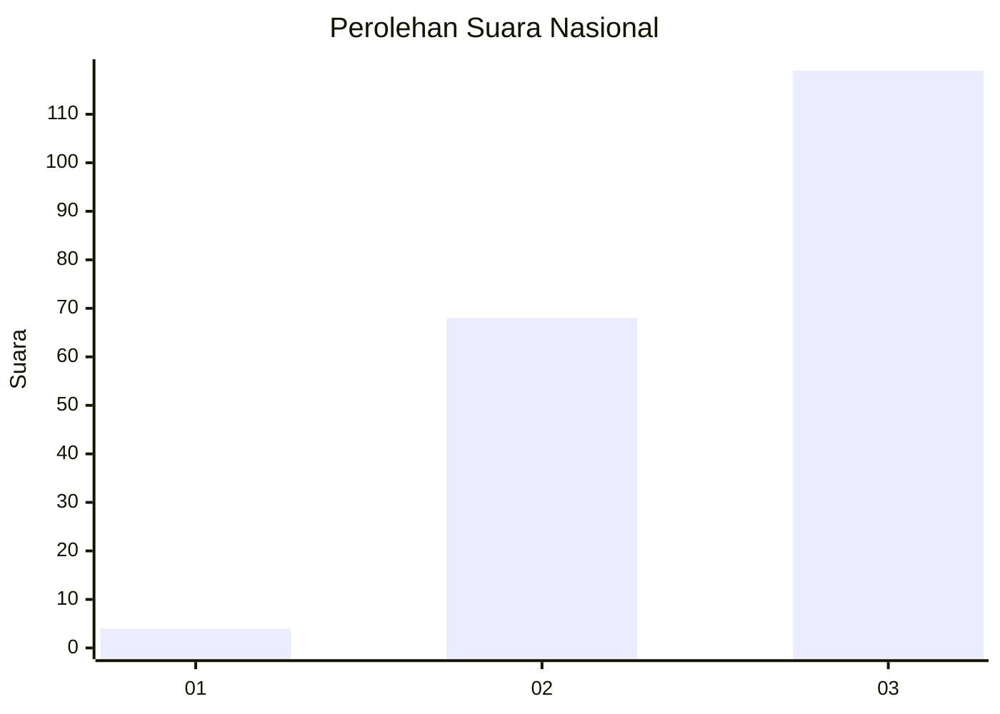
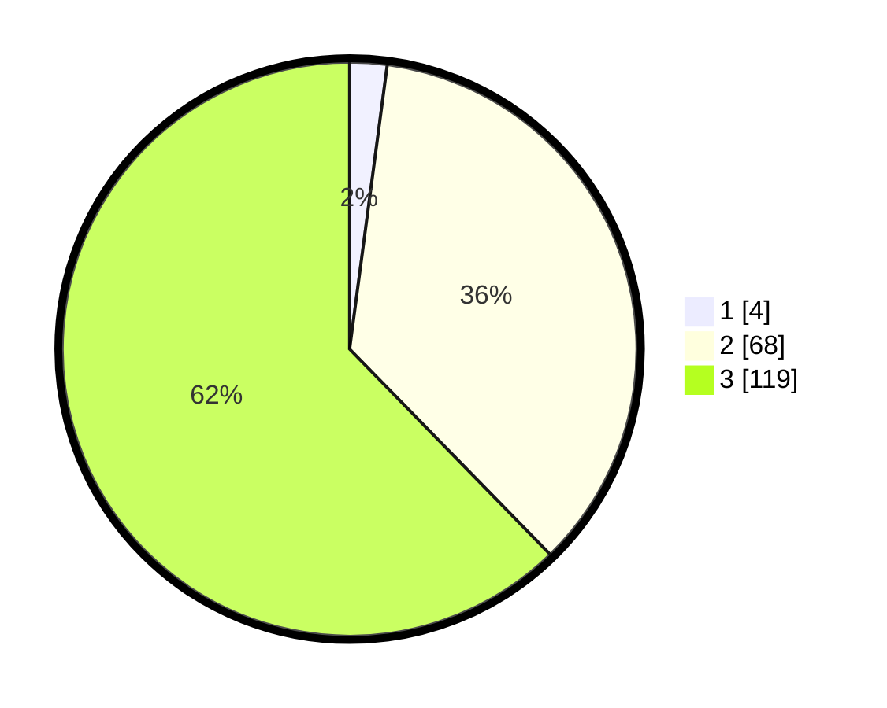

# Hasil

## Grafik

## Tabel

| No. | Nama Paslon    | Suara | Suara (raw) | Persentase |
|:--- |:-------------- | -----:| -----------:| ----------:|
| 1   | ANIES MUHAIMIN | 4     | [4][p-1]    | 2,09       |
| 2   | PRABOWO GIBRAN | 68    | [68][p-2]   | 35,60      |
| 3   | GANJAR MAHFUD  | 119   | [119][p-3]  | 62,30      |

[p-1]: https://github.com/gigit-pemilu/pemilu-2024/blob/main/pilpres/hitung-suara/sub/53-nusa-tenggara-timur/sub/07-sikka/sub/07-nelle/sub/2003-nelle-wutung/sub/005-tps/sub/paslon-1.txt
[p-2]: https://github.com/gigit-pemilu/pemilu-2024/blob/main/pilpres/hitung-suara/sub/53-nusa-tenggara-timur/sub/07-sikka/sub/07-nelle/sub/2003-nelle-wutung/sub/005-tps/sub/paslon-2.txt
[p-3]: https://github.com/gigit-pemilu/pemilu-2024/blob/main/pilpres/hitung-suara/sub/53-nusa-tenggara-timur/sub/07-sikka/sub/07-nelle/sub/2003-nelle-wutung/sub/005-tps/sub/paslon-3.txt

## Foto C Plano

https://sirekap-obj-formc.kpu.go.id/a9f1/pemilu/ppwp/53/07/07/20/03/5307072003005-20240215-104846--263c3828-e05b-45a9-bb03-51bb569f598e.jpg

https://sirekap-obj-formc.kpu.go.id/a9f1/pemilu/ppwp/53/07/07/20/03/5307072003005-20240215-105052--64c3c4c5-8c77-4a34-8bdb-7e613772ee2b.jpg

https://sirekap-obj-formc.kpu.go.id/a9f1/pemilu/ppwp/53/07/07/20/03/5307072003005-20240215-134457--67ebc1bd-0c7c-48bb-89e1-e26cf9d01f72.jpg

## Metadata

| Key        | Value               |
| ---------- | ------------------- |
| Time Stamp | 2024-02-25 21:00:00 |

