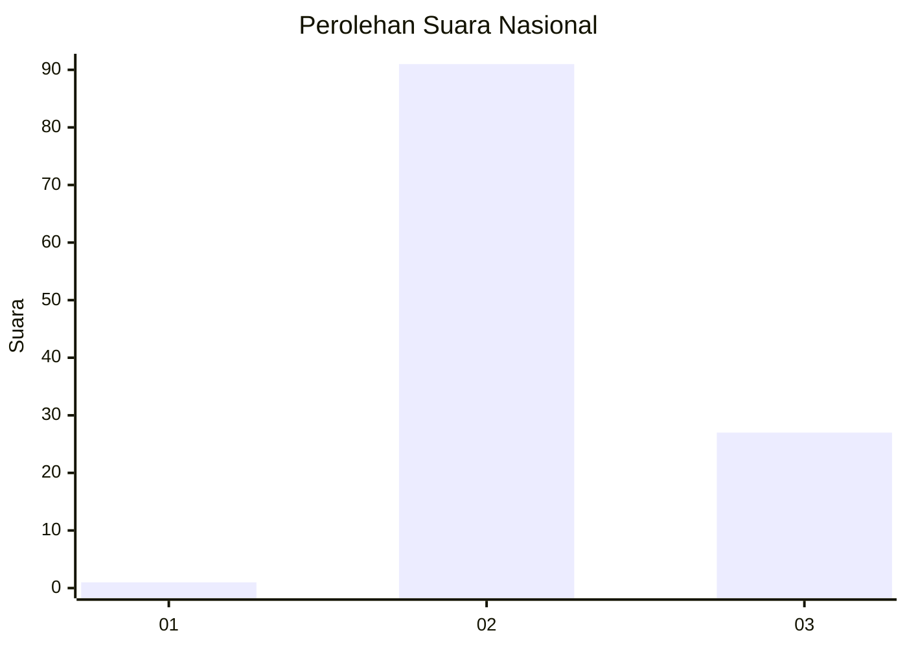
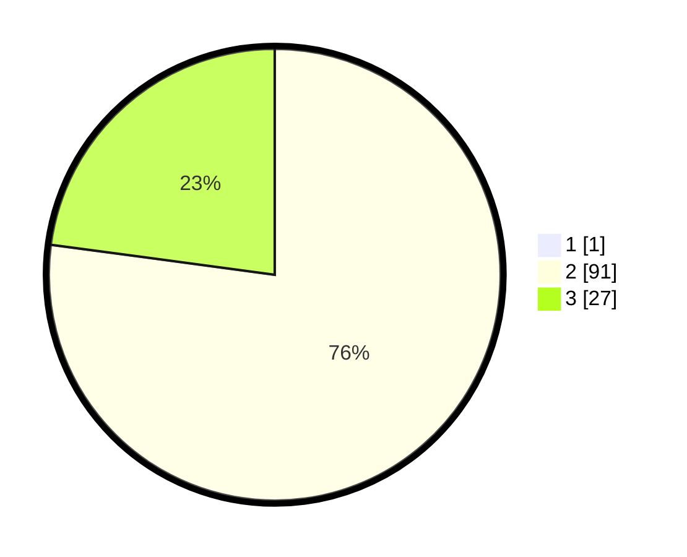

# Hasil

## Grafik

## Tabel

| No. | Nama Paslon    | Suara | Suara (raw) | Persentase |
|:--- |:-------------- | -----:| -----------:| ----------:|
| 1   | ANIES MUHAIMIN | 1     | [1][p-1]    | 0,84       |
| 2   | PRABOWO GIBRAN | 91    | [91][p-2]   | 76,47      |
| 3   | GANJAR MAHFUD  | 27    | [27][p-3]   | 22,69      |

[p-1]: https://github.com/gigit-pemilu/pemilu-2024/blob/main/pilpres/hitung-suara/sub/53-nusa-tenggara-timur/sub/07-sikka/sub/08-talibura/sub/2001-darat-gunung/sub/005-tps/sub/paslon-1.txt
[p-2]: https://github.com/gigit-pemilu/pemilu-2024/blob/main/pilpres/hitung-suara/sub/53-nusa-tenggara-timur/sub/07-sikka/sub/08-talibura/sub/2001-darat-gunung/sub/005-tps/sub/paslon-2.txt
[p-3]: https://github.com/gigit-pemilu/pemilu-2024/blob/main/pilpres/hitung-suara/sub/53-nusa-tenggara-timur/sub/07-sikka/sub/08-talibura/sub/2001-darat-gunung/sub/005-tps/sub/paslon-3.txt

## Foto C Plano

https://sirekap-obj-formc.kpu.go.id/487c/pemilu/ppwp/53/07/08/20/01/5307082001005-20240215-161134--1e4ddb13-0fb3-476a-b411-4f2c739ce816.jpg

https://sirekap-obj-formc.kpu.go.id/487c/pemilu/ppwp/53/07/08/20/01/5307082001005-20240215-150854--1a0636d6-60c3-4c5c-8960-ebfffbf15854.jpg

https://sirekap-obj-formc.kpu.go.id/487c/pemilu/ppwp/53/07/08/20/01/5307082001005-20240215-151004--d67f19b7-997b-416b-b6d8-175c50b1161f.jpg

## Metadata

| Key        | Value               |
| ---------- | ------------------- |
| Time Stamp | 2024-02-17 16:00:02 |

