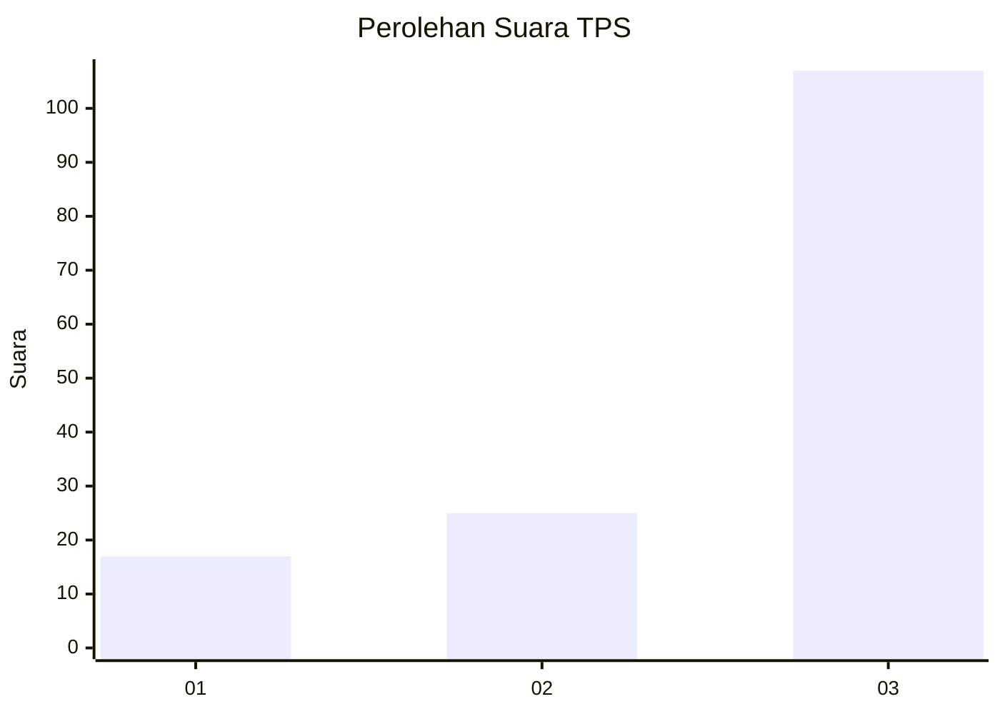
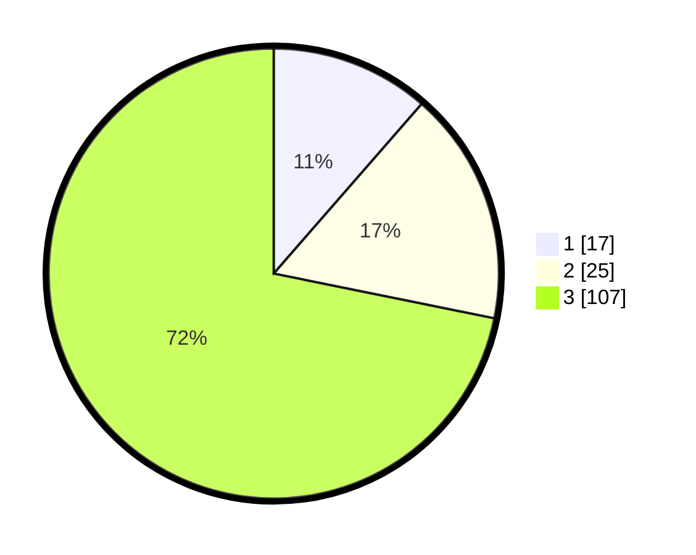

# Hasil

## Grafik

## Tabel

| No. | Nama Paslon    | Suara | Suara (raw) | Persentase |
|:--- |:-------------- | -----:| -----------:| ----------:|
| 1   | ANIES MUHAIMIN | 17    | [17][p-1]   | 11,41      |
| 2   | PRABOWO GIBRAN | 25    | [25][p-2]   | 16,78      |
| 3   | GANJAR MAHFUD  | 107   | [107][p-3]  | 71,81      |

[p-1]: https://github.com/gigit-pemilu/pemilu-2024-53-nusa-tenggara-timur/blob/main/pilpres/hitung-suara/sub/53-nusa-tenggara-timur/sub/07-sikka/sub/08-talibura/sub/2013-talibura/sub/005-tps/sub/paslon-1.txt
[p-2]: https://github.com/gigit-pemilu/pemilu-2024-53-nusa-tenggara-timur/blob/main/pilpres/hitung-suara/sub/53-nusa-tenggara-timur/sub/07-sikka/sub/08-talibura/sub/2013-talibura/sub/005-tps/sub/paslon-2.txt
[p-3]: https://github.com/gigit-pemilu/pemilu-2024-53-nusa-tenggara-timur/blob/main/pilpres/hitung-suara/sub/53-nusa-tenggara-timur/sub/07-sikka/sub/08-talibura/sub/2013-talibura/sub/005-tps/sub/paslon-3.txt

## Foto C Plano

https://sirekap-obj-formc.kpu.go.id/ebcb/pemilu/ppwp/53/07/08/20/13/5307082013005-20240215-193911--3150c074-90e6-4d94-b529-70f9b0a00423.jpg

https://sirekap-obj-formc.kpu.go.id/ebcb/pemilu/ppwp/53/07/08/20/13/5307082013005-20240215-173933--7b7e6f0f-52c2-4081-bf45-9b45633294c4.jpg

https://sirekap-obj-formc.kpu.go.id/ebcb/pemilu/ppwp/53/07/08/20/13/5307082013005-20240215-174112--c1fdf417-9ca1-475c-8323-f3bca0aeac99.jpg

## Metadata

| Key        | Value               |
| ---------- | ------------------- |
| Time Stamp | 2024-02-17 17:30:00 |

