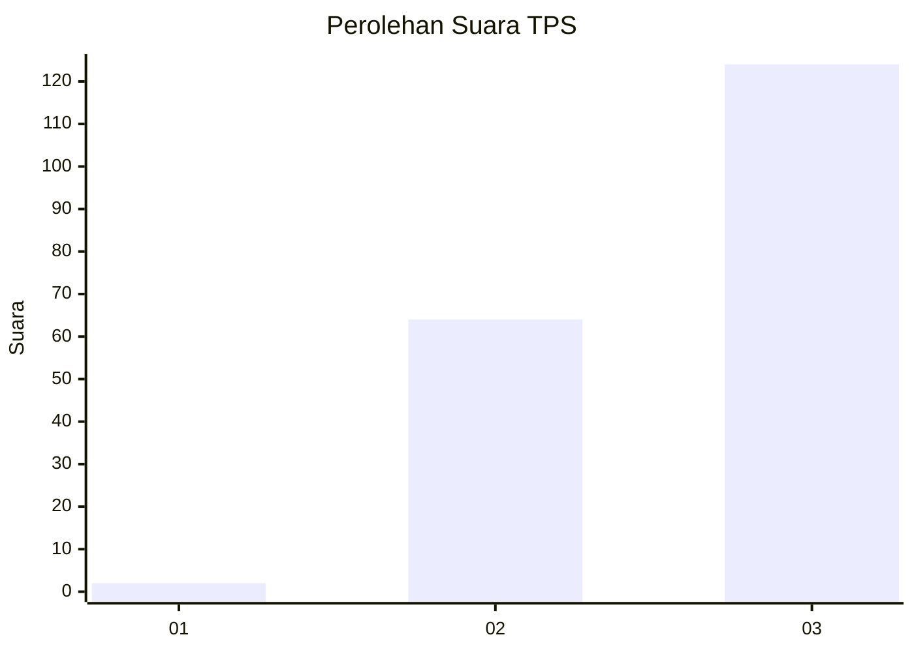
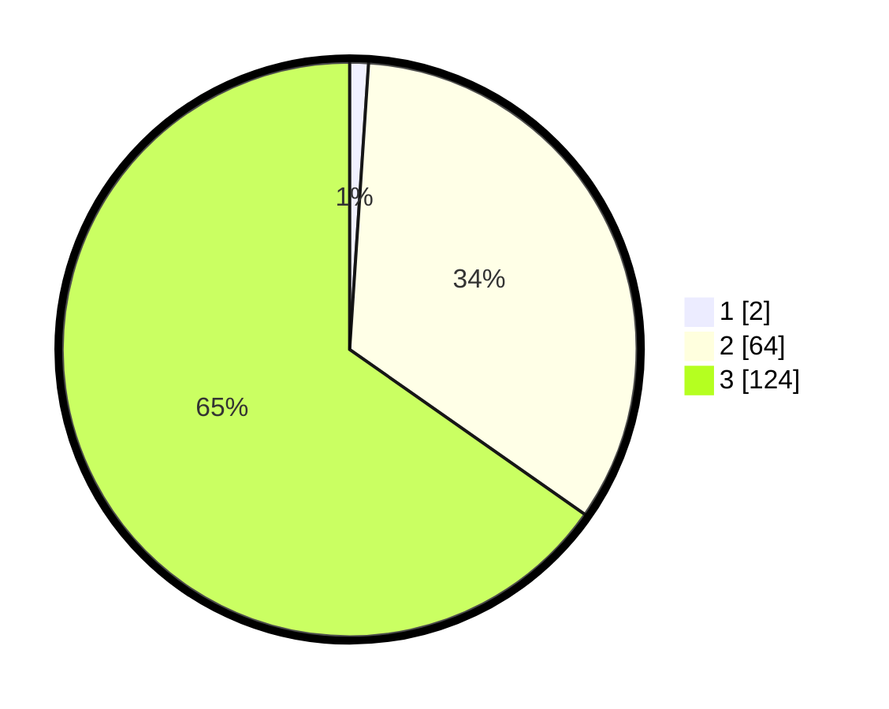

# Hasil

## Grafik

## Tabel

| No. | Nama Paslon    | Suara | Suara (raw) | Persentase |
|:--- |:-------------- | -----:| -----------:| ----------:|
| 1   | ANIES MUHAIMIN | 2     | [2][p-1]    | 1,05       |
| 2   | PRABOWO GIBRAN | 64    | [64][p-2]   | 33,68      |
| 3   | GANJAR MAHFUD  | 124   | [124][p-3]  | 65,26      |

[p-1]: https://github.com/gigit-pemilu/pemilu-2024-53-nusa-tenggara-timur/blob/main/pilpres/hitung-suara/sub/53-nusa-tenggara-timur/sub/07-sikka/sub/09-waigete/sub/2001-runut/sub/002-tps/sub/paslon-1.txt
[p-2]: https://github.com/gigit-pemilu/pemilu-2024-53-nusa-tenggara-timur/blob/main/pilpres/hitung-suara/sub/53-nusa-tenggara-timur/sub/07-sikka/sub/09-waigete/sub/2001-runut/sub/002-tps/sub/paslon-2.txt
[p-3]: https://github.com/gigit-pemilu/pemilu-2024-53-nusa-tenggara-timur/blob/main/pilpres/hitung-suara/sub/53-nusa-tenggara-timur/sub/07-sikka/sub/09-waigete/sub/2001-runut/sub/002-tps/sub/paslon-3.txt

## Foto C Plano

https://sirekap-obj-formc.kpu.go.id/0c59/pemilu/ppwp/53/07/09/20/01/5307092001002-20240215-183938--c2809699-20d6-4304-a5e7-02e51eb0f72a.jpg

https://sirekap-obj-formc.kpu.go.id/0c59/pemilu/ppwp/53/07/09/20/01/5307092001002-20240215-185411--6c8e0100-98c9-439f-86f8-61a3dfea0341.jpg

https://sirekap-obj-formc.kpu.go.id/0c59/pemilu/ppwp/53/07/09/20/01/5307092001002-20240215-185604--9bcc3ca1-1a85-4f46-a60a-196d2e3518dd.jpg

## Metadata

| Key        | Value               |
| ---------- | ------------------- |
| Time Stamp | 2024-02-21 21:00:04 |

