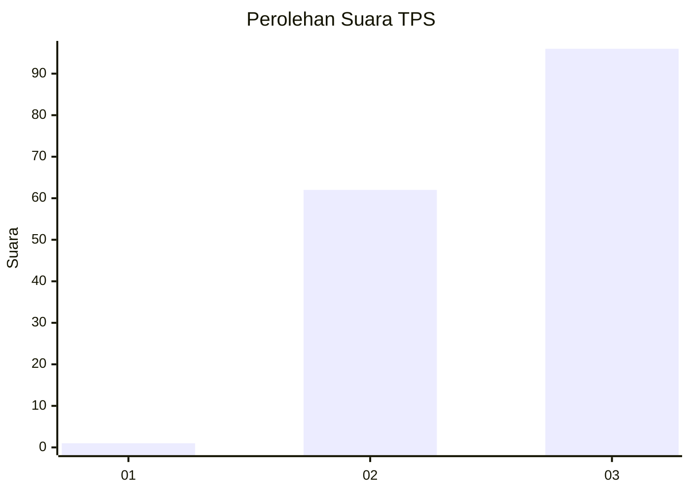
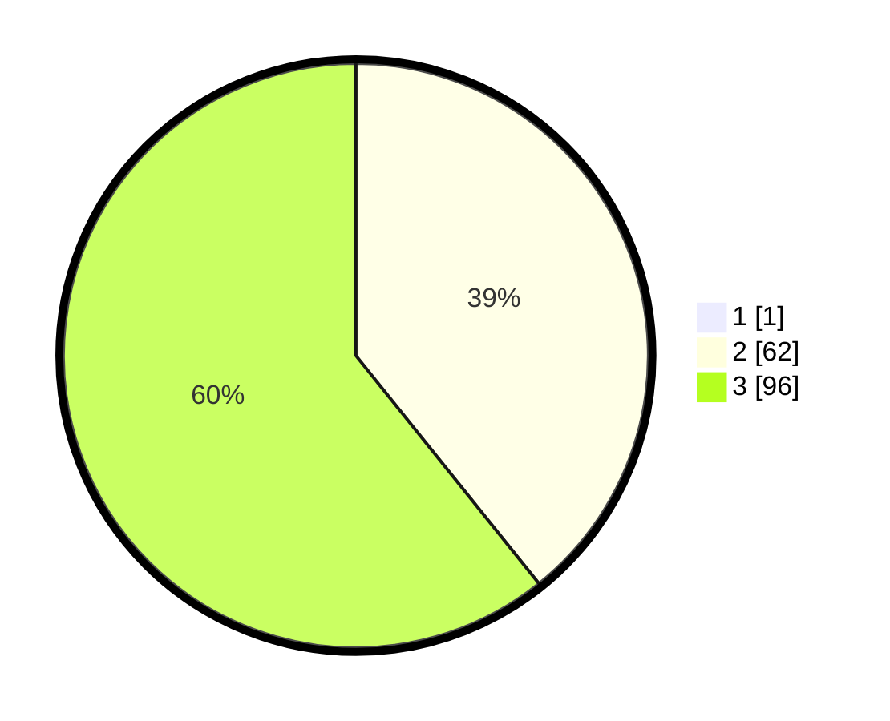

# Hasil

## Grafik

## Tabel

| No. | Nama Paslon    | Suara | Suara (raw) | Persentase |
|:--- |:-------------- | -----:| -----------:| ----------:|
| 1   | ANIES MUHAIMIN | 1     | [1][p-1]    | 0,63       |
| 2   | PRABOWO GIBRAN | 62    | [62][p-2]   | 38,99      |
| 3   | GANJAR MAHFUD  | 96    | [96][p-3]   | 60,38      |

[p-1]: https://github.com/gigit-pemilu/pemilu-2024-53-nusa-tenggara-timur/blob/main/pilpres/hitung-suara/sub/53-nusa-tenggara-timur/sub/07-sikka/sub/09-waigete/sub/2002-egon/sub/002-tps/sub/paslon-1.txt
[p-2]: https://github.com/gigit-pemilu/pemilu-2024-53-nusa-tenggara-timur/blob/main/pilpres/hitung-suara/sub/53-nusa-tenggara-timur/sub/07-sikka/sub/09-waigete/sub/2002-egon/sub/002-tps/sub/paslon-2.txt
[p-3]: https://github.com/gigit-pemilu/pemilu-2024-53-nusa-tenggara-timur/blob/main/pilpres/hitung-suara/sub/53-nusa-tenggara-timur/sub/07-sikka/sub/09-waigete/sub/2002-egon/sub/002-tps/sub/paslon-3.txt

## Foto C Plano

https://sirekap-obj-formc.kpu.go.id/d6f7/pemilu/ppwp/53/07/09/20/02/5307092002002-20240215-013150--8c6f9093-73a4-4a61-bdd9-8c4a84443670.jpg

https://sirekap-obj-formc.kpu.go.id/d6f7/pemilu/ppwp/53/07/09/20/02/5307092002002-20240215-013404--af544679-5f88-4d15-8f5a-e3dc44b0d1b9.jpg

https://sirekap-obj-formc.kpu.go.id/d6f7/pemilu/ppwp/53/07/09/20/02/5307092002002-20240215-013558--6504c655-9d96-4a04-9d71-fbf6bc04351a.jpg

## Metadata

| Key        | Value               |
| ---------- | ------------------- |
| Time Stamp | 2024-02-19 06:16:00 |

