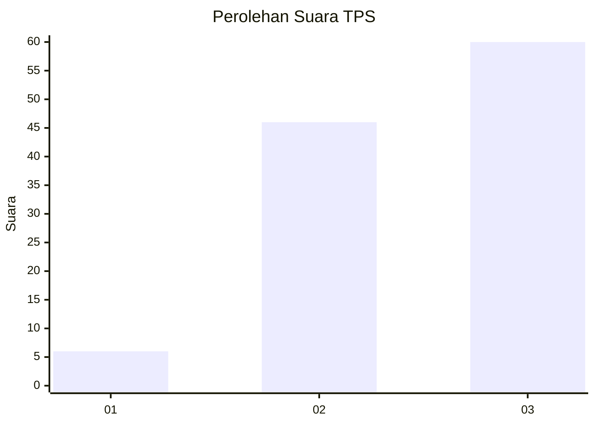
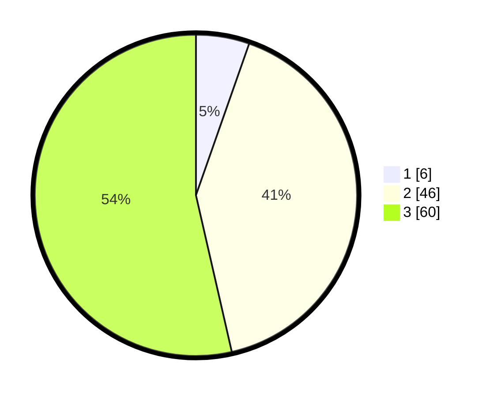

# Hasil

## Grafik

## Tabel

| No. | Nama Paslon    | Suara | Suara (raw) | Persentase |
|:--- |:-------------- | -----:| -----------:| ----------:|
| 1   | ANIES MUHAIMIN | 6     | [6][p-1]    | 5,36       |
| 2   | PRABOWO GIBRAN | 46    | [46][p-2]   | 41,07      |
| 3   | GANJAR MAHFUD  | 60    | [60][p-3]   | 53,57      |

[p-1]: https://github.com/gigit-pemilu/pemilu-2024-53-nusa-tenggara-timur/blob/main/pilpres/hitung-suara/sub/53-nusa-tenggara-timur/sub/07-sikka/sub/09-waigete/sub/2006-hoder/sub/010-tps/sub/paslon-1.txt
[p-2]: https://github.com/gigit-pemilu/pemilu-2024-53-nusa-tenggara-timur/blob/main/pilpres/hitung-suara/sub/53-nusa-tenggara-timur/sub/07-sikka/sub/09-waigete/sub/2006-hoder/sub/010-tps/sub/paslon-2.txt
[p-3]: https://github.com/gigit-pemilu/pemilu-2024-53-nusa-tenggara-timur/blob/main/pilpres/hitung-suara/sub/53-nusa-tenggara-timur/sub/07-sikka/sub/09-waigete/sub/2006-hoder/sub/010-tps/sub/paslon-3.txt

## Foto C Plano

https://sirekap-obj-formc.kpu.go.id/b64b/pemilu/ppwp/53/07/09/20/06/5307092006010-20240215-141754--5513d392-40f7-4b53-8c64-b4a02244a654.jpg

https://sirekap-obj-formc.kpu.go.id/b64b/pemilu/ppwp/53/07/09/20/06/5307092006010-20240215-142044--e1517ea1-c765-4afa-9400-8e9104d20c2f.jpg

https://sirekap-obj-formc.kpu.go.id/b64b/pemilu/ppwp/53/07/09/20/06/5307092006010-20240215-130651--2fb24c8c-d7d3-44b1-ba98-c9a4509bccac.jpg

## Metadata

| Key        | Value               |
| ---------- | ------------------- |
| Time Stamp | 2024-02-19 06:16:00 |

