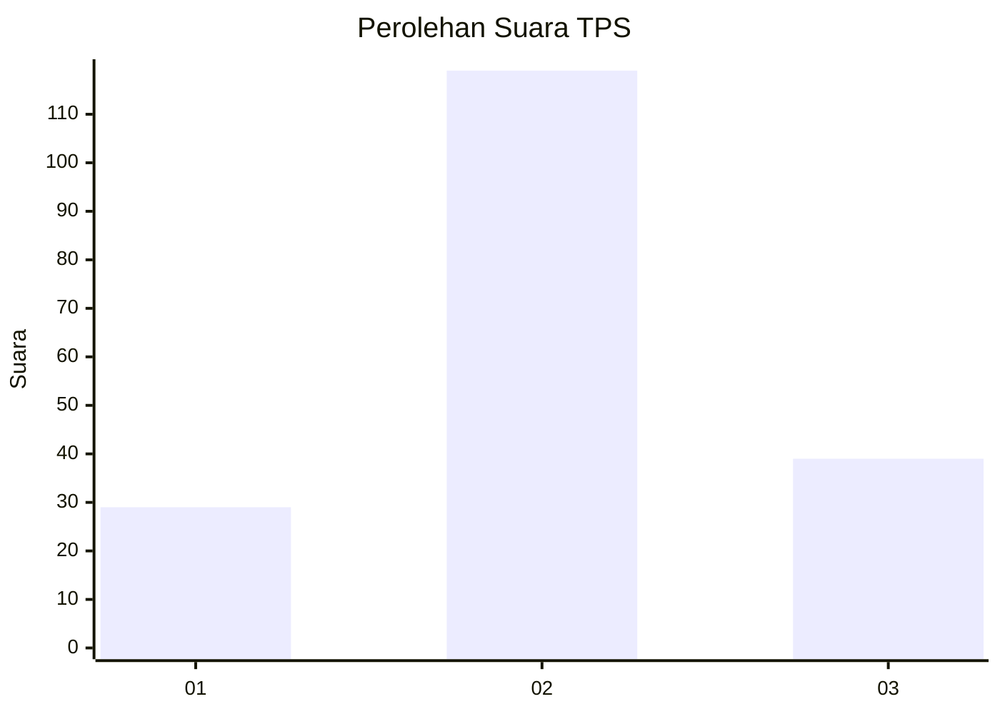
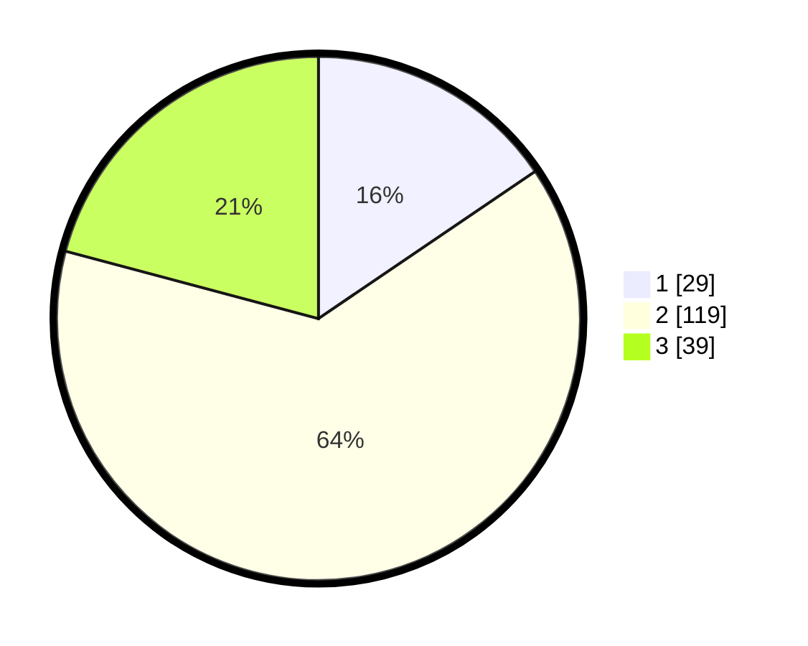

# Hasil

## Grafik

## Tabel

| No. | Nama Paslon    | Suara | Suara (raw) | Persentase |
|:--- |:-------------- | -----:| -----------:| ----------:|
| 1   | ANIES MUHAIMIN | 29    | [29][p-1]   | 15,51      |
| 2   | PRABOWO GIBRAN | 119   | [119][p-2]  | 63,64      |
| 3   | GANJAR MAHFUD  | 39    | [39][p-3]   | 20,86      |

[p-1]: https://github.com/gigit-pemilu/pemilu-2024-53-nusa-tenggara-timur/blob/main/pilpres/hitung-suara/sub/53-nusa-tenggara-timur/sub/07-sikka/sub/12-magepanda/sub/2001-magepanda/sub/001-tps/sub/paslon-1.txt
[p-2]: https://github.com/gigit-pemilu/pemilu-2024-53-nusa-tenggara-timur/blob/main/pilpres/hitung-suara/sub/53-nusa-tenggara-timur/sub/07-sikka/sub/12-magepanda/sub/2001-magepanda/sub/001-tps/sub/paslon-2.txt
[p-3]: https://github.com/gigit-pemilu/pemilu-2024-53-nusa-tenggara-timur/blob/main/pilpres/hitung-suara/sub/53-nusa-tenggara-timur/sub/07-sikka/sub/12-magepanda/sub/2001-magepanda/sub/001-tps/sub/paslon-3.txt

## Foto C Plano

https://sirekap-obj-formc.kpu.go.id/62ab/pemilu/ppwp/53/07/12/20/01/5307122001001-20240221-154213--0ec99158-ecdb-4b7b-9840-4a534bdb0d69.jpg

https://sirekap-obj-formc.kpu.go.id/62ab/pemilu/ppwp/53/07/12/20/01/5307122001001-20240221-153933--d636bdb8-fde7-46ba-b908-041b6b9c30f6.jpg

https://sirekap-obj-formc.kpu.go.id/62ab/pemilu/ppwp/53/07/12/20/01/5307122001001-20240221-154019--6f43fdef-684f-4077-8a74-795edb0bf8f0.jpg

## Metadata

| Key        | Value               |
| ---------- | ------------------- |
| Time Stamp | 2024-02-25 21:00:00 |

