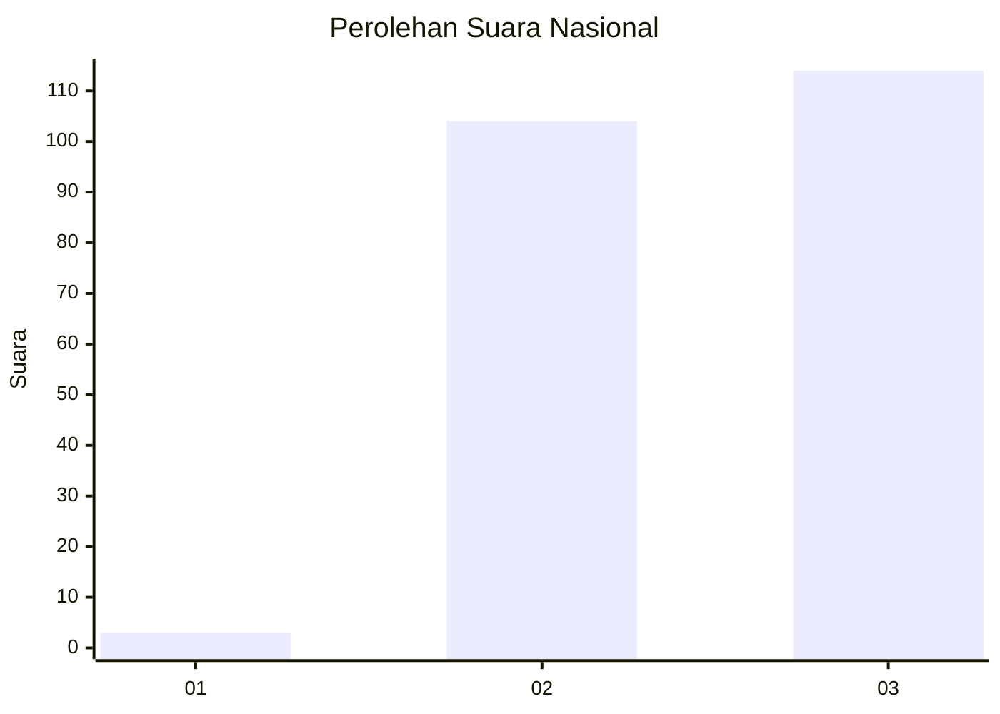
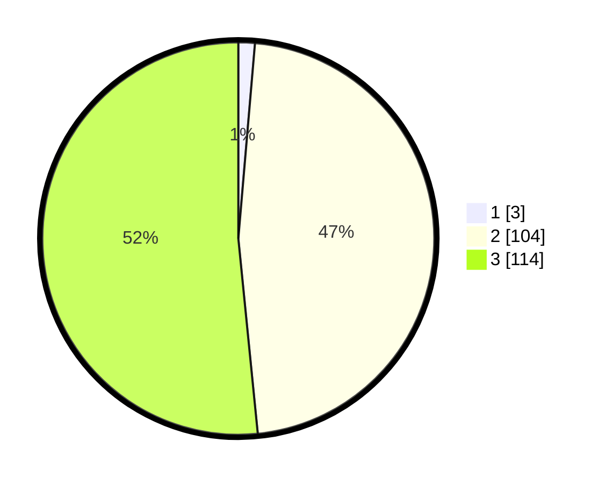

# Hasil

## Grafik

## Tabel

| No. | Nama Paslon    | Suara | Suara (raw) | Persentase |
|:--- |:-------------- | -----:| -----------:| ----------:|
| 1   | ANIES MUHAIMIN | 3     | [3][p-1]    | 1,36       |
| 2   | PRABOWO GIBRAN | 104   | [104][p-2]  | 47,06      |
| 3   | GANJAR MAHFUD  | 114   | [114][p-3]  | 51,58      |

[p-1]: https://github.com/gigit-pemilu/pemilu-2024/blob/main/pilpres/hitung-suara/sub/53-nusa-tenggara-timur/sub/07-sikka/sub/12-magepanda/sub/2001-magepanda/sub/003-tps/sub/paslon-1.txt
[p-2]: https://github.com/gigit-pemilu/pemilu-2024/blob/main/pilpres/hitung-suara/sub/53-nusa-tenggara-timur/sub/07-sikka/sub/12-magepanda/sub/2001-magepanda/sub/003-tps/sub/paslon-2.txt
[p-3]: https://github.com/gigit-pemilu/pemilu-2024/blob/main/pilpres/hitung-suara/sub/53-nusa-tenggara-timur/sub/07-sikka/sub/12-magepanda/sub/2001-magepanda/sub/003-tps/sub/paslon-3.txt

## Foto C Plano

https://sirekap-obj-formc.kpu.go.id/cfff/pemilu/ppwp/53/07/12/20/01/5307122001003-20240225-130646--db1d70eb-ca2c-4395-bb84-f2bfcebe662b.jpg

https://sirekap-obj-formc.kpu.go.id/cfff/pemilu/ppwp/53/07/12/20/01/5307122001003-20240225-125908--18bc7cfe-7ac7-4e7d-84d9-150324a0d065.jpg

https://sirekap-obj-formc.kpu.go.id/cfff/pemilu/ppwp/53/07/12/20/01/5307122001003-20240225-123721--489984cf-cd66-446e-91d4-3d5d589c42c9.jpg

## Metadata

| Key        | Value               |
| ---------- | ------------------- |
| Time Stamp | 2024-02-28 20:00:00 |

