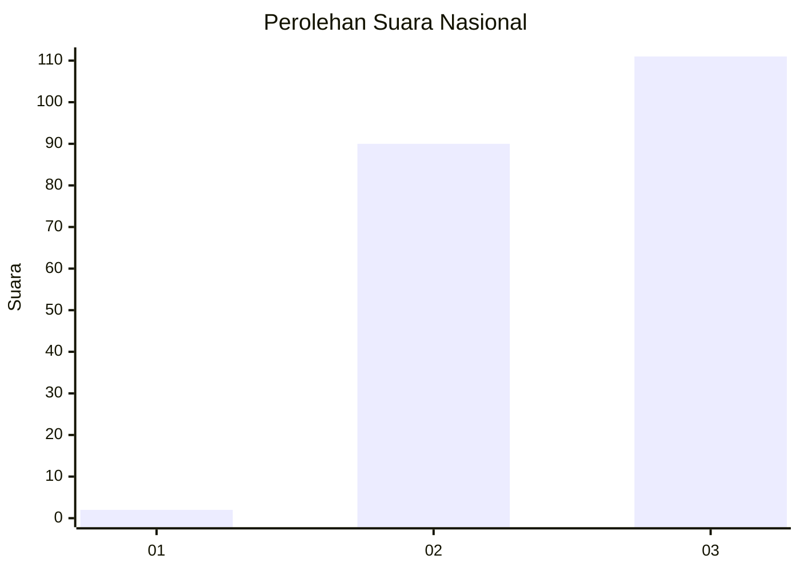
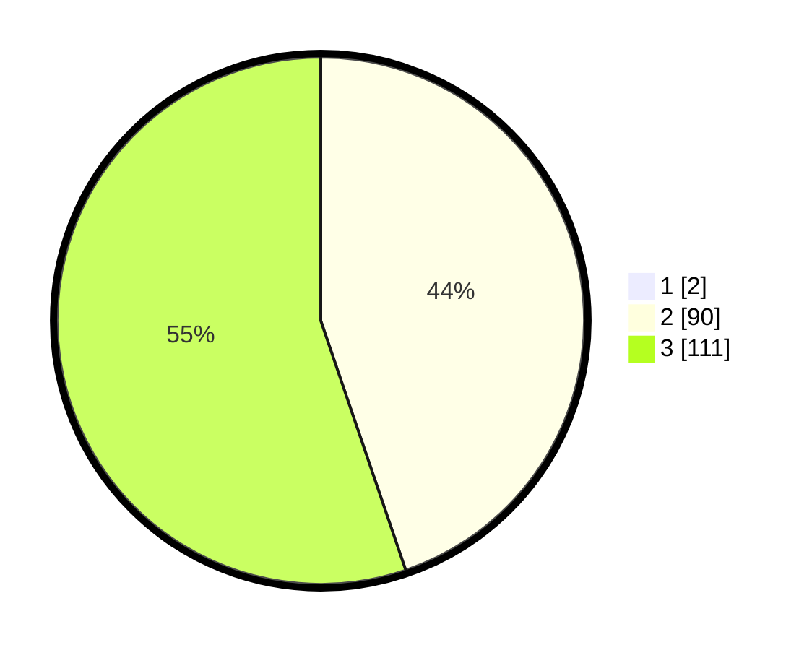

# Hasil

## Grafik

## Tabel

| No. | Nama Paslon    | Suara | Suara (raw) | Persentase |
|:--- |:-------------- | -----:| -----------:| ----------:|
| 1   | ANIES MUHAIMIN | 2     | [2][p-1]    | 0,99       |
| 2   | PRABOWO GIBRAN | 90    | [90][p-2]   | 44,33      |
| 3   | GANJAR MAHFUD  | 111   | [111][p-3]  | 54,68      |

[p-1]: https://github.com/gigit-pemilu/pemilu-2024/blob/main/pilpres/hitung-suara/sub/53-nusa-tenggara-timur/sub/07-sikka/sub/12-magepanda/sub/2001-magepanda/sub/004-tps/sub/paslon-1.txt
[p-2]: https://github.com/gigit-pemilu/pemilu-2024/blob/main/pilpres/hitung-suara/sub/53-nusa-tenggara-timur/sub/07-sikka/sub/12-magepanda/sub/2001-magepanda/sub/004-tps/sub/paslon-2.txt
[p-3]: https://github.com/gigit-pemilu/pemilu-2024/blob/main/pilpres/hitung-suara/sub/53-nusa-tenggara-timur/sub/07-sikka/sub/12-magepanda/sub/2001-magepanda/sub/004-tps/sub/paslon-3.txt

## Foto C Plano

https://sirekap-obj-formc.kpu.go.id/65a7/pemilu/ppwp/53/07/12/20/01/5307122001004-20240225-142627--2f96ad06-666b-440e-9991-9bbfe463732b.jpg

https://sirekap-obj-formc.kpu.go.id/65a7/pemilu/ppwp/53/07/12/20/01/5307122001004-20240225-142656--ec242d99-fc91-40db-8a7e-dedb20833808.jpg

https://sirekap-obj-formc.kpu.go.id/65a7/pemilu/ppwp/53/07/12/20/01/5307122001004-20240225-142731--b93e909d-2de5-4d7a-830d-c1ce018df6ac.jpg

## Metadata

| Key        | Value               |
| ---------- | ------------------- |
| Time Stamp | 2024-02-28 19:00:00 |

