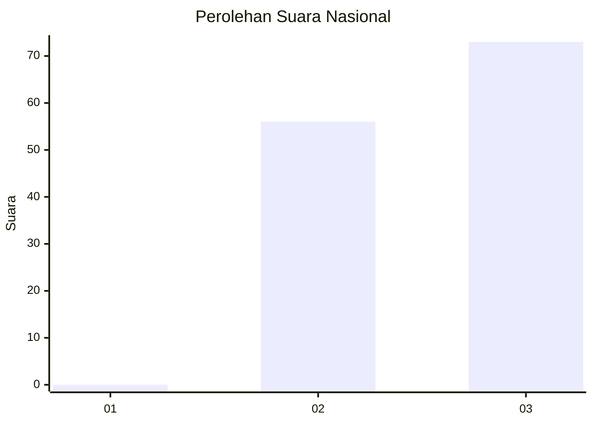
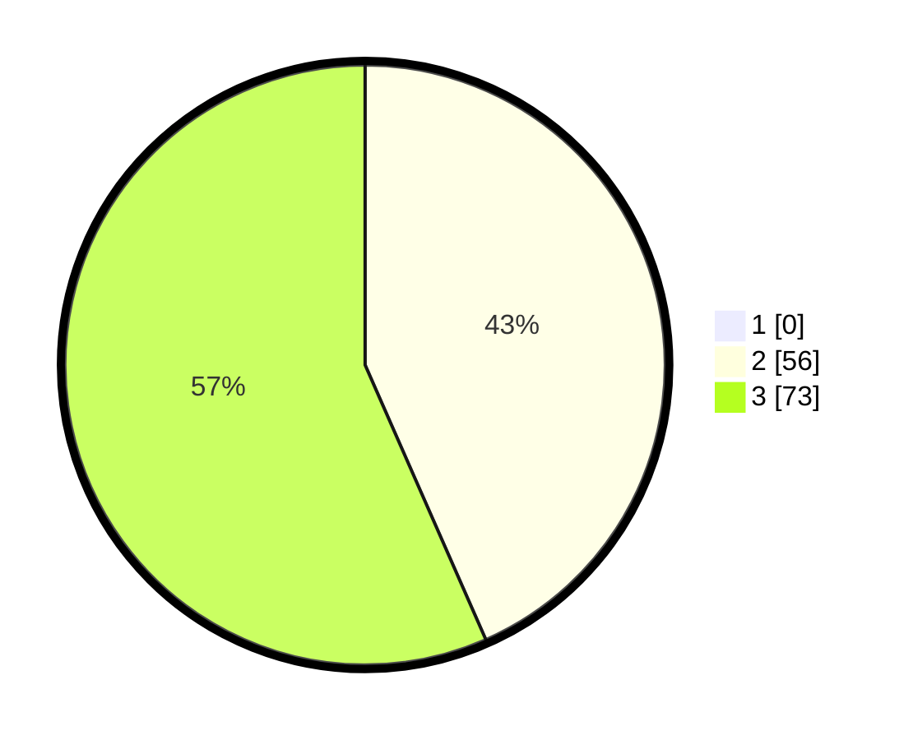

# Hasil

## Grafik

## Tabel

| No. | Nama Paslon    | Suara | Suara (raw) | Persentase |
|:--- |:-------------- | -----:| -----------:| ----------:|
| 1   | ANIES MUHAIMIN | 0     | [0][p-1]    | 0,00       |
| 2   | PRABOWO GIBRAN | 56    | [56][p-2]   | 43,41      |
| 3   | GANJAR MAHFUD  | 73    | [73][p-3]   | 56,59      |

[p-1]: https://github.com/gigit-pemilu/pemilu-2024/blob/main/pilpres/hitung-suara/sub/53-nusa-tenggara-timur/sub/07-sikka/sub/13-waiblama/sub/2004-werang/sub/001-tps/sub/paslon-1.txt
[p-2]: https://github.com/gigit-pemilu/pemilu-2024/blob/main/pilpres/hitung-suara/sub/53-nusa-tenggara-timur/sub/07-sikka/sub/13-waiblama/sub/2004-werang/sub/001-tps/sub/paslon-2.txt
[p-3]: https://github.com/gigit-pemilu/pemilu-2024/blob/main/pilpres/hitung-suara/sub/53-nusa-tenggara-timur/sub/07-sikka/sub/13-waiblama/sub/2004-werang/sub/001-tps/sub/paslon-3.txt

## Foto C Plano

https://sirekap-obj-formc.kpu.go.id/57c2/pemilu/ppwp/53/07/13/20/04/5307132004001-20240215-052205--a3565257-5e5a-4879-af35-26aa507d2e38.jpg

https://sirekap-obj-formc.kpu.go.id/57c2/pemilu/ppwp/53/07/13/20/04/5307132004001-20240215-050040--a7837238-b04f-4044-bce0-e0cf1b12dc49.jpg

https://sirekap-obj-formc.kpu.go.id/57c2/pemilu/ppwp/53/07/13/20/04/5307132004001-20240215-050235--6af9c91a-5b1c-4dce-bb2a-8a5420fd907e.jpg

## Metadata

| Key        | Value               |
| ---------- | ------------------- |
| Time Stamp | 2024-02-19 06:16:00 |

