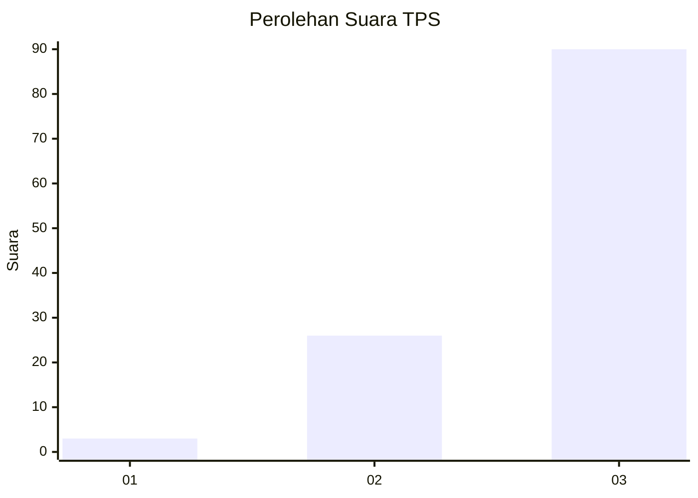
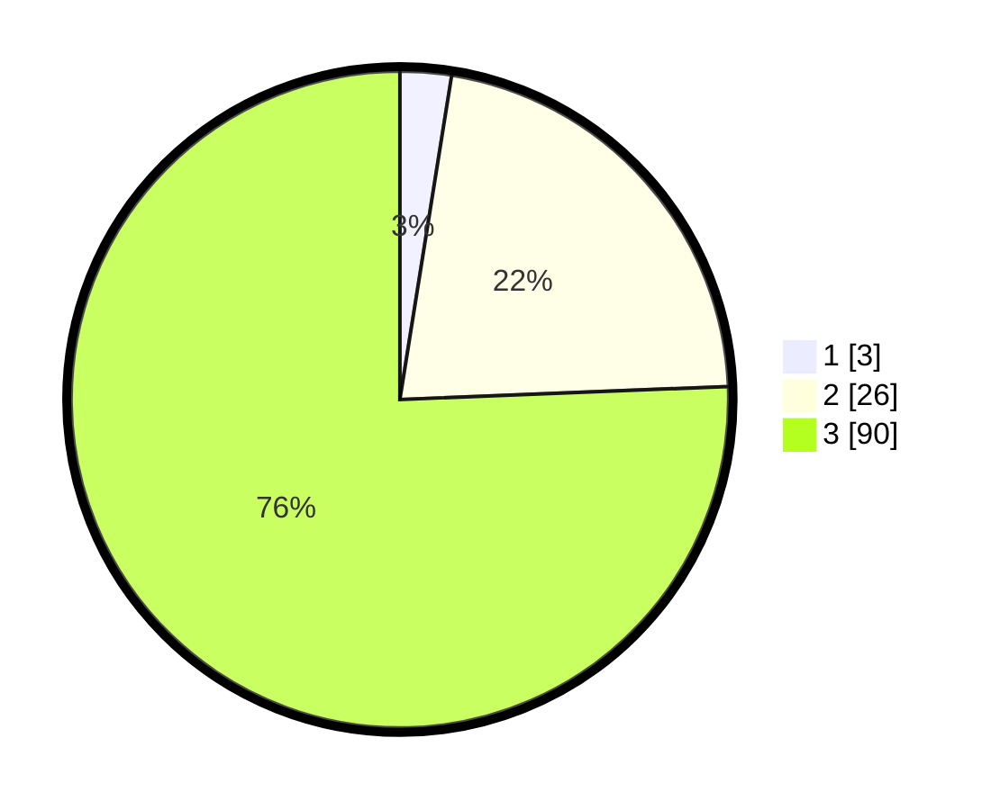

# Hasil

## Grafik

## Tabel

| No. | Nama Paslon    | Suara | Suara (raw) | Persentase |
|:--- |:-------------- | -----:| -----------:| ----------:|
| 1   | ANIES MUHAIMIN | 3     | [3][p-1]    | 2,52       |
| 2   | PRABOWO GIBRAN | 26    | [26][p-2]   | 21,85      |
| 3   | GANJAR MAHFUD  | 90    | [90][p-3]   | 75,63      |

[p-1]: https://github.com/gigit-pemilu/pemilu-2024-53-nusa-tenggara-timur/blob/main/pilpres/hitung-suara/sub/53-nusa-tenggara-timur/sub/07-sikka/sub/13-waiblama/sub/2004-werang/sub/002-tps/sub/paslon-1.txt
[p-2]: https://github.com/gigit-pemilu/pemilu-2024-53-nusa-tenggara-timur/blob/main/pilpres/hitung-suara/sub/53-nusa-tenggara-timur/sub/07-sikka/sub/13-waiblama/sub/2004-werang/sub/002-tps/sub/paslon-2.txt
[p-3]: https://github.com/gigit-pemilu/pemilu-2024-53-nusa-tenggara-timur/blob/main/pilpres/hitung-suara/sub/53-nusa-tenggara-timur/sub/07-sikka/sub/13-waiblama/sub/2004-werang/sub/002-tps/sub/paslon-3.txt

## Foto C Plano

https://sirekap-obj-formc.kpu.go.id/b889/pemilu/ppwp/53/07/13/20/04/5307132004002-20240216-135001--d3718c01-98bc-409a-84e2-c08c5454f0c5.jpg

https://sirekap-obj-formc.kpu.go.id/b889/pemilu/ppwp/53/07/13/20/04/5307132004002-20240216-134536--267371b5-25a0-4ca8-b311-9dac4be1b483.jpg

https://sirekap-obj-formc.kpu.go.id/b889/pemilu/ppwp/53/07/13/20/04/5307132004002-20240216-133849--a1a5bcd2-2a6f-4837-937d-53bc210a75d2.jpg

## Metadata

| Key        | Value               |
| ---------- | ------------------- |
| Time Stamp | 2024-02-16 21:01:00 |

